# The World of Habanos

## Table of Contents

1. [Introduction](#introduction)
2. [Anatomy of a Habano](#anatomy-of-a-habano)
3. [Tobacco paradise](#tobacco-paradise)
4. [The perfect leaf](#the-perfect-leaf)
5. [The Vegueros' magic touch (I)](#the-vegueros-magic-touch-i)
6. [The Vegueros, magic touch (II)](#the-vegueros-magic-touch-ii)
7. [Harvesting leaf by leaf](#harvesting-leaf-by-leaf)
8. [A long way yet to go](#a-long-way-yet-to-go)
9. [Tabaco tapado (shade grown)](#tabaco-tapado-shade-grown)
10. [Tabaco de sol (sun grown)](#tabaco-de-sol-sun-grown)
11. [Totally hand made long filler](#totally-hand-made-long-filler)
12. [The craft of the Torcedor](#the-craft-of-the-torcedor)
13. [Other methods of manufacture](#other-methods-of-manufacture)
14. [Checking the work](#checking-the-work)
15. [Sorting the colours](#sorting-the-colours)
16. [Applying the bands](#applying-the-bands)
17. [Dressing the box](#dressing-the-box)
18. [Marks of distinction](#marks-of-distinction)
19. [Habanos Brands](#habanos-brands)
    - 19.1. [Cohiba](#cohiba)
    - 19.2. [Montecristo](#montecristo)
    - 19.3. [Romeo y Julieta](#romeo-y-julieta)
    - 19.4. [Partagás](#partags)
    - 19.5. [Hoyo de Monterrey](#hoyo-de-monterrey)
    - 19.6. [H. Upmann](#h-upmann)
    - 19.7. [José L. Piedra](#jos-l-piedra)
    - 19.8. [Cuaba](#cuaba)
    - 19.9. [San Cristóbal de La Habana](#san-cristbal-de-la-habana)
    - 19.10. [Trinidad](#trinidad)
    - 19.11. [Bolivar](#bolivar)
    - 19.12. [Fonseca](#fonseca)
    - 19.13. [Punch](#punch)
    - 19.14. [Quintero](#quintero)
    - 19.15. [Vegas Robaina](#vegas-robaina)
    - 19.16. [Diplomáticos](#diplomticos)
    - 19.17. [El Rey del Mundo](#el-rey-del-mundo)
    - 19.18. [Juan López](#juan-lpez)
    - 19.19. [La Flor de Cano](#la-flor-de-cano)
    - 19.20. [La Gloria Cubana](#la-gloria-cubana)
    - 19.21. [Por Larrañaga](#por-larraaga)
    - 19.22. [Quai d'Orsay](#quai-dorsay)
    - 19.23. [Rafael González](#rafael-gonzlez)
    - 19.24. [Ramón Allones](#ramn-allones)
    - 19.25. [Saint Luis Rey](#saint-luis-rey)
    - 19.26. [Sancho Panza](#sancho-panza)
    - 19.27. [Vegueros](#vegueros)
20. [Strenghts](#strenghts)
21. [Principal shapes and sizes](#principal-shapes-and-sizes)
22. [Styles of presentation (I)](#styles-of-presentation-i)
23. [Styles of presentation (II)](#styles-of-presentation-ii)
24. [Special Productions](#special-productions)
25. [Choosing, cutting and smoking](#choosing-cutting-and-smoking)
26. [Keeping Habanos](#keeping-habanos)
27. [Matching the taste](#matching-the-taste)
28. [Ageing tobacco leaves](#ageing-tobacco-leaves)
29. [Ageing finished cigars](#ageing-finished-cigars)
30. [Habano destinations](#habano-destinations)

---

## Introduction

There are in the world just a few things that are known without question to be the best of their kind. A Habano  or Havana cigar  is one of them.

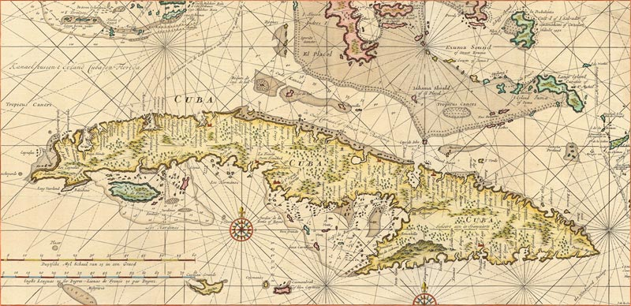

In Cuba in 1492 the Spanish expedition commanded by Christopher Columbus saw tobacco for the first time in the New World. The Taino Indians rolled and burnt some mysterious leaves, which they called Cohiba, in an unknown ceremony for the explorers. From that starting point more than five hundred years ago, tobacco has been traded and planted throughout the world. Since its discovery, *Tabaco Negro Cubano* or Cuban Black Tobacco has been considered the best in the world because of the unique growing conditions in some areas of the Island. This distinction remains incontestably valid after more than five centuries.

The heart of the distinction is the tobacco and its taste born of a combination of four factors that exist only in Cuba: the soil, the climate, the varieties of Cuban black tobacco seed and the know-how of the tobacco growers and cigar makers. Other places may have acquired some Cuban skills, even some Cuban seeds, but never the natural gifts of the Cuban soil and the Cuban climate. These you will find nowhere else.

Nor will you find anything that matches the centuries-old culture of cultivating Cuban tobacco: the extraordinary labour that the tobacco farmer invests in his crop; the months and years of patient waiting before his leaf is deemed fit for a Habano.

A further distinction lies in the definition of the term "Habanos". All Habanos are Cuban, but by no means all Cuban cigars are Habanos.

The title is the Denominación de Origen Protegida (D.O.P), or Protected Denomination of Origin reserved for a selection of the most outstanding brands whose cigars are manufactured to the most exacting standards from tobaccos grown only in particular areas, which are also protected as denominations of origin.

All Habanos are crafted Totalmente a Mano  totally by hand  using methods that were pioneered in Havana two centuries ago and remain virtually unchanged to this day.

More than 500 manual tasks are performed in both the agricultural and manufacturing processes from the planting of the seeds to the Habano's final resting place in its box.

Every cigar must pass through the most stringent quality control processes established by the Regulatory Council for the Protected Denomination of Origin (D.O.P.) Habanos before they can earn the precious title of Habano.

A benchmark for excellence.

Read on, and you will learn how.

El Habano: Una referencia de perfección.

## Anatomy of a Habano

It takes up to six types of tobacco leaf to make a Habano, each type specially grown and prepared for its purpose.

Four for flavour…

Two, three or four types of leaf are blended to form the ***tripa***, or **filler**, source of the rich flavours and aromas that immediately distinguish a Habano from the rest.

1. ***Volado***: a light-flavoured leaf, especially valued for its combustibility also known as *1* (Strength 1).
2. ***Seco***: medium-flavoured, the most important leaf for aroma *2* (Strength 2).
3. ***Ligero***: a full-flavoured and slow-burning leaf that adds strength to the blend *3* (Strength 3).
4. **Medio Tiempo**: a rare leaf used very occasionally to bring extra intensity to the taste *4* (Strength 4).

…one for structure…

The ***capote***, or **binder**, is the special leaf that wraps around the leaves of the filler, defining the shape of the Habano and perfecting its smoking quality…

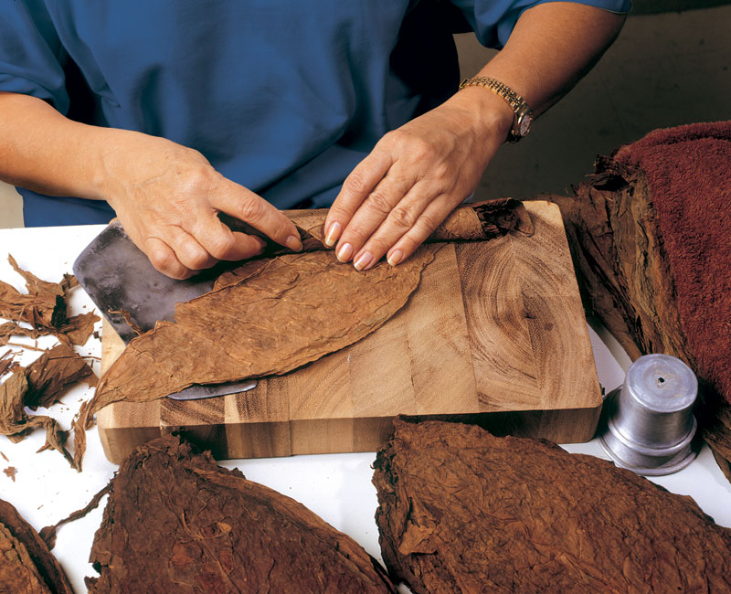

…and one to delight the eye

The ***capa*** or **wrapper** is the exquisitely thin and supple leaf that forms the outer surface of the cigar.
The wrapper contributes little to the flavour of a Habano, but it stands as the ultimate symbol of the cigars perfection.

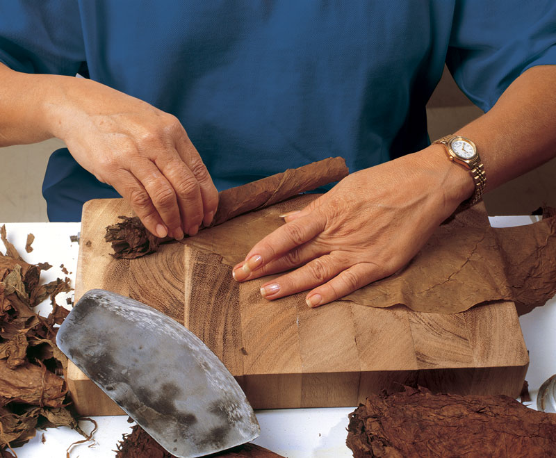

Every leaf is grown in Cuba, especially for the making of Habanos.

**You will not find such tobacco in cigars that are not Habanos.**

## Tobacco paradise

Nowhere in the world grows tobacco better than Cuba. But even here, only a few selected *Vegas* plantations are judged good enough to grow the tobacco for Habanos.

As a great wine is defined by its vineyard, so the character of a Habano is intimately connected with the land where the tobacco grows.

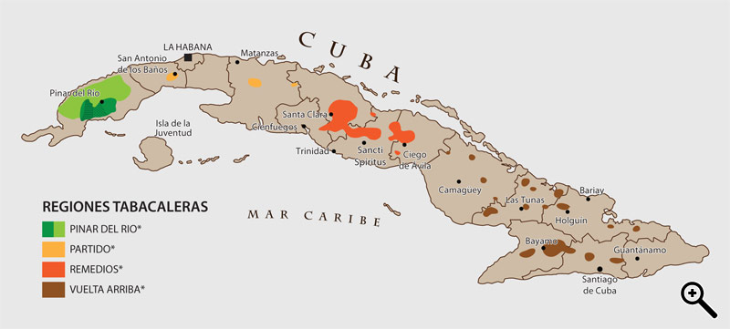

Selection is a principle that runs through every stage in the production of a Habano leaf, and this is where it starts.

The locations where tobacco for Habanos can be grown are strictly limited to certain defined regions, zones and districts of Cuba and within those regions to just a small number of plantations with their own special style of cultivation.

These are the elite *Vegas de Primera* first class fields ranked above all others for the exceptional quality of their soil and microclimate, and the uncommon degree of skill that goes to produce their crop.

So important are many of these regions, zones and districts to the production of a Habano that they enjoy a special status as Protected Denominations of Origin (D.O.P). You will find each one marked with an asterisk in the text.

### 1. PINAR DEL RIO\*

Name of the province that embraces all of the important growing zones in the west of Cuba, and the name of the provincial capital. It also gives its name to a tobacco region that is protected as a Denomination of Origin, and in which there are several tobacco zones such as *Vuelta Abajo\** and *Semi Vuelta,* and districts like *San Juan y Martínez\** and *San Luis\*.*

#### VUELTA ABAJO\*

The finest cigar tobacco-growing land in the world. *Vuelta Abajo\** is the main source of tobacco for Habanos, and the only zone that grows all types of leaf: wrappers, filler and binders. Indeed all tobacco for fillers and binders for Long Filler Habanos comes from this privileged zone. Not surprisingly *Vuelta Abajo* is also protected as a Denomination of Origin. But even here less than a quarter of the tobacco-growing land enjoys the *Vegas de Primera* status that is required for the growing of tobacco for Habanos.

The soil and climate conditions in the western part of Cuba, especially in the Vuelta Abajo tobacco zone, are unique in the world.

**San Luis\***: Small town at the epicentre of Cuban tobacco culture, known above all for the cultivation of wrapper leaves. As a district located in the *Vuelta Abajo\** zone, its name is protected as a Denomination of Origin. Here you find the world-famous *El Corojo Vega* as well as the *Cuchillas de Barbacoa* farm. It is one of the two districts from which the leaves grown on its finest vegas are selected for the Cohiba brand.

**San Juan y Martínez\***: The other famous small town in *Vuelta Abajo\** which gives its name to a district that is protected as a Denomination of Origin. It has a particular reputation for the cultivation of fillers and binders, and the famous *Hoyo de Monterrey* plantation is located here. It is the other district where the finest vegas supply leaves for .

#### SEMI VUELTA

The other tobacco zone situated in the Pinar del Río region known mainly for its cultivation of binder and filler leaves for *Tripa Corta* -Short Filler- Habanos. Traditionally the part of the Pinar del Rio\* tobacco region not included in *Vuelta Abajo\** has been called *Semi Vuelta*. However the area of this zone employed for Habanos is very small, barely one percent of its tobacco growing land. Nevertheless it has good soil for producing seeds which are later sown in *Vuelta Abajo\**. Most *Semi Vuelta* tobacco is grown for other purposes.

### 2. PARTIDO\*

Founded during the early 17th Century, *Partido\** is a historic tobacco region incorporating a number of tobacco-growing zones traditionally located to the south west and more recently to the south east of Havana City. *Partido\**, which is protected as a Denomination of Origin, specialises in the cultivation of wrapper leaves for long and short filler Habanos.

### 3. REMEDIOS\*

Cubas oldest tobacco producing region and a protected Denomination of Origin. It is the source of the leaf for one particular Habano brand: [José L Piedra](https://www.habanos.com/marcas/joselpiedra/ "José L. Piedra"). The soil and climate have their own distinctive character.

### 4. VUELTA ARRIBA\*

It was at Bariay in the extreme eastern part of this region that Columbus landed in 1492 and discovered Cuban tobacco. Consequently it is protected as a Denomination of Origin. Tobacco is still grown here, but not for Habanos.

### LA HABANA\*

Havana city, capital of Cuba. Although no tobacco is cultivated in Havana, the city gave its name to Cubas most famous export because its natural harbour provided the port from which Habanos were originally shipped. Also it remains the location of the most famous Habano factories. It is a Denomination of Origin because of its historical relationship with the production and export of Habanos.

\* Denominations of Origin recognised by The Regulatory Council for the Protected Denomination Of Origin (D.O.P.) Habanos and other Cuban Tobacco Denominations

## The perfect leaf

Every leaf in a Habano is *Tabaco Negro Cubano*  – native Cuban Black Tobacco – directly descended from the plants that Columbus first discovered here more than five hundred years ago.

Two distinct forms of cultivation produce the different types of leaf required.

Wrapper leaves are grown in  (shade-grown) fields covered from end to end by muslin cloth.

Filler and binder leaves are grown in the open, enjoying the full benefit of the Cuban sun.

In each case the leaves have different characteristics at different levels of the plant, and each leaf is classified accordingly. Each leaf has its own destiny.

The muslin cover filters the sunlight and traps the heat so the leaves grow larger and finer – perfect conditions for growing the perfect wrapper leaf. Only the largest and finest leaves are selected to make wrappers for Habanos. No surprise that the wrapper is the most expensive leaf to produce.

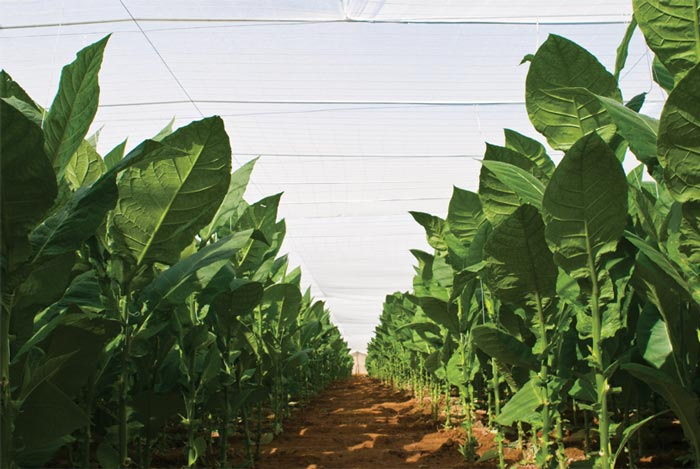
Shade-grown tobacco field.

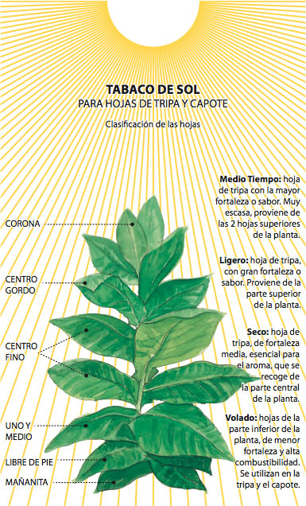

The full force of Cuban sunlight develops the glorious variety of flavours that are blended to form the rich and complex taste of a Habano.

A sun-grown tobacco field

### The true Cuban seed

From the 16th Century onwards, the tobacco that grew naturally in Cuba proved good enough to establish an unrivalled reputation throughout the world.

Then, at the start of the 20th Century as a new age of botanical research dawned, science was brought to bear on the many different seed varieties in use at the time for the growing of .

The botanists had two goals; first to identify the original seed's characteristics that delivered the classic Cuban taste; and second, to find varieties resistant to the many diseases that plagued the farmers.

And so in 1907, the variety known as *Habanensis* was born.

Instituto de Investigaciones del Tabaco. San Antonio de los Baños. Cuba

Independent research continued until in 1937 the industry established the first Experimental Research Station at *San Juan y Martinez*.

Four years later an improved seed variety named *Criollo* was introduced and this remains the basis of all the seeds permitted for the growing of Habano tobacco.

Soon afterwards *Criollo* itself was developed to create a variety called *Corojo*, bred especially for the growing of wrapper leaves and named after the famous plantation where it was tested.

Further new varieties have since been introduced to combat pests and diseases as well as such problems as the effects of global climate change.

Today Cuba's tobacco regions are served by the (Tobacco Research Institute) with its four experimental research stations, which together control all of the seed that the farmers sow.

One of the Research Institute's recent achievements has been to improve further the ecological growth of the plants, which is unique in the world of tobacco.

The quest continues to preserve and perfect the essence of the only true Cuban seed – .

")

## The Vegueros' magic touch (I)

The Vegas de Primera have their own special style of cultivation, and the work that this entails is extraordinarily hard.

The Veguero – farmer – may have charge of half a million plants or more, and each must be visited more than 150 times in the course of the growing season.

")

## The Vegueros, magic touch (II)

The extraordinary labour of shade-grown tobacco

Wrapper leaves are exceptional in every respect. Some 10-20 days into the growing season, the fields are entirely enclosed under canopies of muslin cloth – a remarkable sight.

Each plant is then individually strung to the frame. Irrigation is critical. The plants must get just the right quantity of water at the moment they need it.

Irrigation is critical. The plants must get just the right quantity of water at the moment they need it.

Flavour grows in the open

Cuban sunlight works its magic to bring on the rich variety of flavours in the sun-grown plants that supply the filler and binder leaves.

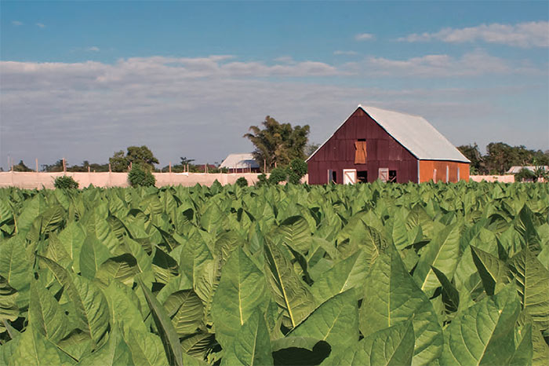

")

## Harvesting leaf by leaf

Around 40 days after planting out, the harvest can begin – a laborious task because each leaf must be picked by hand.

Only two or three leaves can be taken at a time, with days to wait between each picking. The harvesting of a single plant takes close to 30 days to complete.

Leaves are picked at intervals from the bottom up, allowing time between pickings for the plant to develop its remaining leaves.

Shade-grown () plants are taller with more leaves, and so they require more pickings.

A sun-grown plant is illustrated here.

The Mañanita leaves that are picked first are too small for Habanos, but they are the perfect size for Cuban mini cigars (Minis Cubanos).

The beginning of a long journey

The harvested leaves are taken to the farmer's barn for air curing – just the first of many stages that the leaf has yet to pass through.

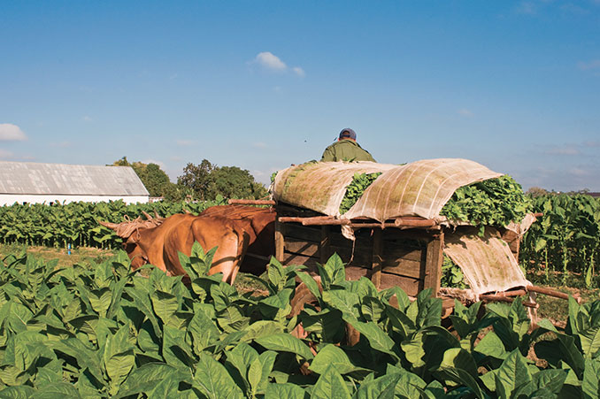

")

## A long way yet to go

Growing the leaf is just the start of the story, with many patient stages of processing yet to come. Nothing can be hurried.

Many months and in some cases years will pass before the leaf is ready to make a Habano.

The diagrams show the path that each type of leaf must take, from the farmer's curing barn to its final resting place in the warehouse where it will be aged.

[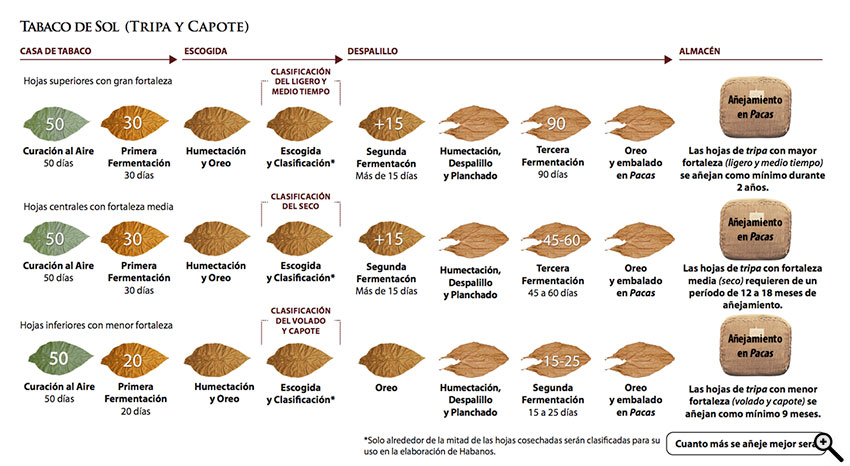](https://www.habanos.com/wp-content/uploads/grafico-procesosxl-es.jpg)

The variation in the time taken to ferment and age the different types of leaf means that the crops from several different harvests are needed to make a Habano.

 ")

## Tabaco tapado (shade grown)

### Shade-grown leaf for wrappers

The processing of the tobacco leaves used to make a Habano differs according to their method of cultivation and their final function in the cigar. Below is a brief description of the processes used for the leaves that are destined to become wrappers.

### Air curing wrappers

The first process for the newly harvested wrapper leaf, on which the success of the whole crop depends, is a slow and careful period of air curing which removes moisture and turns the leaf by stages from bright green to golden brown.

#### 1. Air Curing in the traditional manner

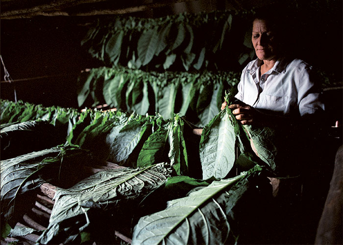

Nimble fingered women sow the leaves in pairs and hang them over poles or cujes, 50 pairs to a pole.

Some wrappers are cured in the farmers' traditional Curing Barns () that depend entirely on the natural effects of the climate. The leaves are sewn in pairs and hung astride poles which are placed on racks in the barn. As the leaves cure, so the pole is raised progressively higher in the racks. Ventilation and light must be constantly adjusted to allow for natural variations in temperature and humidity. This process lasts for around 50 days.

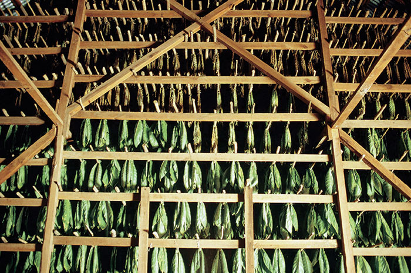

The end of the curing process coincides with the onset of the rainy season, which provides the necessary moisture for the dried leaves to be transported safely to the Sorting House.

#### 2. Controlled Air Curing.

The 1990's saw a major investment in temperature and humidity control for the curing of wrapper leaves, to overcome the unpredictable conditions in a conventional barn. This is air curing at its most refined, with optimum conditions replicated around the clock. The time it takes is naturally less, around 25 days. But there is still the need for constant vigilance and adjustment as the condition of the leaf develops – the more so, because the process now runs at full pace day and night.

### Fermentation of wrappers

Once the wrapper leaves are fully cured, they are removed from the poles and tied in sheaves called . This concludes the work of the farmer and the task passes into the hands of the  – the 'organisation for the gathering and improvement of tobacco' – which buys the leaf from the farmer. The leaves are then taken to the , or Sorting House, where they will be fermented.

As shade-grown leaves are so thin and delicate, wrappers only undergo a single process of fermentation. It lasts for a minimum of 20 days and takes place in chambers at the Sorting House that have been specially designed for this purpose. During the fermentation the leaf's impurities are eliminated and its acidity, tar and nicotine contents are reduced whilst its taste characteristics are accentuated. The fermentation also evens out the colour of the wrapper.

Following the fermentation, the wrappers stay in the Sorting House and pass to the process of sorting into classes or classification.

### Sorting and classification of wrappers

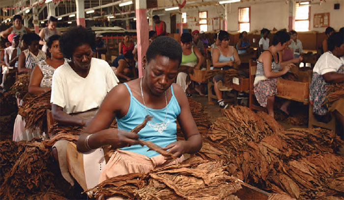

The classification of Cuban tobacco leaves is probably the most meticulous in the world.

Size, colour and texture are the three criteria that guide the sorters. Precious wrappers, as you might expect, are the subject of very close attention. First they are moistened and aired to prepare them for handling. Then they are classified into a bewildering array of some 50 different categories designed to ensure that only the most perfect will ever dress a Habano. Any leaf below a certain standard is rejected and set aside for other purposes.

### Baling and ageing of wrappers

After the wrappers have been sorted into classes, they are once again tied into  (sheaves). The gavillas are then packed in bales known as , made from , which is the loose bark of the Royal Palm tree, a material used for many purposes in Cuba. Every bale carries a label rich with information about the leaves within it including their size, the year of harvest and the date of packing. Tercios are also marked with the code of the Escogida where the wrappers were sorted.

Finally the tercios are transported to the warehouse where the wrappers will be left to age for a minimum of six months.

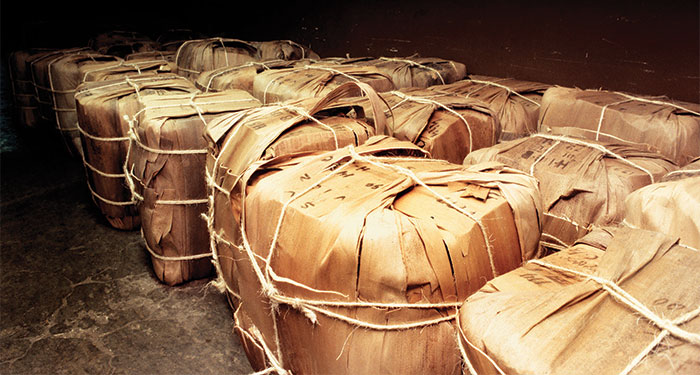

")

## Tabaco de sol (sun grown)

##### Sun-grown leaf for Fillers and Binders

Filler and binder leaves on the other hand are subjected to a much more complex and extensive process than wrappers, including several fermentations as is revealed below.

##### Air curing for Fillers and Binders

All filler and binder leaves are cured in the farmers' traditional Curing Barns. As with wrappers, the leaves are sewn together and hung over poles and, throughout the curing process as the leaves lose humidity, the poles are raised progressively to the upper part of the barn. Again the ventilation and light are adjusted constantly to allow for natural variations in temperature and humidity.

  Building piles of filler and binder leaves at the Stripping House for fermentation.

This process lasts for a minimum of 50 days, with longer periods for the leaves taken from the higher levels of the plant.

##### First Fermentation of Fillers and Binders

Still in the farmer's Curing Barn, fillers and binders are subjected to their first fermentation. The leaves from each pole are gathered intogavillasthen placed in piles and covered in cloth with a view to reducing further the natural humidity still contained in the leaf after its curing.

The fermentation process is precisely the same as takes place in a garden compost heap. Moisture and compression combine to generate heat. Constant supervision is required to ensure that things do not go too far.

Fermentation is essential to the smoking quality of the cigar. It sweats out impurities in the leaf, smoothing the flavour and reducing acidity, tar and nicotine.

This first fermentation takes a maximum of 30 days to complete. The leaves taken from the top levels on the plant need longest periods of time because they are thicker and richer in oils.

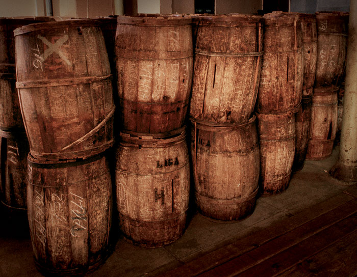 The final stage of fermentation is sometimes conducted in barrels.

##### Sorting and classification of Fillers and Binders

It is at this stage that theEmpresa de Acopio y Beneficio del Tabacobuys the filler and binder leaves from the farmer and assumes the responsibility for the next phase which takes place in theEscogidaor Sorting House, where the leaves are taken after the first fermentation in the curing barn.

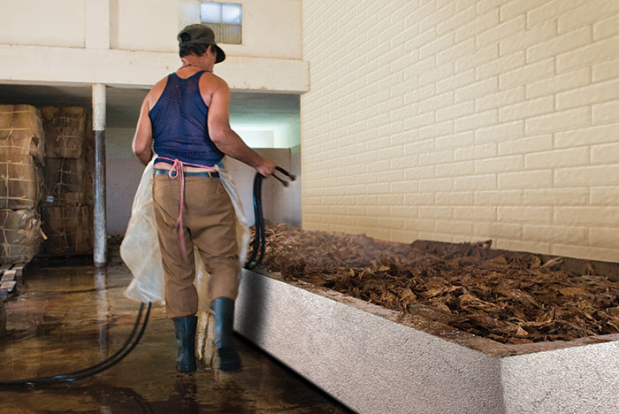 Pure water is now used for the moistening or moja at the Stripping House.

The leaves are first moistened and aired to make them easier to handle and less vulnerable to damage during the classification. Then they are sorted and grouped in the four essential categories of flavour or that will be combinedin the blends of filler for Habanos: , , and .Volado leaves are collected from the lowest part of the plant and have little strength. They are also referred to as 1 (Strength 1) and the biggest and best of them are classified as binder. Thesecoleaves are taken from the middle of the plant and are renowned for their aroma. They have medium strength (Fortaleza2).Ligeroandmedio tiempoleaves come from the top of the plant and are the strongest in flavour (Fortalezas 3 and 4).

After this strict process of selection that is essential to the Habano, only around half of all the leaves will make the grade and be classified asmedio tiempo, ligero, seco, voladoand binder that will finally be used to make Habanos.

##### Second and third fermentations of Fillers and Binders

Following classification into thetiemposorfortalezasthat will be used in the preparation of blends in the factories, the leaves continue their long process of refinement.

In a building called the or Stripping House where they have been taken from the Sorting House, themedio tiempo, ligeroandsecoleaves undergo a second fermentation (sometimes also known as the pre-stripping fermentation) inpilonesor piles for a period of 15 days. Thevoladoand binder leaves, which are thinner, are only aired at this stage.

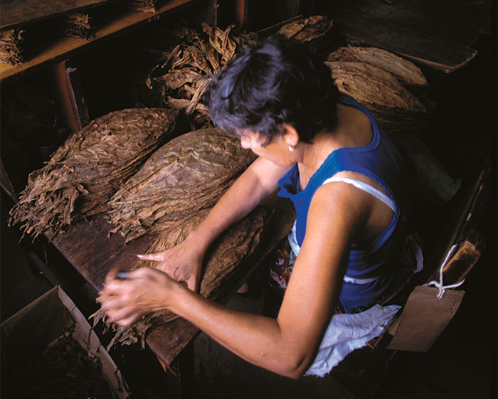 The Despalilladoras, literally strippers, wear a ring-like metal knife on their thumbs to help cut the central veins.

Next all the filler and binder leaves are moistened in preparation for the tasks of stripping and pressing. The sure fingers of the stripout the lower portion of the central vein in each leaf of filler or binder. Then the leaves are stacked in small piles and pressed between boards.

  Stacking filler leaves in piles known as "burros".

Subsequently, all the leaves undergo another fermentation. This will be the second fermentation forvoladoand binder leaves, and the third formedio tiempo, ligeroandsecoleaves. The amount of time taken depends strictly upon the type of tobacco being 15 to 25 days forvoladoand binder, 45 to 60 days forsecoand around 90 days formedio tiempoandligero. For these fermentations the tobacco is stacked in piles known as burros covered in cloth, and the process is triggered by the water content retained in the leaf after the moistening that took place before the stripping.

The temperature during fermentation must be watched with great care. When it gets too hot, the pile is broken up, the leaves are allowed to cool down and the stack is rebuilt the other way round (bottom leaves to the top, top leaves to the bottom). This may happen several times in the course of the fermentation.

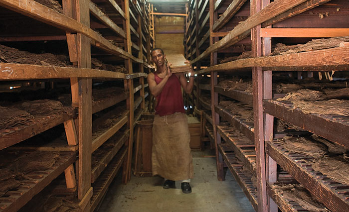 Airing filler leaves on racks after the final fermentation.

##### Baling and ageing of Fillers and Binders

After this last fermentation, the leaves are aired on racks for a few days, then packed and transferred to the warehouse for the final patient process of ageing.

The fullest-flavoured leaves (ligeroandmedio tiempo) are aged the longest – for a minimum of two years. Meanwhile the lightest-flavoured leaf is aged the least. Like a fine wine, the longer the leaf is left to mature, the better it will be.

Filler and binder leaves are packed in hessian bales calledpacas. Each bale carries a label with all the information about the leaf it contains including its size, the year of harvest and the date of packing. In addition the labels on pacas indicate the leaf'stiempoorfortalezaas well as both the and the where the binders and fillers were processed.

Pacas containing filler and binder leaves before their departure to the warehouse.

The labels indicate the specific local character of the leaf which is the key to the distinctive blending of each of the sizes in all the Habano brands. It will allow for the creation of the blends that will be put into practice by the – Master Blender – in each of the factories in Cuba.

")

## Totally hand made long filler

Time has done its work, and the leaf is ready at last to play its part in the making of a Habano.

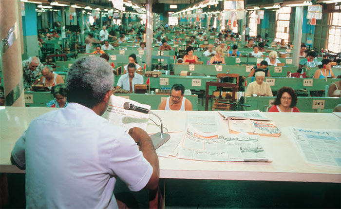 The heart of any factory for hand made cigars is the 'galera', literally the 'galley', or workshop. Since 1865 Torcedores (cigar rollers) have been read to whilst they work by a 'Lector' or Reader.

The following pages describe an extraordinary craft that has changed little in 200 years.

##### Variations in the method of making

1. Totalmente a Mano Tripa Larga – Totally hand-made, long filler –

   All but a small number of Habanos are made totally by hand with a filler composed of full length tobacco leaves.

   According to the standards laid down by the , these are "totally hand-made, long filler" Habanos, made with fillers and binders harvested leaf by leaf only in  – first class fields – situated in .

2. Totalmente a Mano Tripa Corta – Totally hand-made, short filler–

   Some others are also made totally by hand, but using filler that is partly composed of shorter sections of leaf. These are the "totally hand made, short filler" Habanos. They can be made with filler and binder leaves from any tobacco region of Cuba protected as Denominations of Origin.

##### Preparing the wrapper leaves

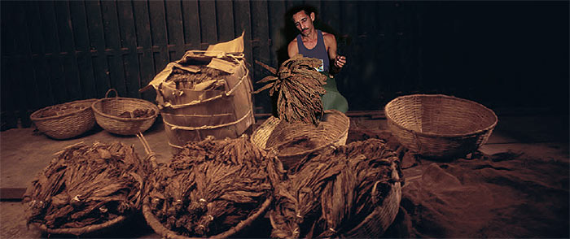 1. Precious wrappers are carefully removed from their bales and separated, a process called zafado.

The wrapper leaves are now aged and it is time for their final sorting and classification. They must also be stripped of their stems.

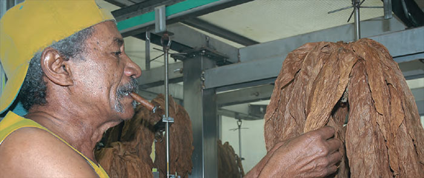 2. The moistening or 'moja' of wrappers under a fine spray in electronically controlled moistening cubicles.

A moistening, or , brings them to the supple condition required for stripping and sorting, and their final purpose of wrapping a cigar.

The  or bunches of 40 to 50 leaves are held under a fine spray of pure water. Excess droplets are then shaken off with practised flourishes to avoid any staining, and the leaves are hung on racks so the moisture is absorbed evenly. Electronically controlled moistening cubicles, have been installed in some of the leading factories to perform this task.

Next the hands of highly skilled men and women perform the despalillo (stripping) and the rezagado (grading). One movement deftly removes the entire central vein of the leaf leaving its two halves ready to be graded into some 20 finely distinguished sizes and shades.

 3. Removing the central veins from the wrapper leaves and grading them by size and colour.

In the past, these tasks were performed only by women. Working from piles of leaves on their laps thus lent weight to the popular myth that Habanos are rolled on maidens' thighs.

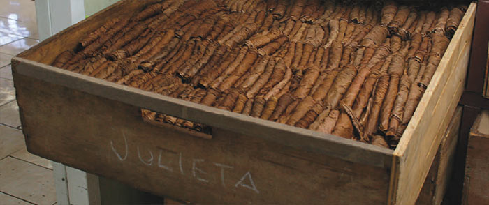 4. Stripped and graded wrappers are stored in batches selected for the sizes they will dress.

##### Preparing the filler and binder leaves

Filler and binder leaves are carefully removed from their bales for examination.

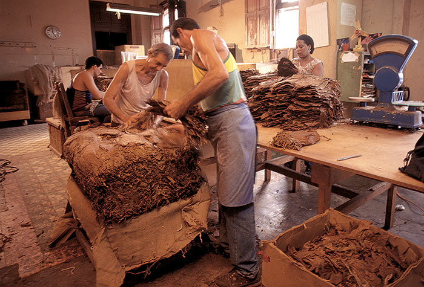

If necessary they are aired on racks to attain the required moisture level, or alternatively they are taken to the drying room where excess moisture is removed. Then they are placed in wooden containers for between one and three days until they are judged to be ready.

##### Composing the blend

The task of selecting the blends for each brand according to its own recipe starts well before the bales reach the factory.

The blend for each size within each brand is specified and monitored by the Tobacco Research Institute together with Habanos s.a. as part of the Regulatory Council to ensure that the quality and taste characteristics of each cigar are respected. The task of the  – Master Blender – in each factory is to make certain that the prescribe.

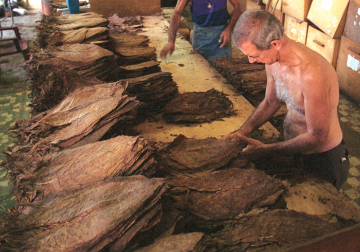

It is a remarkable feature of Cuban tobacco that such a small acreage of  can produce such a wide variety of flavours from area to area. Literally the tobacco grown on one side of a road in the  can taste completely different from the tobacco grown on the other side.

There is an established link between the factory and the areas that supply the leaf for the brands it manufactures. Nevertheless it is the Master Blender's responsibility to sample the flavour of the tobaccos in use from day to day. He carries the recipe for each brand and size in his head and is the guardian of their consistency.

In accordance with the Tobacco Research Institute guidelines, the ratio of each type of leaf that the Master Blender specifies for the cigars in production is assembled by the blending department in batches and issued to the cigar rollers for the day's work.

They call the blending department – literally 'the pack of cards' – because the process of assembling the leaves for a blend is similar to shuffling cards.

Finally, three years or more since the oldest leaf was picked, it is now about to become a Habano…

")

## The craft of the Torcedor

Habanos are made Totalmente a Mano –Totally by hand – as they have always been, by the Torcedores and Torcedoras, whose practised hands no machine can ever match

### This is how they do it

For tools they have only a wooden board (), two cutters (the flat-bladed – – and the little disc-cutting – –), a guillotine, a pot of colourless and flavourless natural vegetable gum (), a template to check length and girth (cepo), and the skill of their fingers.

[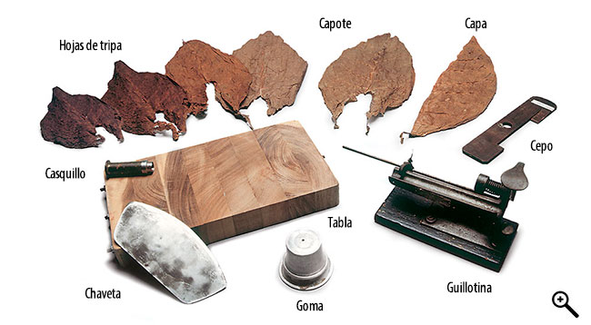](https://www.habanos.com/wp-content/uploads/toolsxl-en.jpg)

There are four grades of Torcedor and only the top grade is allowed to make the biggest, most complicated Habanos.

It takes natural talent to reach the peak of this time-honoured craft, but one thing at least has changed. Most Torcedores these days are women (Torcedoras).

By tradition, a Lector – reader – reads to the Torcedores as they work, from the daily newspaper and from novels selected by popular vote.

Es tradición que un Lector acompañe con su lectura a los Torcedores en su trabajo, bien sea leyendo el periódico o bien novelas escogidas por elección popular.

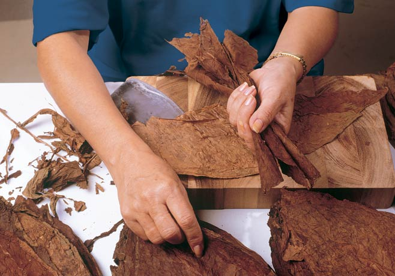

First the Torcedora lays out the two or sometimes three half leaves that form the binder, placed so that the veined undersides of the leaves will face inwards when the cigar is formed.

Next she gathers together the leaves of the filler, folding and aligning each leaf to ensure a straight passage for smoke in the finished Habano. All leaves are placed with their lighter-flavoured tips towards what will be the foot (the lit end) of the cigar so that the flavour will intensify as it is smoked. The stronger-flavoured, slower-burning and  leaves are always placed at the centre.

Now the Torcedora forms the  or bunch by rolling the filler into the binder to the precise diameter required for that particular Habano. Rolling starts at what will become the foot of the cigar. Compression of the filler must be consistent at all points. The word torcedor translates as 'twister', but this is precisely what the torcedor must not do at this stage. The head (the mouth end) of the bunch is then cut square with the guillotine.

The Torcedora makes her bunches in batches and presses them for 30 minutes or more in a wooden mould to set their shape.

Next the Torcedora prepares the half leaf for the wrapper, still moist so that it will form perfectly to the shape of the bunch. She lays it on the board with its most veined side facing upward, leaving its smoothest side to be visible on the outside of the cigar.

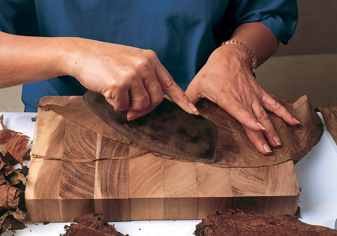

She lightly trims the leaf with the chaveta blade, paying special attention to the edge that will be seen on the finished Habano.

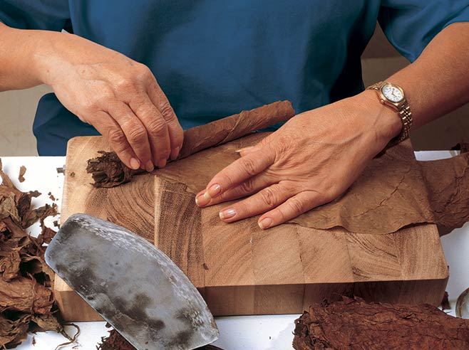

The bunch is laid on the wrapper and rolled, starting at the cigar's foot with the tip of the wrapper leaf. Sensitive fingertips carefully stretch and straighten the leaf as the bunch takes up the wrapper. The tension in the leaf has to be perfect.

Next comes the 'cap'. First a section called the 'flag' is cut out from the spare wrapper leaf. It is then wound round the head to close off the open end and secure the wrapper.

To add the finishing touch, a small disc of wrapper is cut out with the casquillo and secured on the head with vegetable gum.

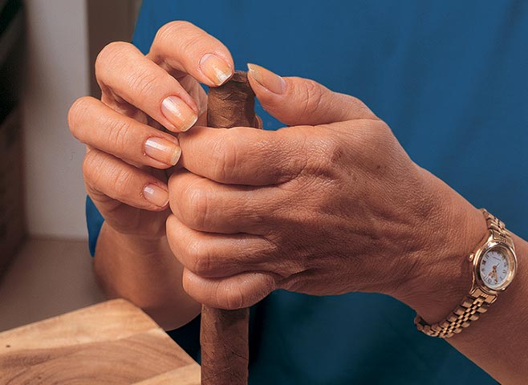

Finally the cigar is guillotined to length, and the work is complete.

In a day a good Torcedor can make between 60 and 150 Habanos in this fashion, depending on the size and complexity of the shape.

Video Resume

<http://www.archivohabanos.testwalking.com/booklet/videos/manufacture/07_torcedor_en.mp4>

## Other methods of manufacture

##### The "Totalmente a Mano, Tripa Corta" – totally by hand, short filler technique

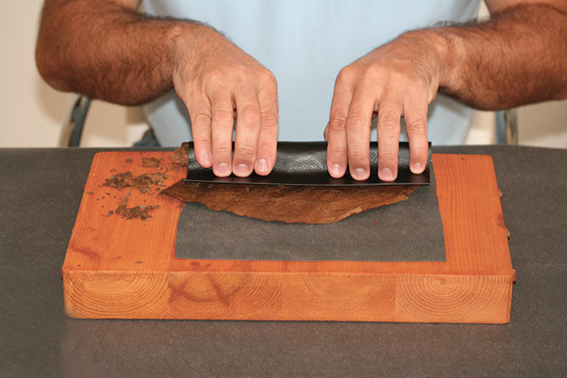

The trimmings from the bunches of long-filler cigars are combined with other selected chopped tobaccos to create the blends for short-filler Habanos. The Torcedor rolls the filler into full-length binder leaves with the aid of a flexible mat fixed to his bench to form a firm bunch. The wrapper is applied by hand in the normal fashion.

As the whole process is conducted by hand, these cigars too are Totalmente a Mano – totally made by hand.

Machine made cigars, "Tabaco Mecanizado"

Since the 1950's some cigars have been made in Cuba by machines.

At times in the past machine made cigars were also referred to as Habanos.

But now the Habanos title is awarded solely to cigars Totalmente a Mano – made totally by hand – in Cuba according to the procedures and quality controls laid down by the Regulatory Council for the Protected Denomination of Origin (D.O.P.). Habanos from tobaccos grown in the regions and zones that are also protected denominations of origin.

 Seal that identifies the boxes of machine-made cigars "tabaco mecanizado"produced in Cuba.Those are not Habanos.

## Checking the work

There are strict quality control tests at all stages of hand making. Cigars that fail will never become Habanos.

Everyday the Workshop Manager (El Jefe de Galera) supervises the work of the cigar rollers. At the same time supervisors, who are themselves top grade , oversee each brigade of 30 to 40 workers watching their technique and checking the dimensions of the cigars they are making.

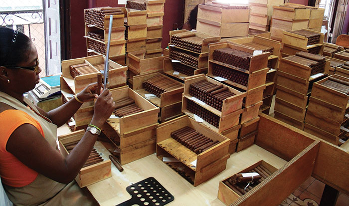

Supervisors examine the work of each Torcedor.

Finished cigars are placed in lidless, wooden boxes, open at the front like office out-trays, called  or cajuelas.

Each mini-rodero is labelled with the Torcedor's number, the vitola de galera and the date of manufacture. Afterwards the mini-roderos are placed inside larger wooden receptacles called roderos, which then go to the quality control department where technicians check the cigars for weight, length, girth, consistency, construction and appearance, particularly examining the tightness of the wrappers and the finish of the caps.

Samples of each Torcedor's work are regularly taken apart to verify their internal construction and blend. When problems are found the cigars are deducted from the daily quota – a serious matter for the Torcedores who are paid by piecework.

Amongst the latest quality control techniques there is a machine that checks the draw of the bunch by suction. The test takes place after the bunch has been pressed in the mould and before the wrapper is added. It was first introduced at the end of 2001 and is now used in every factory.

Testing the draw of the bunch by suction before the wrapper is added.

### Tasting the result

Every factory has its team of cigar tasters – the  – who meet every day to test cigars and score them according to a six-point quality checklist for draw, burn, aroma, flavour, strength and overall quality. 3-5 different cigars are tested at each sitting. If any deviation from the normal character of any brand and size is detected, they recommend adjustments to the blend.

The Catadores or tasters regularly smoke the work of each Torcedor in the factory.

The Catadores are the front line of the  – National Commission for Tasting –, which, as a part of the , is closely related to the Regulatory Council for the Protected Denomination of Origin (D.O.P.) Habanos. The latter is responsible for the consistency of the blends of all Habanos.

At any time, the Regulatory Council can make spot checks on any of the quality control procedures.

### Time to rest

Between making and packing, the cigars are taken to the conditioning room or Escaparate. Here in cedar-lined drawers, they are left to rest while they shed the excess moisture that was gained in the rolling process. After a week the cigars become smokeable but the longer they stay here the better. Conditions are strictly maintained at between 16 and 18°C and 65 to 70 percent relative humidity, noticeably cooler and drier than the ambient Cuban climate.

The Escaparate is often referred to as the "treasury". It is here that the true wealth of the factory is stored.

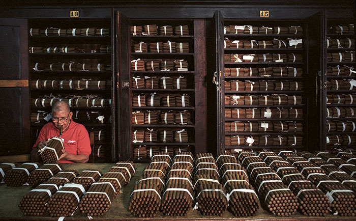

Formerly in the Escaparate Habanos were stored in bundles of 50 known as "medias ruedas" or "half wheels". Partagas Factory, Escaparate, 2000. La Habana, Cuba.

### Video

<http://www.archivohabanos.testwalking.com/booklet/videos/manufacture/08_control_en.mp4>

## Sorting the colours

No product on earth enjoys a more painstaking treatment in its presentation and packaging, starting with the perfect colour-matching of the wrappers.

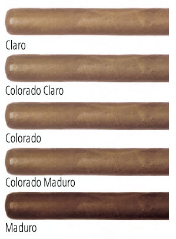

Wrappers come in many finely distinguished shades of colour, and great care is taken to ensure that all of the cigars in any one box are the exact same shade.

The colour of a Habano wrapper is purely natural in origin – no artificial process is used to force it. Leaves from the upper levels of the plant are naturally darker, and become darker still in the course of fermentation.

Among the most senior workers in the factory are the Escogedores – colour graders – who work in pairs to colour-match the wrappers in any box or bundle of Habanos.

One Escogedor sorts the cigars en masse, dividing them by colours and shades of each colour in a pattern of columns and rows that may well represent 60 or more finely distinguished shades.

Sorting each shade into tones of dark to light from left to right.

A second Escogedor then sorts the cigars within each shade, one box-full at a time, ordering them so that any slight differences in tone run dark to light from left to right across the box. The Escogedor also chooses which face of each Habano will face upwards in the box.

Selecting the face of each Habano for banding.

At any stage in these processes the Escogedores will reject any cigars that do not look good enough.

Video Resumen

<http://www.archivohabanos.testwalking.com/booklet/videos/manufacture/10_acabado_en.mp4>

## Applying the bands

Cigar bands were introduced in the 1860's by Don Gustavo Bock, a European who had arrived in Havana to make his fortune in cigars. Legend has it that the idea sprang from a desire to protect the white-gloved fingers of his more refined customers from staining.

Other explanations suggest that bands were introduced simply to differentiate between cigar brands and to make the production of fakes and imitations more difficult.

Whatever the true reason was, cigar bands grew to become the Habano's most potent popular symbol, prized by collectors and copied by every rival.

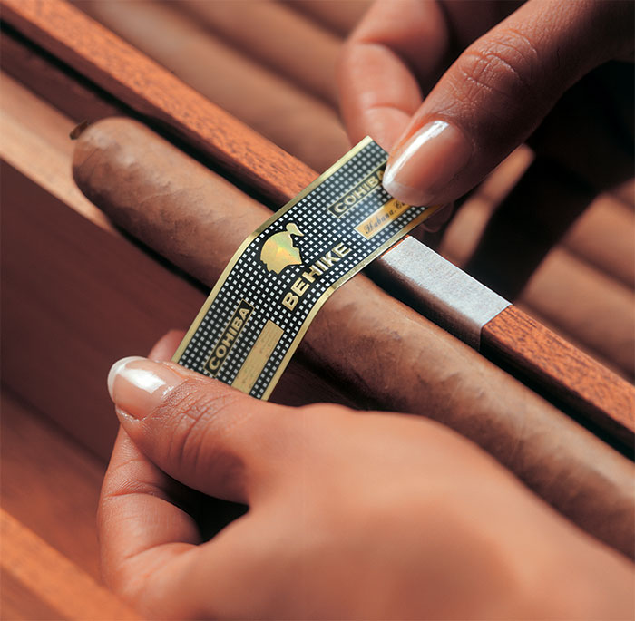

The Cohiba Behike band, which was the first in the world to incorporate two individual hologramsto help smokers identify the genuine product.

The Anilladora – or 'bander' – delicately applies a band to each Habano and places them in their part-dressed box, following the  arrangement in every detail: same face upwards with the band appropriately aligned, and the same order left to right.

[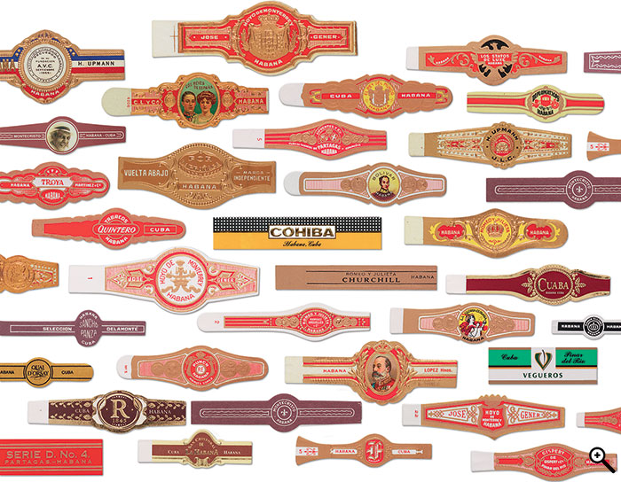](https://www.habanos.com/wp-content/uploads/anillado2xl.jpg)

Habanos bands from the past and present are highly collectable.

 |

## Dressing the box

Cuba was first to introduce the classic labelled cigar box in the mid-19th Century, and it remains the best known form of Habano packaging

The extravagant paper trimmings on the box are called habilitaciones, literally dressings. Each label has its own time-honoured name and all of them are applied by hand.

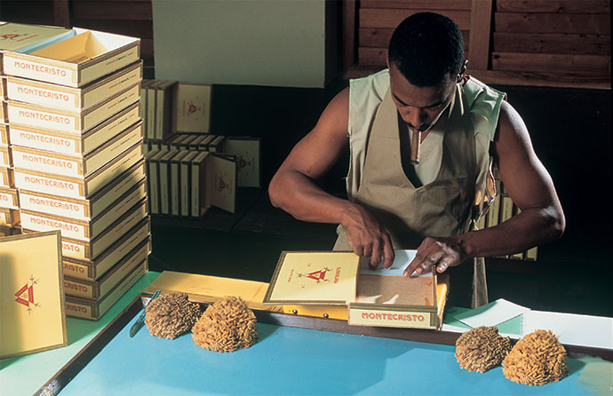

Some labels are applied before the box is filled, and some afterwards.

Just before the box is closed and sealed there is a final quality examination by the Revisadores or inspectors.

Expert eyes scour the contents to check the colour matching, the banding and, above all, the appearance of each and every Habano.

Any that fail the test are placed upside down and the whole box is returned to the Escogedor for correction.

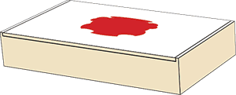

### LA CUBIERTA

The image on the top of the box, often reminiscent of the time when the names were literally branded onto the box with a hot iron. This is where the idea of a 'brand name' first came from.

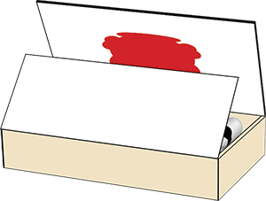

### LA VISTA

A romantic pictorial celebration of the brand, often with much gold and embossing. Vistas typically feature medals that the brand has won, the coats of arms of former royal patrons, historical images and notes about the brand.

### EL FILETE

The decorative strip that seals the the lid's hinge.

### LA PAPELETA

A rectangular or oval seal on the short side of the box.

### EL BOFETON

The protective leaf of paper inside the box, decorated to complement the Vista

### LA ANILLA

Cuba's term for the cigar band. The common term elsewhere is la vitola (hence 'vitolfilia' for cigar-band collecting) but this is a word with other meanings in Cuba. A particular size and shape of Habano is also a vitola.

### EL LARGUERO

The coloured strip on the long sides, often showing the brand.

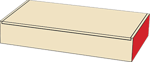

### EL COSTERO

The coloured strip on the short sides of the box, often showing the size name.

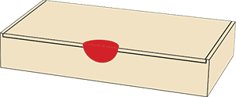

### EL TAPACLAVO

A seal fixed over the nail that secures the lid of some boxes.

## Marks of distinction

When you have a reputation like Habanos, it is no surprise that unscrupulous persons will try to pass off their product as yours.

Here are the authenticating marks that you should look for when buying Habanos. It's also important always to buy your cigars at authorised shops.

### The Cuban Government warranty seal

The warranty seal was first introduced in 1889 by Royal Decree of the King of Spain. Then in 1912 the independent Cuban Government passed a law authorising the use of a new design, which is similar to the one in use today. It was modified slightly in 1931 and more radically in 1999 with the addition of the red serial number and an emblem that is visible only under ultra-violet light.

[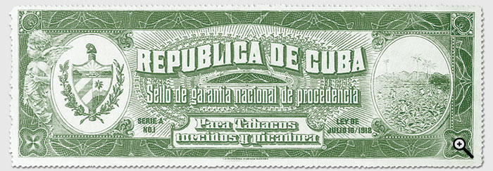](https://www.habanos.com/wp-content/uploads/billete1.jpg)

[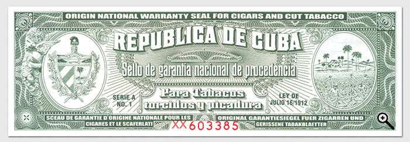](https://www.habanos.com/wp-content/uploads/billete3.jpg)

Most recently, in 2009, a new version was introduced with a hologram on each seal as well as an individual bar code that tracks every box of Habanos from production to each Habanos s.a. exclusive distributor anywhere in the world. The bar code allows you to find out if a box is genuine by using the Authenticity Check you will find on Habanos s.a.'s website at [www.habanos.testwalking.com](https://www.habanos.com/en/verificacion-de-autenticidad/ "Verificación de Autenticidad")

[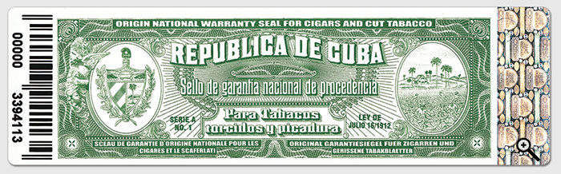](https://www.habanos.com/wp-content/uploads/billete2.jpg)

### Denomination of origin

Since 1994 all boxes have carried the Habanos seal as a mark of the cigars' denomination of origin. No box of Habanos is shipped from Cuba without it.

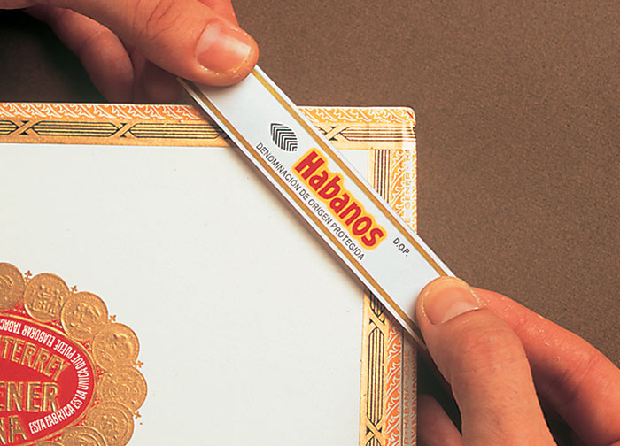

### Local importers' stamps

Individual countries or regions have their own certifying marks as an extra, local defence against counterfeiting. These marks are the responsibility of the local [exclusive distributors](https://www.habanos.com/en/donde-comprar-2/distribuidores/ "Distribuidores"). For more information about the stamp in the market where you are ask your local authorised [Habanos Specialist](https://www.habanos.com/en/donde-comprar-2/especialista-habanos/ "Especialista Habanos").

### On the bottom of the box

Since 1960, the bottoms of all Habano boxes have been hot-stamped with the words 'Hecho en Cuba'. Before that time, it was often written in English ('Made in Cuba'). Since 1994, the bottoms of the boxes have also been hot-stamped with 'Habanos s.a.', the name of the company that distributes Habanos worldwide. From 1985 to 1994, the name was 'Cubatabaco'. Nowadays they are marked as shown below:

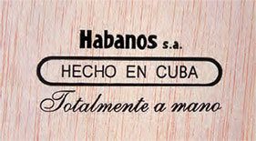

Totalmente a Mano – Tripa Larga
Since 1989 boxes of classic, Tripa Larga – long-filler – Habanos have been hot-stamped with the words Totalmente a Mano –Totally by hand'–.

Totalmente a Mano – Tripa Corta
Boxes of short-filler Habanos are also hot-stamped with the words Totalmente a Mano – Totally by hand – and since 2002 ink stamped with the letters TC (Tripa Corta – 'Short Filler').

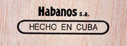

There are also some boxes of cigars that are inscribed only with "Habanos s.a." and "Hecho en Cuba" (Made in Cuba) omitting the words "Totalmente a mano" (Totally by hand).

These are machine made cigars which are not essentially covered by the Habanos Denomination of Origin (D.O.P). Most of them are covered by the "Cuba. Tabaco Mecanizado" Denomination of Origin (D.O.P.) for *machine made cigars*

### Factory code and box date

There are two ink-stamps on the bottoms of Habanos boxes. One is a secret code that tells the industry which factory made the cigars. The other is the month and year when they were boxed.

The dates are not in code and the year is simple enough. The system started in 2000 with '00', then '01' and so on. However, unless you know a little Spanish, the months may need deciphering.

They are:

1. ENE (Enero) January
2. FEB (Febrero) Frebruary
3. MAR (Marzo) March
4. ABR (Abril) April
5. MAY (Mayo) May
6. JUN (Junio) June
7. JUL (Julio) July
8. AGO (Agosto) Agost
9. SEP (Septiembre) September
10. OCT (Octubre) October
11. NOV (Noviembre) November
12. DIC (Diciembre) December

Habanos improve with age, so the date is important to connoisseurs.

*Note: Ink-stamps indicating the factory and date of manufacture were first introduced on Habanos boxes in 1985 but both were in code. If you want to check the date of a box between 1985 and 1999. Ask your authorised [Habanos Specialist](https://www.habanos.com/en/donde-comprar-2/especialista-habanos/ "Especialista Habanos").*

## Habanos Brands

Habanos, S.A. manages a wide portfolio of brands, many of them with a long history and others created in recent decades. The Habanos portfolio includes 27 brands, which cover a wide range of concepts, formats, flavors, positioning and, in general, characteristics to satisfy the tastes of Premium tobacco smokers from all over the world.

The 27 Habanos brands are protected by the D.O.P. Habanos, whose protection is ensured by the "Regulatory Council of the Protected Denomination of Origin Habanos and other Cuban Tobacco Companies" and whose distinctive seal has been included in all Habanos boxes since 1994.

Habanos, S.A. classifies its brands based on a series of factors, such as the breadth of its portfolio, distribution and presence in the markets and in specialized points of sale, or the focus on communication and product activation.

Following these and other criteria, Habanos brands are classified in Global Brands, where the 6 most relevant and well-known brands for the fan are located, which have the largest portfolio and variety of formats, a global distribution and presence in all points of sale. specialized sales; and the so-called Portfolio Brands. Within this category are the so-called High Value Brands, which are brands with a wide distribution, interesting portfolios and which are widely used in Habanos Specialties; the Volume Brands, which offer an excellent value-for-money proposition and the Rest of the Portfolio Brands, with a wide group of brands that cover different flavor, strength and price proposals and that, apart from the standard Habanos portfolio, they can be found in exclusive products for La Casa del Habano and Habanos Especialistas, as well as in the Regional Editions for exclusive territories.

[All Brands](https://www.habanos.com/en/the-world-of-the-habano/the-habanos-brands-academia/#todas) | [Global Brands](https://www.habanos.com/en/the-world-of-the-habano/the-habanos-brands-academia/#global) | [Portfolio Brands](https://www.habanos.com/en/the-world-of-the-habano/the-habanos-brands-academia/#portfolio)

#### All Brands

#### Global Brands

#### Portfolio Brands

**Brands Value**

**Brands Volume**

**Rest of brands**

### Cohiba

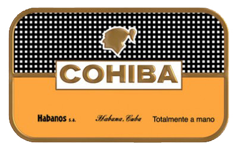

Cohiba is the most prestigious brand in the tobacco world and in 2016 it celebrated its 50th anniversary.
It was created in 1966 and for many years it was intended solely as a gift to government personalities, national and foreign, and of course to President Fidel Castro. Since then, it has been manufactured in the prestigious El Laguito factory in Havana.

Since 1982, the year in which it is presented in different countries, Cohiba has been available to be enjoyed by the world's most demanding smokers in limited quantities.

*Factory «El Laguito», in Havana.*

The name "Cohiba" is an old word used by the Taíno Indians, original inhabitants of the Island, to define the rolled tobacco leaves that these Indians smoked, and that Christopher Columbus saw for the first time in Cuba in 1492. Cohiba is for hence the first name of tobacco.

It is the most prestigious brand in the tobacco world, the elite of Habanos. The leaves used in its preparation are "the selection of the selection" of the best vegas of "San Juan y Martínez" and "San Luis", in the "Vuelta Abajo" area of the "Pinar del Río" region, Cuba.

All the Habanos of the Cohiba brand are made "Totalmente a mano".

Cohiba is the only Habanos brand in which two of the three types of leaves used to make it, dry and light, undergo additional fermentation. This special treatment gives Cohiba an unmistakable aroma and flavor, which cannot be found in any other brand.

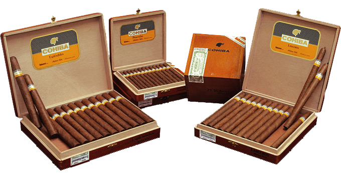

*Línea Clásica.*

Cohiba initially launched the Línea Clásica, developed between 1966 and 1989 with its characteristic medium to strong flavor; to which would be joined the Line 1492, with a medium flavor, which was launched in 1992 to commemorate the V Centenary of the arrival of Christopher Columbus on the Island; and later the Cohiba Maduro 5 Line, with a mature layer aged for five years through natural processes, which was launched in 2007 with three new vitolas.

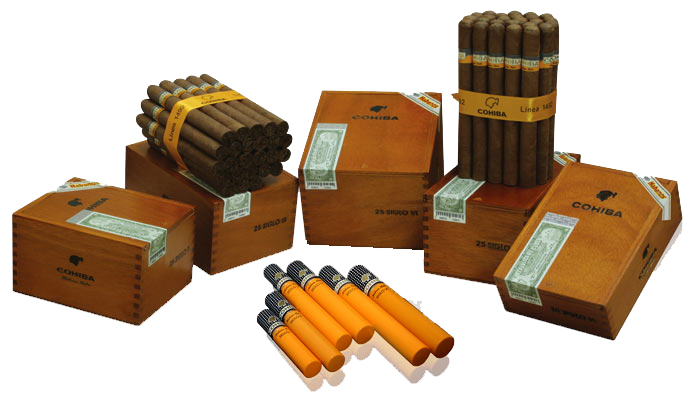

*Línea 1492.*

In 2009 the first Gran Reserva de Habanos was presented, under the Cohiba brand with the Siglo VI vitola, emphasizing the unique character of Habanos.

In 2010, the brand's portfolio was expanded with the launch of the new Cohiba Behike line, the most exclusive Habanos, S.A. has ever launched. For the first time, it incorporated Medio Tiempo in its blend, a leaf from the 2 upper leaves of the sun tobacco plant that gives it an exceptional character and flavor.

*Línea Maduro 5.*

In 2021, Cohiba turns 55 and has developed a broad portfolio and, in addition, has been present as a priority in the development of special products, which include products that are introduced to the market on a very limited and exclusive basis.

Cohiba, at 55, continues to be a brand in continuous renewal and innovation, always desired and attractive to current and future fans.

*Behike.*

Through this constant innovation, Cohiba is always the avant-garde brand that leads the trends in the world of Habano, being the first to introduce a Reserva in 2002, and a Gran Reserva in 2009, which were made with leaves of tobacco aged a minimum of 3 and 5 years respectively.
Cohiba, is synonymous with exclusivity, of the highest quality, but also of something beyond the senses, a unique experience for lovers of considered the best tobacco in the world.

*Cohiba Medio Siglo.*

*Cohiba Medio Siglo.*

**Strenght:**

- Línea Clásica: *Medium to Full*
- Línea 1492: *Medium*
- Línea Maduro 5: *Medium to Full*
- Línea Behike: *Full*

### Montecristo

Montecristo is one of the most recognized Habanos brands in the world. Montecristo could be considered to be the benchmark by which all other Habanos are measured.

Its name originates from the novel "The Count of Monte Cristo" by Alexander Dumas. The tobacco store reader read the novel to the Torcedores (cigar makers) at the H.Upmann factory in Havana, where the brand was founded in 1935. Such was the acceptance that it was decided to give the name of the novel's protagonist to the new brand.

Although initially it was composed by five unique vitolas, numbered from 1 to 5, the brand progressively completed an offer that currently covers the tastes of the most demanding smokers, from the majestic Montecristo A, to smaller formats.

*Línea Clásica*

Montecristo Edmundo and Petit Edmundo, were launched in 2004 and 2007 respectively, stood out among the latest launches of the brand.

*Montecristo Petit Edmundo*

With its distinguished aroma and its Long filler vitolas, made "Totalmente a mano" with leaves from "Vuelta Abajo" zone, it has captivated both experienced smokers and those new to the world of Habano.

In 2007, the Montecristo Reserva was presented, which has been aged for three years in all its leaves (wrapper, binder and filler) and paid tribute to the classic Montecristo No. 4, the best-selling Habano in the world.

In 2009, the Línea Montecristo Open was introduced, specially conceived to be enjoyed in open spaces, with four new vitolas: Eagle, Master, Regata and Junior.

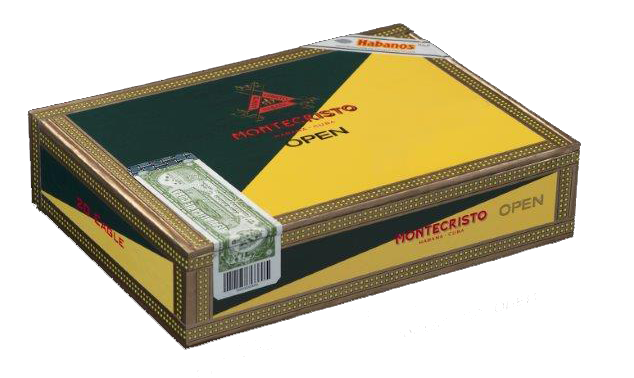 *Montecristo Open Eagle*

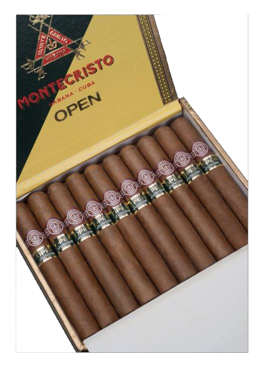 *Montecristo Open Junior*

 *Montecristo Open Regata*

In 2011, the Montecristo Gran Reserva Cosecha 2005 was presented, the first Gran Reserva made in Montecristo, in a format highly prestigious among smokers: Montecristo No. 2.

In 2013, the Double Edmundo vitolas and a new figurado, the Montecristo Petit No. 2, were launched.

In 2015 the brand saw the launch of its special 80th anniversary vitola and Montecristo Churchills Añejados, and in 2016, the brand presented its 2016 Limited Edition with the new Montecristo Dantés vitola. Later on, Montecristo Línea 1935 was launched with three new vitolas -Maltés, Dumas and Leyenda- which were incorporated into the brand's regular portfolio, becoming the most premium proposal of the Montecristo brand.

 *Montecristo Petit No.2*

Montecristo Herederos is the vitola selected by Habanos, S.A. in 2020 to commemorate the 85 years of the brand and the 30th anniversary of the La Casa del Habano franchise network. Herederos was presented to the market in a special case of 20 flat-format Habanos and they were exclusively sold At the La Casa del Habano and Habanos Specialists franchise network.

 *Montecristo Herederos*

**Strenght**

- *Medium to Full*
- Línea Open: *Medium*

### Romeo y Julieta

The name Romeo y Julieta, created as a Habanos brand in 1875, has its roots in the literary tragedy of the same name by the English writer William Shakespeare.
The brand achieved international renown in the early years of the 20th century, after Don "Pepín" Rodríguez, one of the first to recognize the importance of rings as a factor for success.

Winston Churchill was one of the brand's most devoted smokers. Since his visit to Havana in 1946, his name was used on some rings and gave name to the brand's best known vitola: Churchills of Romeo y Julieta.

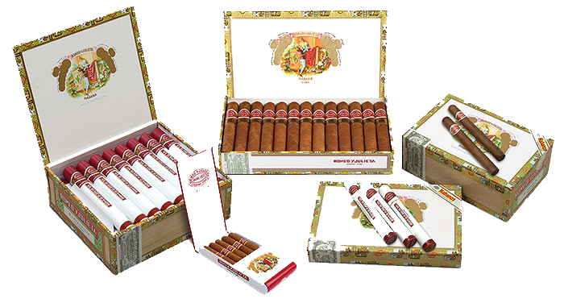

In 2006, Habanos, S.A. launched the younger brother of this emblematic vitola: Short Churchills, the Robustos of Romeo y Julieta.

Churchills is a mythical name in the Habano. Ever since Winston Churchill's visit to Cuba in 1946, numerous elements have reflected this personality's fondness for Habano in his rings.

First it was the Churchills, then the Short Churchills and, in 2010, two new vitolas of this famous brand were introduced: Wide Churchills, a new format that inaugurates the 55 ring gauge for the trend among lovers of thick ring gauge vitolas, and Julieta.

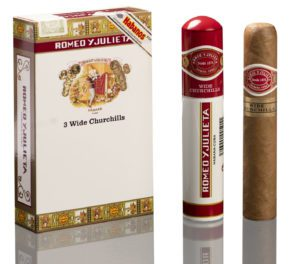

*Wide Churchills*

Its balanced and aromatic blend, with filler and binder leaves from the Vuelta Abajo area, in Pinar del Río region, makes Romeo y Julieta the classic medium-flavored Habano. Today, it enjoys great international prestige and presents one of the widest range of Habanos vitolas.

In 2012, the brand introduced 2 new products. A new vitola, Petit Churchills, ideal for those looking for a Habano with an aromatic and balanced flavor that can be enjoyed in a short period of time, and the new Reserva of Romeo y Julieta brand, with the vitola Churchills Reserva Cosecha 2008, made with cigars from the Vuelta Abajo zone, in the Pinar del Río region, aged for a minimum of 3 years.

*Romeo y Juleita Añejados*

In 2015 Romeo y Julieta Gran Reserva Cosecha 2009 and Julieta Pirámides Añejados were presented.

In 2017, the brand introduced the Romeo y Julieta Petit Royales and, in 2018, the Romeo y Julieta Tacos Limited Edition was launched.

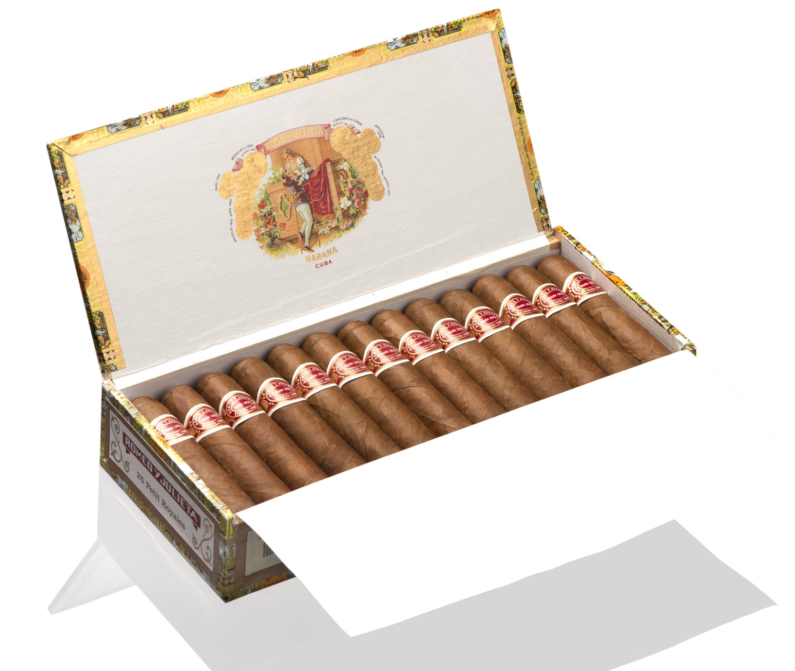

*Petit Royales*

Romeo y Julieta turned 145 years old and to commemorate its anniversary the new "Linea de Oro" was presented, the most exclusive and elegant of Romeo y Julieta. This new Linea consists of 3 new vitolas, two of them in an even format and one in a figurative format, they are new vitolas in the Romeo y Julieta portfolio and introduced, for the first time, a Medium to full strength.

***Dianas, Hidalgos y Nobles***, have been the vitolas chosen by Habanos, S.A. to make up this new Linea, which is presented to the market in a high- quality case, with a high gloss lacquered finish on sycamore wood dyed the brand's red. These Habanos also have a foot band designed exclusively for this linea.

**Strength**

- *Medium*
- Línea de Oro: *Medium to Full*

### Partagás

If there is a particularly famous Habanos factory in Havana, it is Partagás. For many years this Factory was located at 520 Industria Street, right behind the Havana's Capitol, in the heart of the city. Today, the Factory is located at 806 San Carlos Street.

The factory was created in 1845 by Don Jaime Partagás, and has been producing this prestigious Habanos brand ever since.

Partagás Habanos are immediately recognizable for their intense flavour. The character of its blend, made up of selected cigars from the Vuelta Abajo area, in the Pinar del Río region, is of inimitable richness and aroma.

The Partagás vitolario is characterized by a wide variety of shapes and sizes.

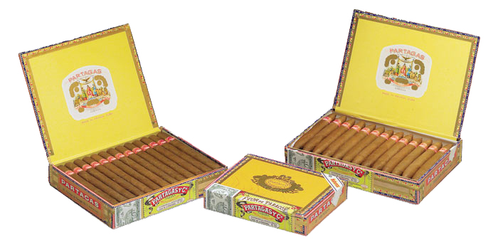

Particularly well- known are the Series D No. 4 vitolas, whose Reserva was the first made by Habanos in this concept, Lusitanias, 8-9-8 and the Partagás Pirámide: Series P No. 2, a pyramid that quickly became a Habano of choice for lovers of full flavor cigars, introduced in 2005.

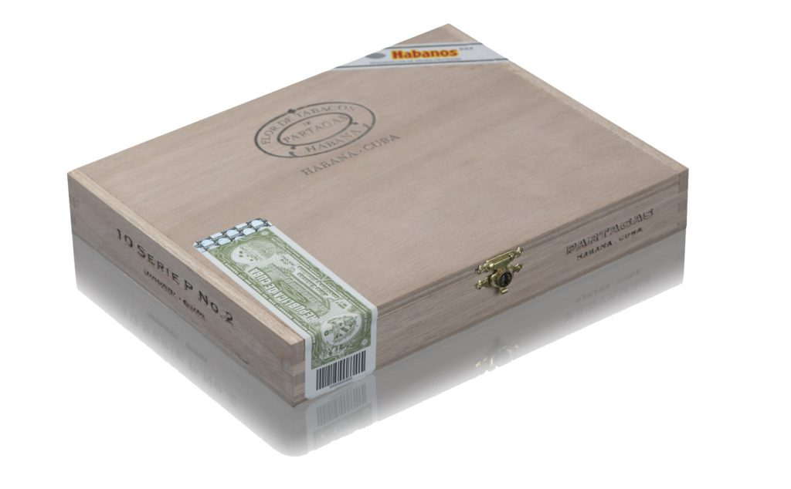

In 2008, the Partagás Series P No. 2 and Series D No. 4 tubes and cardboard boxes released a new image.

In 2011, 2 new vitolas, Series E No.2 and Series D No. 5 were presented, within the well-known Series.

In 2013, the first Gran Reserva in the brand's history, Lusitanias Gran Reserva Cosecha 2007 was introduced to satisfy the most experienced smokers looking for an intense flavor with character.

The Partagás Tropicales Humidor has been chosen by Habanos, S.A. to commemorate the celebration of the brand's 175th anniversary, being one of the most awaited novelties for demanding Habanos lovers.

Tropicales has been the vitola selected to make up this special humidor. The vitola is of an even elegant format, and with unique measurements within the brand's portfolio (54ring gauge x 175 mm length), ideal for those aficionados who appreciate large-format and long-lasting vitolas.

In 2014 the brand hosted the launch of Series D No. 6 and in 2015 the concept of aged cigars was inaugurated with two reference brands, Montecristo and Romeo y Julieta, followed by Partagás Coronas Gordas.

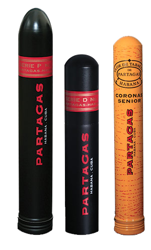

The Partagás Series No. 1 Limited Edition, launched in 2017, introduced for the first time the factory name Noblezas, totally new, in the Habanos portfolio.

In 2018, Partagás Línea Maduro No. 2 and Maduro No. 3 were launched. The Maduro No. 1 vitola was launched in 2015 for the La Casa del Habano network of specialized stores and which became part of the standard portfolio making up this new Línea.

In recent times, humidors have been the object of desire of aficionados, becoming more relevant each year. Partagás Tropicales Humidor 175 Aniversario, is a "Global Specialty" of which only a unique series of 450 numbered copies will be made, containing 50 Habanos each, becoming a precious collector's item.

**Strength**

- *Fuerte*

### Hoyo de Monterrey

Hoyo de Monterrey owes its origin to the plantation of the same name located in "San Juan y Martínez", in the heart of the "Vuelta Abajo" area. The Hoyo de Monterrey plantation, one of the most famous, has an inscription on the entrance door that reads: "Hoyo de Monterrey. José Gener. 1860". Hoyo de Monterrey is located in one of the fertile lands on the banks of the river that runs through "San Juan y Martínez".

All of the brand's vitolas are made "Totally Handmade with Long filler" with leaves coming from the region of "Pinar del Río", in the "Vuelta Abajo" area.

Vitolas such as Double Coronas and Serie Le Hoyo stand out in the brand, thanks to their slim and medium-ring gauge formats. Special mention should be made of Petit Robustos, a 102-mm-long 50-gauge format that was added to Hoyo de Monterrey's portfolio in 2004 and is especially aimed at those smokers who are looking for a high-quality Habano and do not have much time to enjoy it.

In 2008, the Epicure Especial vitola was introduced, joining the brand's standard portfolio after its success as Edición Limitada in 2004, and together with Epicure No. 1 and Epicure No. 2, it constitutes a Línea with a differentiated presentation.

In 2014, Le Hoyo de San Juan was launched, a new vitola that has revitalized and renewed the historic Le Hoyo Series.

In 2016, the brand introduced its Reserva Cosecha 2012 Epicure No. 2 and in 2018, it presented with a special edition for the La Casa del Habano franchise network. Also the same year, Le Hoyo de Rio Seco, the new thick-gauge vitola in the Le Hoyo series, was launched.

Last year's Hoyo de Monterrey Double Coronas Gran Reserva Cosecha 2013 was the Festival's main launch, being the brand's first Gran Reserva in its iconic Double Coronas vitola.

The light flavour of its blend makes it an attractive option for those who like a lower-strength, delicate and aromatic Habano with great elegance and complexity.

Primaveras under Hoyo de Monterrey brand was the new vitola selected by Habanos, S.A. in 2021 to celebrate the spring festival of the Chinese lunar year, the "Year of the Ox".

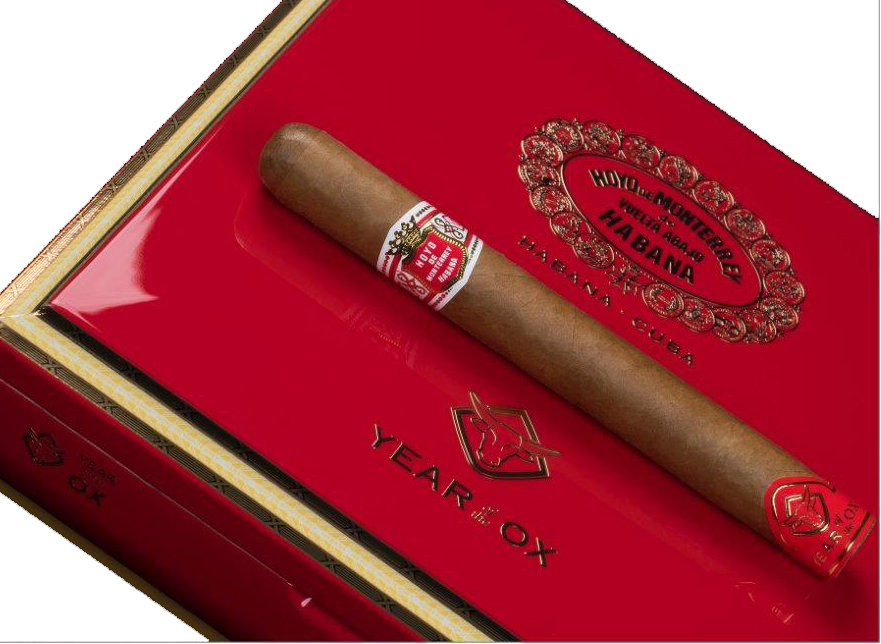

Primaveras of Hoyo de Monterrey is a limited-quantity production to commemorate this celebration in China, available worldwide. This vitola is presented in a special box of 18 Habanos made "Totally Handmade with Long Filler ", after a careful selection of the wrapper, filler and binder leaves from the most prestigious area, "Vuelta Abajo", in the "Pinar del Río" region, Cuba.

Its medium strength is another distinctive feature of this release that will delight the most experienced smokers of what is considered the best tobacco in the world.

**Strength**

- *Light*

### H. Upmann

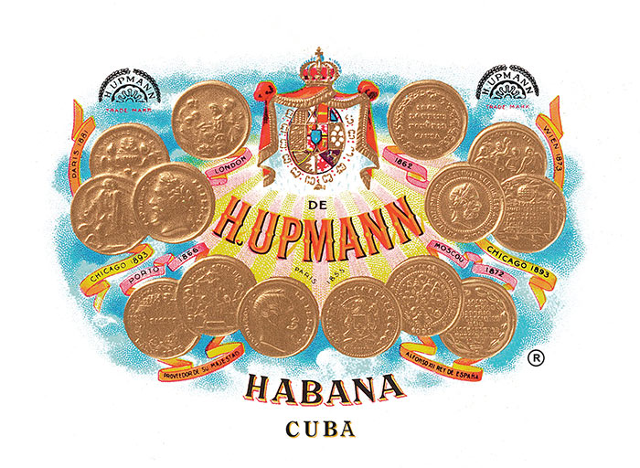

Herman Upmann was a German banker whose love for Habanos led him to settle in Havana in 1844 and found a bank and a Habanos factory in this city.

Over time, the bank closed, but his brand of cigars persists today as an example of the most refined Habanos medium strength flavour Habanos. The H. Upmann blend, with a light to medium strength, is obtained from leaves coming from the Vuelta Abajo zone, in the Pinar del Río region. All its vitolas are made "Totalmente a Mano con Tripa Larga "– Totally handmade with Long Filler.

The gold medals adorning the H. Upmann box were obtained in no less than eleven international fairs throughout the nineteenth century, as a reward for the brand's quality and inimitable aroma.

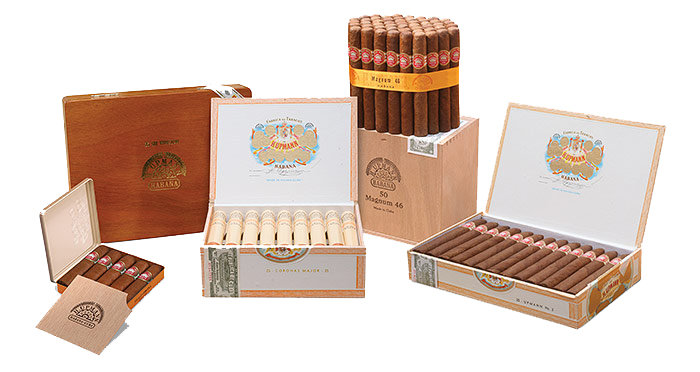

In 2008, the Magnum 50 was presented, a vitola that forms a Linea of its own together with the Magnum 46. This Linea has a differentiated presentation within the brand.

The vitola Half Corona was presented in 2011, specially designed for those who want to enjoy the full flavour of the Habano in a short smoke, or those who want to get closer to the Habano through the aromatic and balanced flavour of H. Upmann .

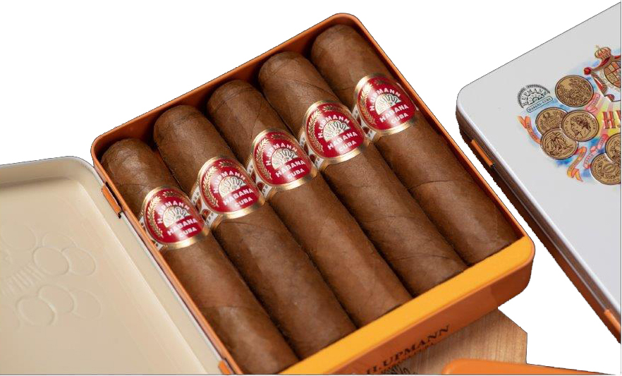
*H-Upmann Half Corona*

The first Reserva of the brand was presented in 2014: Upmann No. 2 Reserva Cosecha 2010.

*H-Upmann No. 2 Reserva*

The brand presented an important novelty in its regular line in 2016, with the launch of the H. Upmann Magnum 54 and the first Gran Reserva of the brand was presented in 2017: H. Upmann Sir Winston Gran Reserva Cosecha 2011.

The last Edición Limitada- Limited edition for the brand was presented in 2018 with the vitola H. Upmann Propios, a unique vitola within the medium ring gauge Habanos vitolas.

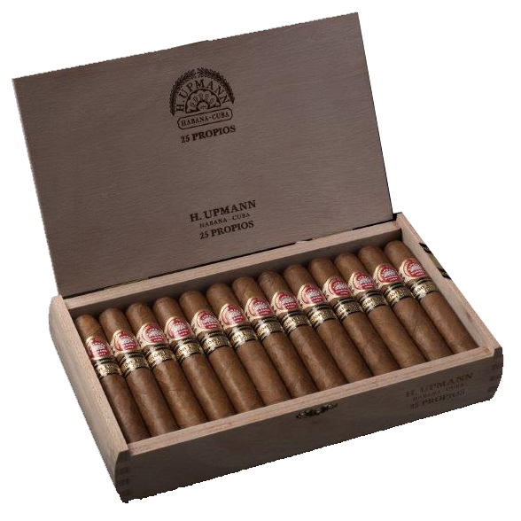
*H-Upmann Propios*

The brand launched the H. Upmann Magnum 56 Jar in 2019, an exclusive product for the Duty Free and Travel Retail channels that contains 20 units of the Magnum 56 vitola (56 ring gauge x 150 mm length).

*Jarra H-Upmann Magnum 56*

Colección Habanos continues to be one of the year's special launches most eagerly anticipated by faithful aficionados of the finest tobacco in the world.
This Colección Habanos H. Upmann is a benchmarks within the most refined Habanos with a smooth to medium strength flavour.

This Colección includes 20 H. Upmann SUPER MAGNUM, of which a production of 3,000 has been produced to satisfy a greater number of consumers and collectors. This production will be available at the international network of stores under La Casa del Habano franchise. For the first time, Habanos, S.A. incorporates an exclusive identifying second ring at the bottom for the collections.

SUPER MAGNUM (56 ring gauge x 180 mm length) is the parejo vitola with the heaviest ring gauge under the brand's standard portfolio. This ring gauge had only been used for the 2015 H. Upmann Magnum 56 Limited Edition. Línea Mágnum is characterized by its elegant, nuanced blend with smooth to medium strength flavour.

H. Upmann SUPER MAGNUM are made "Totalmente a mano con tripa larga" – "Totally Handmade with Long Filler" and their leaves are specially selected from the Vuelta Abajo area in Pinar del Río, Cuba, in small quantities. They are made by expert Cuban torcedores – cigar rollers – working painstakingly to meet the expectations of the most demanding Habanos aficionados.

*Colección H-Upmann*

*Some other new vitolas have been incorporated in the brand's portfolio.*

**Strength**

- *Medium to Light*

### José L. Piedra

José L. Piedra is a particularly noteworthy Habano not only because its blend is composed of filler tobaccos grown exclusively in the Remedios tobacco region, but also because it is made using the Totalmente a Mano, Tripa Corta, or "totally hand made, short filler" technique.
The Piedra family came to Cuba in the 1880's from the Spanish province of Asturias.

They settled near the town of Santa Clara, which lies at the heart of the Remedios region where tobacco has been grown since the 16th Century, and started to make cigars.

The family's second generation led by José Lamadrid Piedra, whose name is commemorated today, founded and developed the brand.

All seven of the José L. Piedra sizes are made from Remedios tobaccos using the traditional Tripa Corta,Totalmente a Mano – short filler, totally hand made – technique with a blend that provides a medium to full flavour.

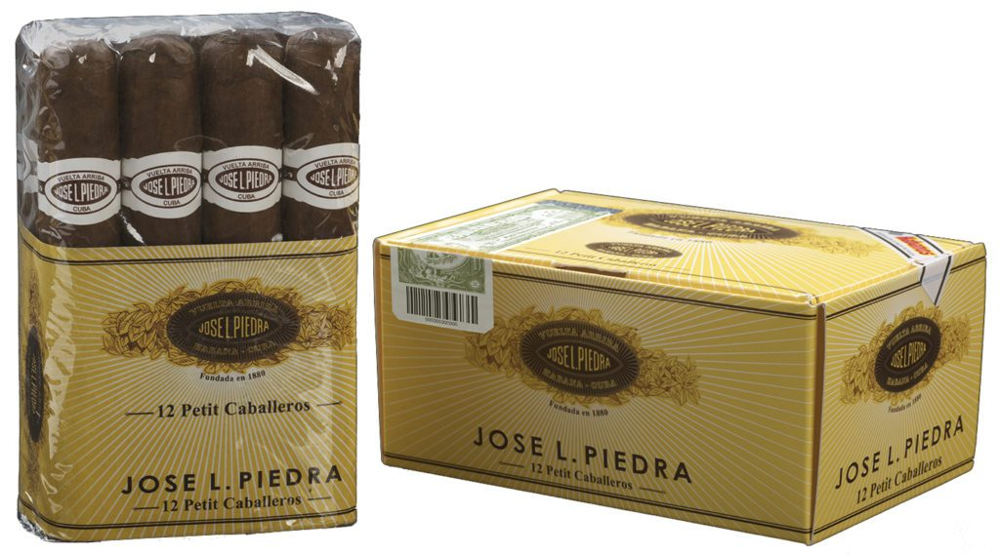

The José L. Piedra brand is presented to the market with a new, renewed and more modern image. In the particular case of José L. Piedra Petit Caballeros, it is already appreciated with the new image, the deck of 12 units and the display of 15 units with petanque of 3 Habanos each.

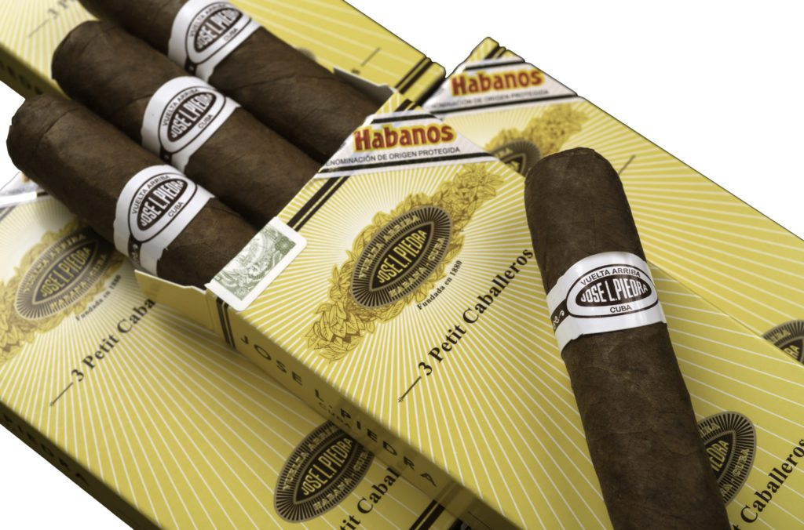

**Strength**

- *Medium to Full*

### Cuaba

The Cuaba brand is characterized by having Habanos with very distinctive shape known as *Double figurados*.

This brand recreates at the end of the 19th the style for Double Figurados Habanos became fashionable. A century later, in 1996, this traditional style was revived at the Romeo y Julieta factory.

Double Figurados, are at the pinnacle of the cigar maker's art, and for this alone they merit a place in every cigar enthusiast's collection.

At the start Cuaba offered just comparatively small sizes. Divinos, Tradicionales, Generosos and Exclusivos. Since 2003, three much larger vitolas, Distinguido, Diadema and Salomon, have been released as part of the standard range.

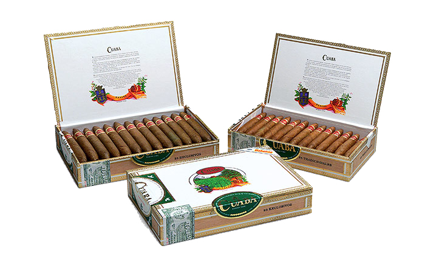

Cuaba is an Indian word dating back to the time of Christopher Columbus when he arrived to Cuba, it was the name for a highly combustible bush, and was used to light cigars during religious ceremonies.

All Habanos are made "Totalmente a Mano con Tripa Larga "- Totally handmade with Long Filler, with wrapper filler leaves coming from the Vuelta Abajo zone, in the Pinar del Rio region, Cuba.

**Stregnth**

- *Medium to Full*

### San Cristóbal de La Habana

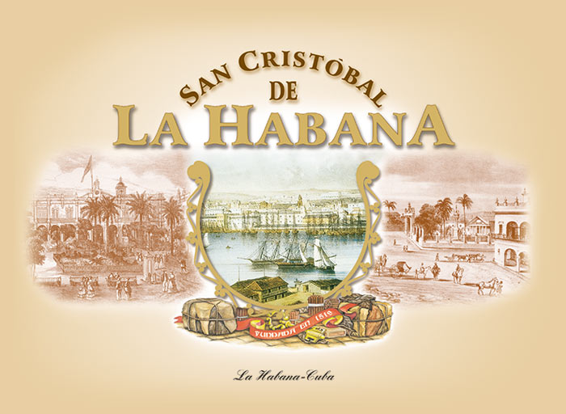

The original name of the San Cristóbal de la Habana brand was the name given to the city of Havana in 1519. This brand was launched in 1999 as a tribute to the city's long history at the dawn of the new millennium.

The brand placed on the market for the first time with a range of four vitolas, whose names correspond to the fortresses located in the city, built between the 16th and 18th centuries by the Spaniards to defend the city from possible aggressions: El Morro, La Fuerza, La Punta and El Príncipe.

El Morro and La Fuerza correspond to factory sizes that are only present in this brand.

In 2004, the brand's chart size was expanded with Mercaderes, Oficios and Murallas, which are the names of well-known streets in the historic center of the city, Old Havana.

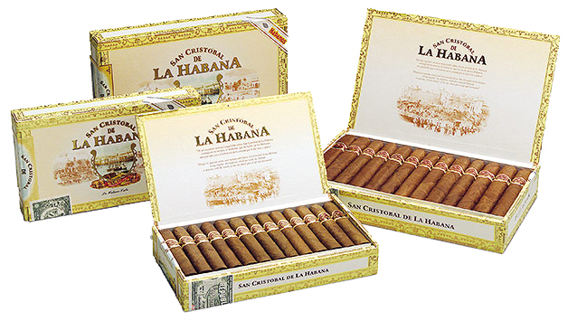

All the vitolas are made "Totally by Hand with Tripa Larga", with tripa leaves and capote from the Vuelta Abajo area. They are characterized by a mild to medium-flavored blend. All the Habanos of the brand are made "Totalmente a Mano con Tripa Larga"- Totally handmade with Long Filler, with wrapper and filler leaves coming from the Vuelta Abajo zone. They are characterized by having a light to medium flavour blend.

Every year, Habanos, S.A. offers innovative and exclusive productions for its specialized retail channels, especially for the international network of La Casa del Habano under franchise stores and for retail establishments certified as Habanos Specialists.

The San Cristobal brand is one of the brands where its products are designed exclusively for this network of specialized stores under La Casa de Habano franchise.

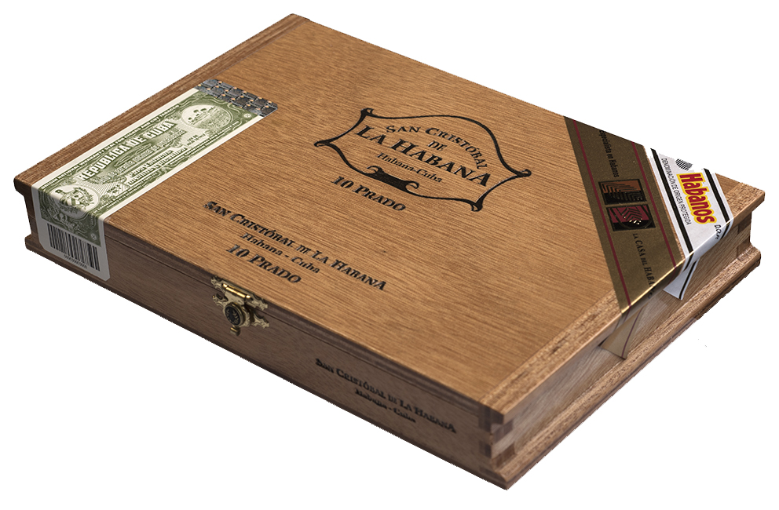

San Cristóbal de la Habana Prado Edición Limitada

In 2019, the brand celebrated its 20th anniversary within the framework of the Havana 500 and launched the San Cristóbal de La Habana 20 Aniversario (52 ring gauge x 162 mm length).

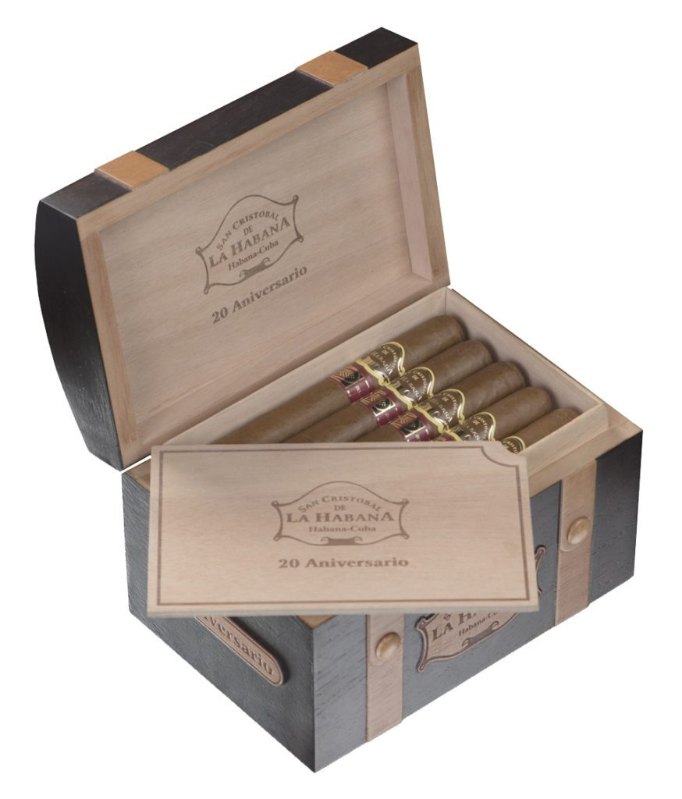

San Cristóbal de la Habana 20 aniversario

This launch was presented in a specially designed box for the network of specialized stores under the La Casa del Habano franchise.

San Cristóbal de La Habana 20 Aniversario Habanoss are made "Totally Handmade with Long Filler" with selected leaves coming from the Vuelta Abajo zone, in the Pinar del Río region, Cuba, by expert Cuban cigar rollers.

**Strength:**

- *Light to Medium*

### Trinidad

Trinidad is named as a tribute to the Santísima Trinidad city raised during the 16th century, and listed by UNESCO as a World Heritage Site, which is located on the southern coast of Cuba.

Trinidad, as a Habano brand, dates back to 1969, and for many years, like the Cohiba brand, it was only used for gifts to foreign diplomats.

It was in 1998 when this brand was available to smokers for general sale and then only in very limited quantities.

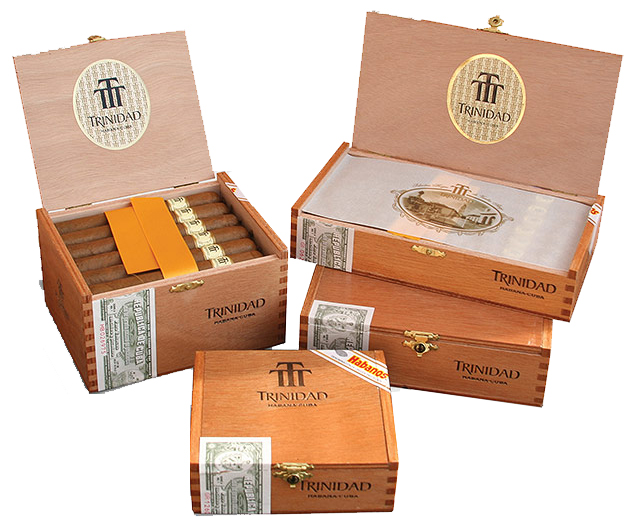

At the start there was only one size of Trinidad: **Fundadores**. In 2003 three more sizes the **Reyes**, **Coloniales** and **Robustos Extra** were added to the range. A new image of the brand was also introduced, more modern and consistent with the extraordinary quality of its Habanos.

For several years Trinidad was made at El Laguito, the historic Cohiba factory, where its uniquely fragant and aromatic, medium flavoured blend of filler and binder leaves coming from the Vuelta Abajo zone, which make them unique and very exclusive.

Today Trinidad is made in Pinar del Río, the most important city of Vuelta Abajo.

In 2009 the **Trinidad Robustos T** was introduced to complete the brand's range.

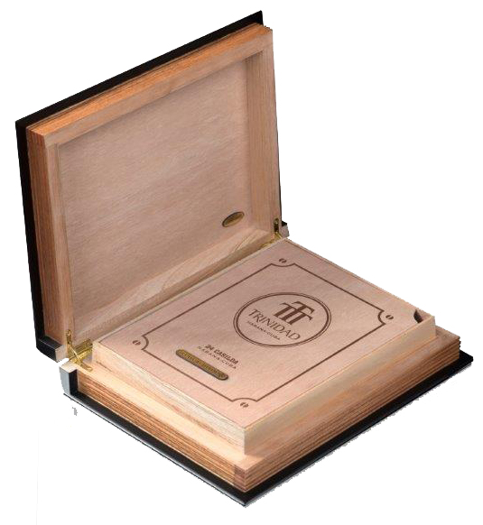

Three new brand launches were added to the regular Habanos portfolio in 2019. Of the three vitolas, two of them are unpublished. These are **Esmeralda** (ring gauge 53 x 145 mm long) and **Media Luna** (ring gauge 50 x 115 mm long), while **Topes** (ring gauge 56 x 125 mm long) had already been launched as a Limited Edition in 2016 and with very good reception. Now, Topes incorporates ring gauge 56 for the first time in the brand's regular portfolio.

All Habanos are made "Totalmente a mano con Tripa Larga"- Totally Handmade with Long Filler.

**Strength**

- *Medium*

### Bolivar

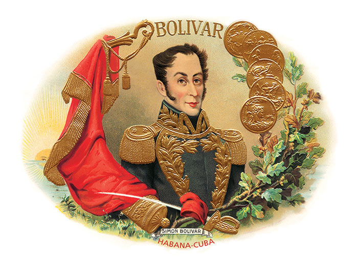

Simón Bolívar is one of the great figures of the 19th century. He has gone down in history as the Liberator of a large part of South America from Spanish rule.

The Bolívar brand was created in 1902. Today it is based at the Partagás factory in downtown Havana.

In keeping with the character of the historical figure after whom it is named, this Habano is characterized by the strong personality of its flavour. Bolivar is one of Habanos' strongest and most flavour brands. The blend composed of filler and wrapper leaves coming from the Vuelta Abajo zone  is especially appreciated by expert smokers.

The Bolívar brand has spread its chart size and presentations: in 2018 was launched its limited edition **Bolívar Soberano (54 x 140 mm length)**, which for the first time featured the Duke Factory size, totally unprecedented in the brand's portfolio.

With this Habano, aficionados can enjoy the brand's balanced and aromatic blend in a completely new format. Its most recent release was **Bolívar Regentes** (52 x 130 mm length) 2021 Limited Edition.

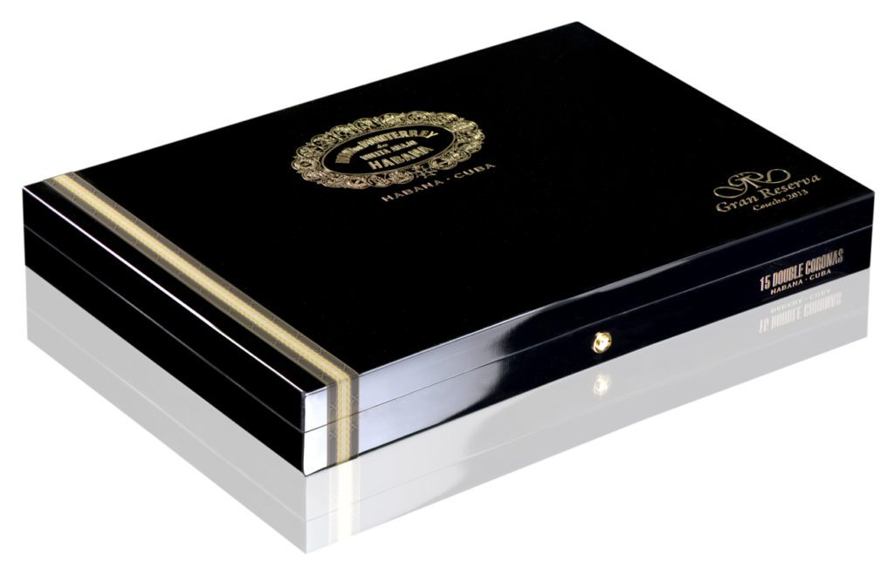

All  Habanos  are made "Totalmente a mano con tripa larga" – *Totally  hand**made with long filler.* It is a favorite brand  among Habanos enthusiasts of full flavour Habanos.

**Strength**

- *Full*

### Fonseca

Don Francisco Fonseca founded his brand in the last decade of the 19th century.

It is said that Don Francisco was an elegant person whose concern for appearance was transferred to the Habanos brand he created: presenting his Habanos in an original tissue paper that wraps them all together.

Even today, this kind of presentation is still a characteristic and distinctive feature of the vitolas that make up this brand's offer. Fonseca's smooth blend of filler and wrapper tobaccos from the Vuelta Abajo zone, with a light strength, is ideal to accompany light meals.

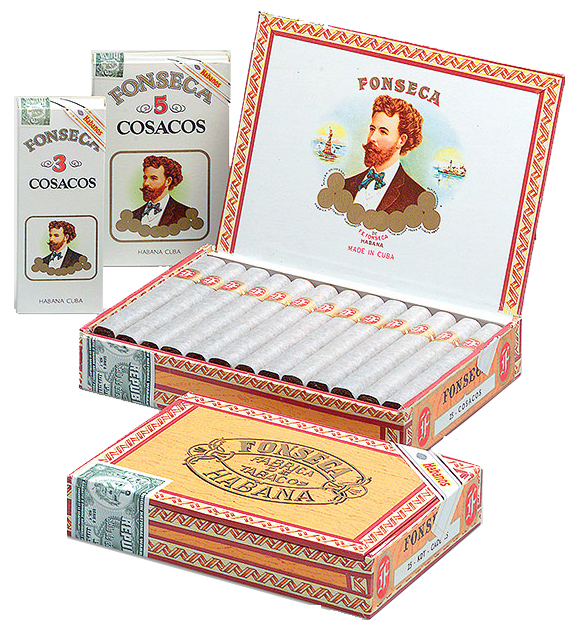

All Fonseca vitolas are Totalmente a Mano -Totally handmade, some with long filler and others with short filler.

**Strength**

- *Light*

### Punch

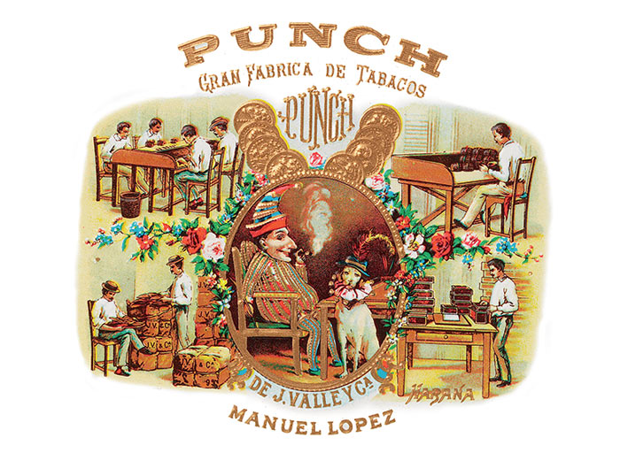

Punch is one of the oldest Habanos brands. Don Manuel López de Juan Valle and Cia founded this brand in the mid-19th century, with the idea of ​​attacking the growing English market, where a humorous publication of the same name was in vogue in those days.

Mr. Punch, the clown that was the symbol of that publication, continues to appear in each of the brand's boxes with his Habano in hand, surrounded by 19th-century images that shows the making of Habanos, and that are practically the same as those that today can be seen in factories in Cuba.

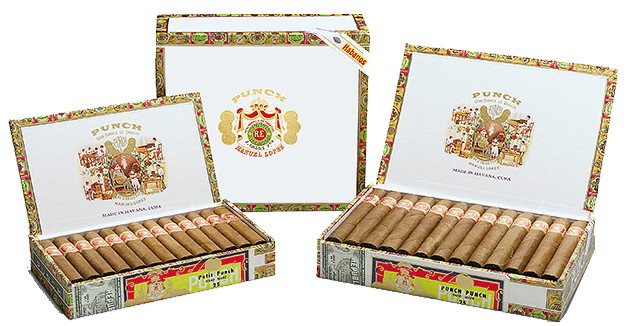

In 1931, Punch moved to the factory where Hoyo de Monterrey was produced; a long association that continues today. Actually, the two brands are produced at La Corona factory.

The characteristic flavour and medium strength of Punch, made with a blend mixed of filler and wrapper leaves coming from the Vuelta Abajo zone, are available in a range of vitolas that are made "Totally Handmade with long filler".

The historic Habanos brand created in the mid-19th century, Punch, presented its latest release in 2019: the new Short de Punch vitola, which expands the brand's chart size by incorporating, for the first time, the 50 ring gauge.

**Short de Punch, (50 ring gauge x 120 mm length)**, is a new trend vitola that has already been used in Regional Editions in different markets with great acceptance by enthusiasts of good smoking, and that now will have the opportunity to taste. This vitola of excellent dimensions offers a new option for those who prefer thick ring guages and short-haul Habanos in their smoke and is presented in the Semi Boîte Nature (SBN) box with 10 Habanos.

**Strength**

- *Medium*

### Quintero

Quintero is an interesting brand for those who want to access to the Habano's flavour with a medium strength, but with an affordable price.

It is one of the few Habanos brands that was not born in Havana. Its founder, Agustín Quintero settled in the city of Cienfuegos, also called the Pearl of the South.

All the Habanos made with this brand's blend comes from the Vuelta Abajo zone.

Quintero Habanos are made with the "Totalmente a Mano" technique with Short filler to get their characteristic medium flavour.

**Strength**

- *Medium*

### Vegas Robaina

Since 1845, the Robaina Family has been producing excellent tobacco on its plantations at Cuchillas de Barbacoa situated in the San Luis district of the Vuelta Abajo tobacco zone.

Vegas Robaina brand was created in 1997, as a tribute to Cuban tobacco farmers through the figure of Alejandro Robaina, for having achieved high yields of the finest wrapper leaves.

Therefore, this brand also honours all the anonymous tobacco growers whose knowledge and skills make Habanos what they are today.

All five vitolas are made "Totalmente a Mano con Tripa Larga-Totally Handmade with Long Filler.

**Strength**

- *Medium to Full*

### Diplomáticos

Diplomáticos is a comparatively recent brand dating from the 1960's. It bears a marked resemblance to Montecristo, using numbers not names to describe its sizes.

All the Habanos of the brand are made "Totalmente a Mano con Tripa Larga", Totally handmade with long filler and with wrapper and filler leaves coming from Vuelta Abajo zone, in the Pinar del Río region, Cuba.  This brand is a medium to full strength Habano.

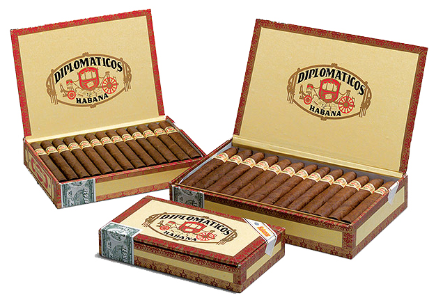

**Strength**

- *Medium to Full*

### El Rey del Mundo

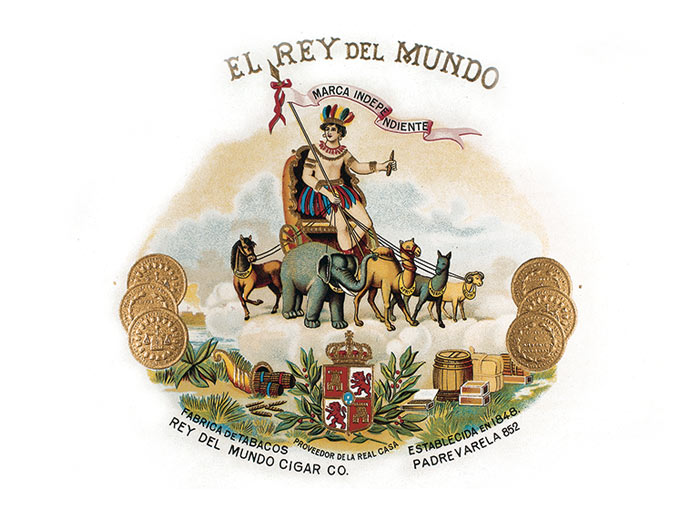

In 1882, and under the aegis of Antonio Allones, who had started producing Habanos over 30 years in Havana, it was decided to launch a brand of premium quality and price, with a name that quickly became known for its great dose of pretense: "The King of the World".

This success lives on to this day in a selected range of Habanos renowned for its light to medium flavour and consistency by the most demanding smokers.
It is a brand that it has been used a lot in regional editions.

All of the Habanos are made "Totalmente a Mano con Tripa Larga"- Totally Handmade with Long Filler" with filler and wrapper leaves coming from the Vuelta Abajo zone, in  Pinar del Río region, Cuba.

**Strength**

- *Light to Medium*

### Juan López

The Juan López brand was created by a Spaniard of the same name in the 1870s.

It is a brand known mainly in small circles of smokers, but they have a great deal of loyalty to this brand. The Selección No.1 and especially the Selección No.2 basically make up the brand's vitolario.

**Selección Especial** is a vitola that was incorporated into the brand's vitolario to commemorate its 150 years and 30 anniversaries of the international network of the La Casa del Habano franchise. Selección Especial consists of 25 Habanos of unique dimensions and a pleasant smoke.

All its vitolario presents a consistent flavour and is composed of vitolas made Totally by Hand with Long Tripe, with a blend composed of tripe and cape leaves from the Vuelta Abajo area, in the Pinar del Río region.

**Strength**

- *Medium to Full*

### La Flor de Cano

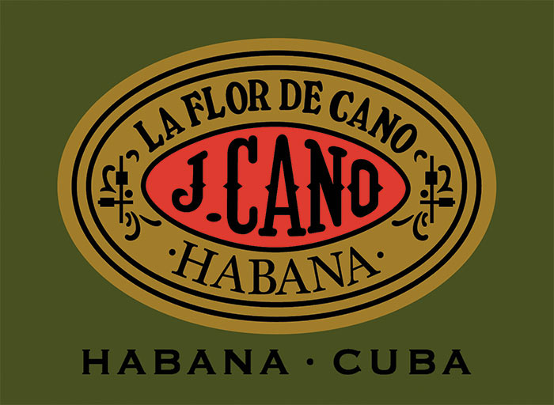

La Flor de Cano Habanos are characterized by a good balance between flavour and aroma. They are at a medium price level.

The Flor de Cano vitolario is made up of Habanos made Totally by Hand with Short Tripe from the Vuelta Abajo area of the Pinar del Río region, Cuba.

The Flor de Cano incorporates the new vitola with name Elegidos which is produced by the rest of the brand's portfolio, "Totalmente a Mano con Tripa Corta" – Totally Handmade with Short filler with leaves coming from the Vuelta Abajo zone, of Pinar del Río region, Cuba.

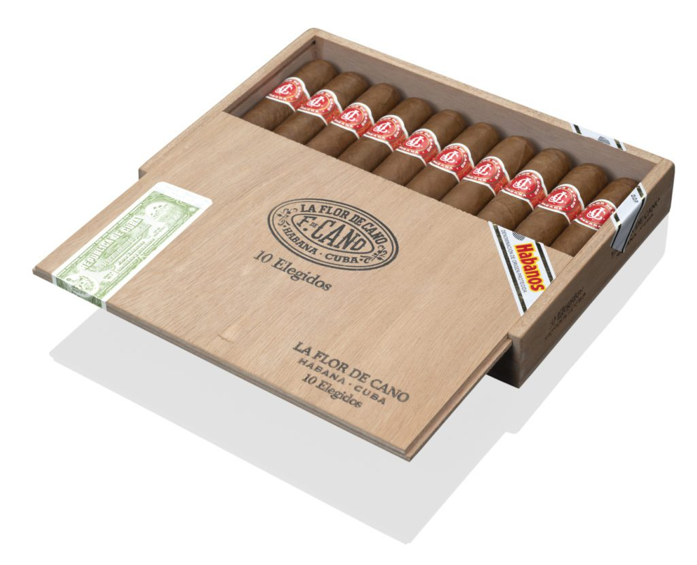

**Strength**

- *Medium*

### La Gloria Cubana

La Gloria Cubana, founded in 1885, is a little known jewel amongst Habano brands, nevertheless it enjoys a long history, its name alone clearly defines its origin.

During its more than 100 years of history, La Gloria Cubana has always attracted a circle of loyal fans, who are traditionally among the most knowledgeable smokers.

The brand is characterized by its elegant presentation, especially in the Medaille d'Or Series. All the vitolas are Tripa Larga, Totalmente a Mano – long filler, totally hand made.

The blend, made from filler and binder tobaccos grown in the Vuelta Abajo region, is classified as medium and offers well-balanced nuances of taste and aroma.

**Strength**

- *Medium*

### Por Larrañaga

Por Larrañaga is a Habanos brand with a long history. Founded in 1834, it has a well-earned reputation as a brand that is carefully crafted and well presented.

The Por Larrañaga brand is characterized by Habanos made "Totalmente a Mano con Tripa Larga" y "Totalmente a Mano con Tripa Corta" -Totally Handmade with Long Filler and Totally Handmade with Short Filler. The filler and wrapper leaves for its preparation come from the Vuelta Abajo zone, in the Pinar del Río region, Cuba.

One of the brand's latest launches is the new Galanes vitola (52 ring gauge x 120 mm length) which is incorporated within the chart size of this historic brand of characteristic strength from light to medium and follows trend shapes of recent times. It is the first heavy-gauge vitola to be introduced into the brand's portfolio.

**Strength**

- *Light to Medium*

### Quai d'Orsay

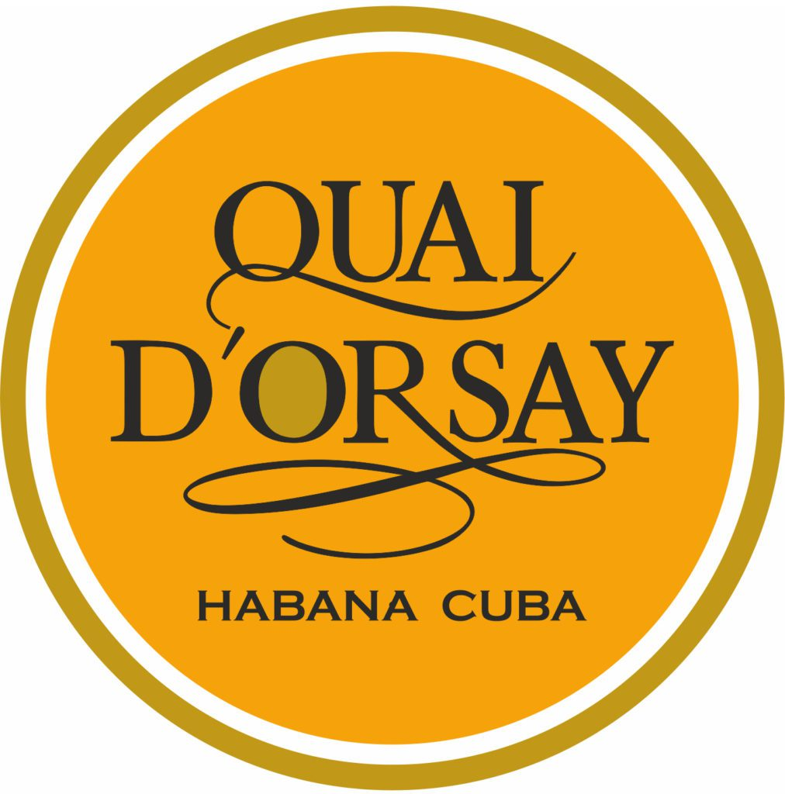

Quai D'Orsay is a young brand within the Habanos vitolario, established in 1973 by Cubatabaco exclusively for the French market at the request of Seita, the former French company.

Its name is due to the famous avenue of Paris located on the edge of the Seine and where Seita had his offices at that time.

For more than 40 years, the brand has remained a discreet jewel in the Habanos portfolio, accessible only to experts in the French market. The biggest innovations were successful in regional editions and four in recent decades were exclusively for the French market.

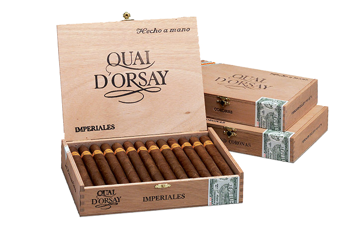

All the Habanos of Quai D'Orsay are made "Totalmente a mano con Tripa Larga"-"Totally Handmade with Long filler" and light strength.

Quai D'Orsay brand began a new stage with the launching of two new vitolas in which they were released with a new image and with international distribution to the different markets of Habanos, S.A.

**Quai D'Orsay No. 50** (50 ring gauge x 110 mm length) and **Quai D'Orsay No. 54** (54 ring gauge x 135 mm legth), the latter, is a new vitola within the regular portfolio of Habanos, S.A. Both presentations were combined with the **Coronas Claro** size (42 ring gauge x 142 mm length) to produce a suggestive brand portfolio available throughout the world through the international distribution network of Habanos, S.A.

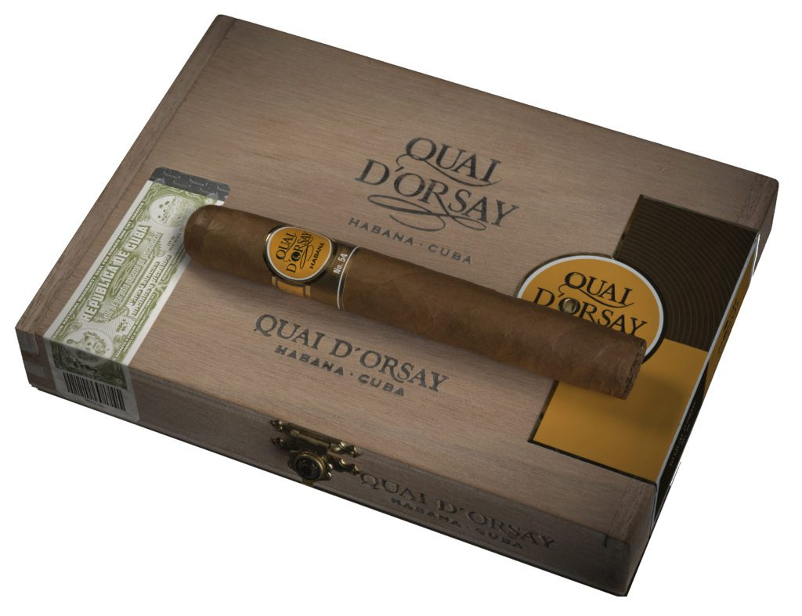

The brand has gained presence and visibility of origin with the mentions "Havana" and "Cuba" in the center and on the sides of the ring. A simplified version of this new ring was presented in the 2016 Regional Edition for the French market, in the **Quai D'Orsay Secreto Cubano** vitola (ring gauge 40 x 110 mm length).

With these new vitolas which were incorporated into the brand's regular portfolio, Habano enthusiasts from all over the world will be able to discover and enjoy the refinement and French "charm" and all the light strength of the best Cuban tobacco.

**Strength**

- *Light*

### Rafael González

Rafael González is a brand created in the 1930's.

This brand which has the factory name of Cervantes, was first called a Lonsdale after Lord Lonsdale.

On its lid label each box carries a curious inscription written in English to the effect that the cigars should be smoked within one month of the date of shipment from Havana or otherwise they should be carefully matured for about one year.

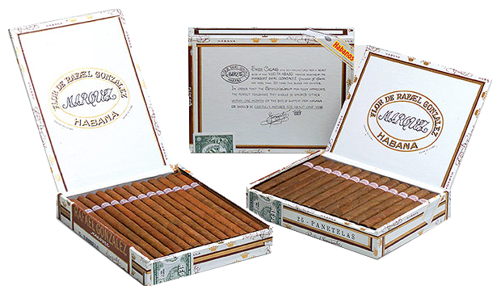

All sizes are made with filler and binder leaves coming from the Vuelta Abajo zone, in Pinar del Río region and it is characterized by a light strength.

Rafael González vitolas are made "Totalmente a Mano con Tripa Larga" – Totally Handmade with Long Filler and just one is made with short filler technique.

**Strength**

- *Light*

### Ramón Allones

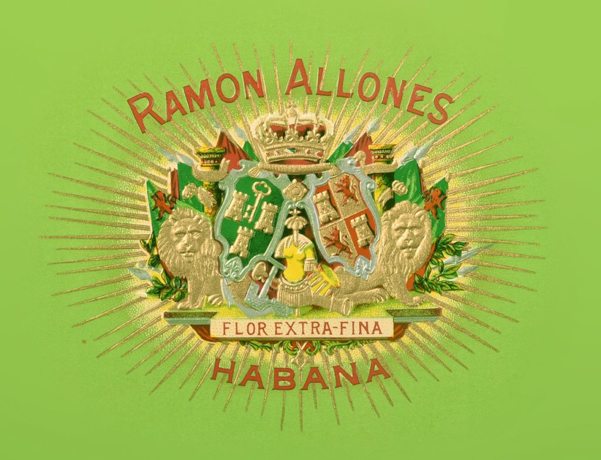

Ramón Allones is one of the big names in the history of Habanos. Founded in 1837, it is also one of the oldest brands still in production.

Ramón Allones was the first one to pack his Habanos in boxes decorated with labels and stamped with his brand's emblem, being the pioneer of packaging tradition that we know today.

The Ramón Allones brand is also used in regional editions.

All the Habanos are made "Totalmente a Mano con Tripa Larga" Totally Handmade with Long Filler, with wrapper, binder and filler leaves coming from the Vuelta Abajo zone, in Pinar del Río region, Cuba. It is a brand characterized by their intense and complex taste.

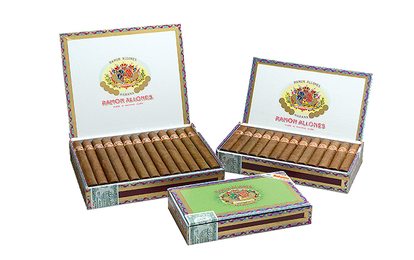

Among the most renowned vitolas are: Gigantes and Allones Specially Selected.

Vitolas, such as Ramón Allones Allones No.2, 2019 Limited Edition have been incorporated among others with a great acceptance.

**Strength**

- *Full*

### Saint Luis Rey

Saint Luis Rey is a Habanos brand founded before the Second World War. Some say that its name was taken from the work of Thornton Wilder, "The bridge of Saint Luis Rey", very popular at that time.

However it is more likely that it refers to the town of San Luis, one of the districts at the epicenter for the tobacco culture in the Vuelta Abajo zone, in the Pinar del Río region, Cuba, which is particularly famous for the superb wrapper leaves produced there.

The Saint Luis Rey brand enjoy a reputation among smokers who like intense flavors Habanos.
It is a brand which it is used for regional editions.

These Habanos are made with wrapper, filler and binder leaves coming from the Vuelta Abajo zone, in the Pinar del Río region, Cuba.

**Strength**

- *Full*

### Sancho Panza

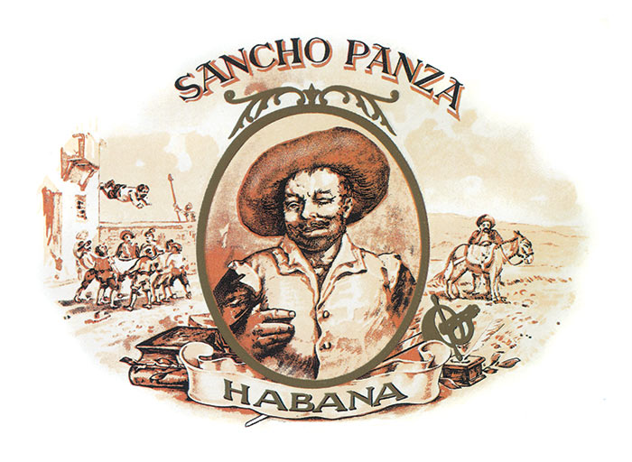

Sancho Panza, like other great Habanos brands such as Montecristo and Romeo y Julieta, the brand's name was inspired by one of the main works of universal literature and the most prominent in Spanish literature, Don Quixote de la mancha, written by Miguel de Cervantes in the seventeenth century. Sancho Panza gives its name to this brand as Don Quixote's faithful squire.

The first registration of the brand dates back to 1848, and since then, it has always been known for its high quality, capable of satisfying the most demanding smokers. The range today comprises three Habanos including the famous Molino, which is a Cervantes factory name. Don Quixote was, of course, famous for tilting at windmills that he identified as giants.

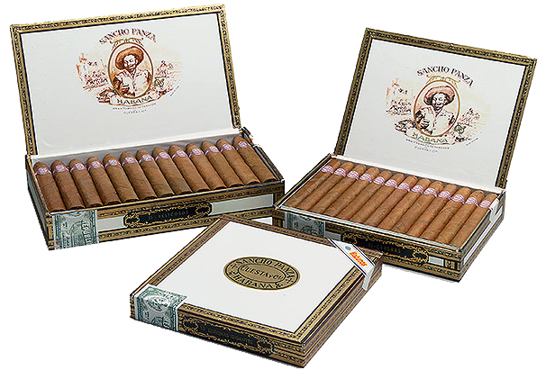

Sancho Panza is a medium strength brand and all Habanos are made "Totalmente a mano con Tripa Larga"- Totally Handmade with Long Filler, with filler and binder leaves coming from the Vuelta Abajo zone, in the Pinar del Río region, Cuba.

**Strength**

- *Medium*

### Vegueros

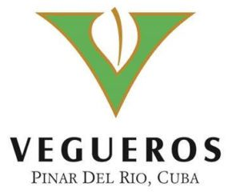

Vegueros brand was introduced to the market in 1996 and pays tribute to all the farmers who from generation to generation have cultivated tobacco in the "Pinar del Río" region, Cuba.

It is a tradition in the "Vuelta Abajo" zone, for the vegueros – farmers – to make their own cigars. Visitors to this part of Pinar del Río province were curious and wanted to taste the cigars made in the land where the considered best tobacco in the world is grown.

Vegueros brand is made at the "Francisco Donatién" Factory, in a sturdy building located in Pinar del Río, was built in 1868, and converted into a cigar factory in 1961.

The brand was totally renewed, after more than fifteen years of its birth, incorporating innovative formats within its portfolio: Tapados (46 x 120 mm length), Entretiempos (52 x 110 mm length), Mañanitas (46 x 100 mm length) and now, the range is enriched with the Centrofinos vitola (50 x 130 mm length), being an attractive option for those who seek a medium to full flavor Habano, accessible and renewed.

The new vitolas of Vegueros are presented with the new image of the brand and in a 16-unit metal tin. Centrofinos in its trend format, highly appreciated by smokers of these times and may be accessible to a wider spectrum of smokers.

All the Habanos have been made "Totalmente a Mano con Tripa Larga"- Totally handmade with Long Filler, with wrapper, binder and filler leaves coming from the "Vuelta Abajo" zone, in "Pinar del Río" region with a medium to full strength by Cuban cigar rollers.

**Strength**

- *Full*

## Strenghts

Here is a full list of the Habanos brands and lines categorised by their availability around the world and colour coded by flavour from full to light. The flavour ranking is just the first step to guide your choice. Tastes vary between sizes and there are countless nuances between brands of the same ranking to be explored.

**Global Brands**

| Brand | Strength |
| --- | --- |
| **** (Linea Behike) | FULL |
| **** (Linea Maduro 5) | MEDIUM TO FULL |
| **** (Linea Clasica) | MEDIUM TO FULL |
| **** (Linea 1492) | MEDIUM |
| **** (Linea Series) | FULL |
| **** (Linea Maduro) | FULL |
| **** | MEDIUM TO FULL |
| **** (Linea Edmundo) | MEDIUM TO FULL |
| **** (Linea 1935) | FULL |
| **** (Linea Open) | MEDIUM |
| **** | MEDIUM |
| **** (Linea Oro) | MEDIUM TO FULL |
| **** | LIGHT |
| **** (Linea Le Hoyo) | LIGHT |
| **** (Linea Epicure) | LIGHT |
| **** | MEDIUM TO LIGHT |
| **** (Linea Magnum) | MEDIUM TO LIGHT |

**Portafolio Brands**

***Brands Value***

| Brand | Strength |
| --- | --- |
| **** | FULL |
| **** | FULL |
| **** | MEDIUM |
| **** | MEDIUM |
| **[Quai D'Orsay](https://www.habanos.com/en/the-world-of-the-habano/the-habanos-brands-academia/quai-d%c2%92orsay-brand/ "Quai D'Orsay")** | LIGHT |

***Brands Volume***

| Brand | Strength |
| --- | --- |
| **** | FULL |
| **** | MEDIUM TO FULL |
| **** | MEDIUM |

**Rest of Brands**

| Brand | Strength |
| --- | --- |
| **** | FULL |
| **** | MEDIUM TO FULL |
| **** | MEDIUM TO FULL |
| **** | MEDIUM TO FULL |
| **** | MEDIUM TO FULL |
| **** | MEDIUM |
| **** | MEDIO |
| **** | MEDIUM |
| **** | MEDIUM TO LIGHT |
| **** | MEDIUM TO LIGHT |
| **** | MEDIUM TO LIGHT |
| **** | LIGHT |
| **** | LIGHT |

*\* These brands contain vitolas made with Tripa Corta (TC) (TC)*

[Habanos Brands](https://www.habanos.com/en/the-world-of-the-habano/flavours/ "Las Marcas de Habanos") |

## Principal shapes and sizes

One of the glories of Habanos is the sheer choice – 27 brands with more than 250 different cigars between them. Here are the main shapes and sizes that it is useful to know about.

Habanos come in lengths from under 4 inches (100mm) to over 9 inches (230mm).

The industry standard measure for diameter is known as 'ring gauge' and is expressed in 64th of an inch, although some countries prefer to use millimetres. Ring gauges vary from 26 (i.e. 26⁄64 th of an inch or 10.32mm) to 57 (i.e. 57⁄64 of an inch or 22.62mm).

In Cuba, the sizes are calledvitolas. Thevitola de galerais the size name the factories use – the factory name. Thevitola de salidais the size name you find on a box – the market name.

Sometimes the market name is the same as the factory name, but not often.

The same size is often known by different market names in different brands, and different brands may sometimes use the same market name for different sizes.

On top of this, some vitolas have popular generic names like 'torpedo'.

Confused? The following examples are listed by factory name with their popular names too.

### MAREVA

Popular Name: Petit Corona
Dimensions: 5 1/8 ins x 42 ring gauge, or 129 mm x 16.67 mm diameter.

The Marevais by far the most popular of all the sizes. Its 42 ring gauge allows three filler leaves to be used to their full in the blend and it is as near as you get to a 'standard' girth for Habanos. TheMarevaorPetit Coronaoffers around 30 minutes of smoking pleasure.

### CORONA

Popular Name: Corona
Dimensions: 5 5/8 ins x 42 ring gauge, or 142 mm x 16.67 mm diameter.

A Corona is the size to crown a memorable dinner, or perhaps to give you time for contemplation on a busy day. With the same girth as the Mareva, it offers over half an hour of essential relaxation.

### LAGUITO NO.1

Popular Name: Lancero
Dimensions: 7 1/2 ins x 38 ring gauge, or 192 mm x 15.08 mm diameter.

When elegance is the order of the day, the slender length of the Lancero is hard to beat. There is a shorter version too, the Coronas Especiales, which measures just 6 inches. Both originated at Havana's El Laguitofactory, the home of Cohiba, and boast the finesse of a twist of leaf on the cap. This one will take the best part of one hour to smoke.

### CAÑONAZO

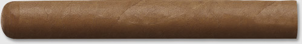

Popular Name: Siglo VI
Dimensions: 5 7/8 ins x 52 ring gauge, or 150 mm x 20.64 mm diameter.

Many consider this to be the ultímate shape and size for a Habano. Today it is acknowledged for its excellent combustion that releases the full flavourof its filler blend during the hour or so it takes to smoke. This size was chosen for the first Gran Reserva Habano.

### PETIT EDMUNDO

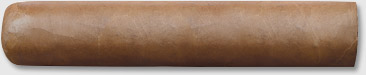

Popular Name: Petit Edmundo
Dimensions: 4 3/8 ins x 52 ring gauge, or 110 mm x 20.64 mm diameter.

The trend for heavy gauge cigars combined with a reduction in the amount of time available these days to enjoy them has seen the popularity of the Petit Edmundo – as well as similar sizes like Petit Robusto – increase. It burns well whilst drenching the palate with flavour for the 20 to 25 minutes you should allow to smoke it.

### EDMUNDO

Popular Name: Edmundo
Dimensions: 5 1/3 ins x 52 ring gauge, or 135 mm x 20.64 mm diameter.

The Edmundo is part of a group of heavy girth sizes that have grown in popularity in recent years. Halfway between a robusto and a Cañonazo, it commandsa loyal following for its good draw and balanced release of flavour for the 50 minutes or so it takes to smoke.

### JULIETA NO. 2

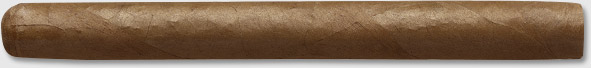

Popular Name: Churchill
Dimensions: 7 ins x 47 ring gauge, or 178 mm x 18.65mm diameter.

Originally from the Romeo y Julieta factory. It is said that Winston Churchill smoked some 300,000 Habanos duringhis long life. Not all matched these dimensions but this was his size of choice. Another feast for the palate to be enjoyed for over an hour.

### PROMINENTE

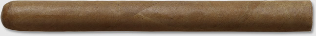

Popular Name: Double Corona
Dimensions: 7 5/8 ins x 49 ring gauge, or 194 mm x 19.45 mm diameter.

When time allows, there are few experiences for the taste buds to match the steady revelations of a Double Corona. Its colossal leaves may surprise you at firstwith their delicacy before they build to acrescendo of flavour. A good hour and a quarter is needed to smoke one.

### ROBUSTO

Popular Name: Robusto
Dimensions: 4 7/8 ins x 50 ring gauge, or 124 mm x 19.84 mm diameter.

Modern constraints on time have made this stocky shape the first choice for many experienced smokers. Slow burning and packed with flavour, most of the joys of a really large cigar can be savoured in 30 to 40 minutes.

### PIRÁMIDE

Popular Name: Torpedo
Dimensions: 61⁄8 ins x 52 ring gauge, or 156 mm x 20.64 mm diameter.

The sizes shown so far are what is called parejo or straight-sided. This is a figurado. Many believe that the Piramide or Torpedo, with its tapered head and shoulders, hasspecial advantages when it comes to combustibility during the hour or so it takes to smoke.

### EXQUISITO

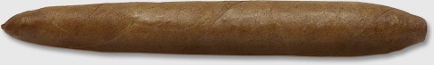

Popular Name: Double Figurado
Dimensions: 5 3/4 ins x 46 ring gauge, or 145 mm x 18.26 mm diameter.

Pointed at both ends, this Double Figurado shape is perhaps a better candidate for the title of 'torpedo'. A century ago mostHabanos looked like this but today the shape is rare except in one brand – Cuaba, where every size is Double Figurado.

### PERLA

Popular Name: Tres Petit Corona (TPC)
Dimensions: 4 ins x 40 ring gauge, or 102 mm x 15.87 mm diameter.

The Perla is one of a group of smaller vitolas, some a little longer, others a little fatter than this one. They share the abilityto deliver the true taste of a Habano in 20 minutes or so.

### LAGUITO NO. 3

Popular Name: Panetela
Dimensions: 4 .ins x 26 ring gauge, or 115 mm x 10.32 mm diameter

A quarter of an hour will suffice to smoke this tiny example of the Torcedor's art. Perfect, for instance, to enjoy during aninterval at the theatre. In fact one similar vitola is called the Entreacto, literally 'between acts'.

### How shape and size affect the taste

Each brand has its own characteristic style of flavour, but different vitolas can vary the sensation of taste.

The bigger the Habano, the richer the taste will tend to be, and the cooler the smoke.

Fat Habanos burn slowly and deliver a large volume of rounder smoke that drenches the palate with the full mixture of flavours.

Double Figuradosoffer a unique flavour at the start dominated by the wrapper and binder. The true blend is revealed when the widest part is reached.

Thinner Habanos smoke more quickly and concentrate the flavours on the tongue giving a slightly sharper taste.

The blender will to some extent compensate for these differences by, for instance, omitting the strongest flavoured ligero leaf from the blending of thinner Habano sizes.

[Flavours](https://www.habanos.com/en/the-world-of-the-habano/flavours/ "Flavours")")

## Styles of presentation (I)

Choices and more choices. There are seven forms of presentation for individual Habanos, and an abundance of options when it comes to the packs you can buy.

**With a band**

The classic Habano: fully-dressed with a band to identify its brand. .

With a double band

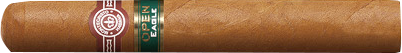In some cases there can be a second band identifying the vitola, or, where appropriate, a second band featuring a special production.

Without a band

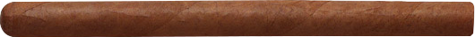In specialist cigar shops it is still possible to find Habanos without bands in slide lid boxes or bundles. However these were discontinued in the first years of the 21st century and now all Habanos leave the factories with bands on them.

Cedar-wrap (cedros)

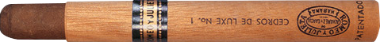The subtle aroma of cedar imparts a delicacy to the flavour and some brands wrap each cigar accordingly. The wood is porous so the cigars can be kept like this in a humidor.

Aluminium tubes

Created for railway companies in the 1930's, cedar-lined aluminium tubes help preserve cigars from damage and drying out. Ideal for outdoor pursuits like yachting or mountaineering. Decant the cigars from the tubes when placing them in a humidor.

Tissue-wrap

Employed by just one Habano brand at present – Fonseca. The tissue offers a modicum of protection for the wrapper.

Silver or gold paper wrapping

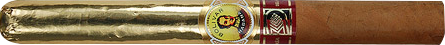Some Habanos are wrapped in metallic silver or gold paper according to the traditions of certain high quality sizes.

Cellophane-wrap

In the past most Habano brands were from time to time wrapped in cellophane sleeves for some countries. Today cellophane is used only for machine made cigars.

##### Round versus box-pressed Habanos

All Habanos are round when they leave the Torcedor's bench. However when they are placed in labelled boxes the cigars are pressed into a square shape because the box is deliberately made too small. Why? At first perhaps it was to prevent damage during shipping but, as with many aspects of the Habano world, the original thinking is lost in time. Perhaps it was simply a fashion in days gone by.

In some brands most of the vitolas are box-pressed, in others none are. The present trend is for round Habanos, but the choice of shape is entirely yours.

 ")

## Styles of presentation (II)

### Labelled Boxes (10, 20 or 25 habanos)

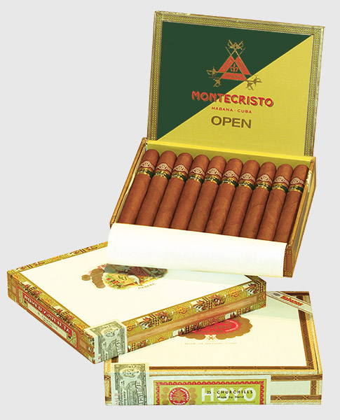

This is the most common form of Habano package. All box-pressed habanos come in this type of presentation.

### Semi Boîte Nature or SBN (5, 10, 12, 24 or 25 habanos)

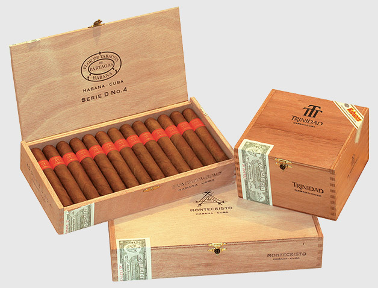

The French name for this box confirms its Gallic origin. Some boxes are plain wood, others are varnished. The brand marks are hot-stamped into the wood. The cigars are always round.

### Cabinet Selection – SLB (10, 25 or 50 habanos)

'SLB' stands for 'Slide Lid Box', a presentation created for the British at the start of the 20th Century for selected 'Cabinet Quality' Habanos. Plain wood and varnished versions. The cigars are always round and tied in a silk ribbon.

### Cabinet Boîte Nature or BN (10 or 25 habanos)

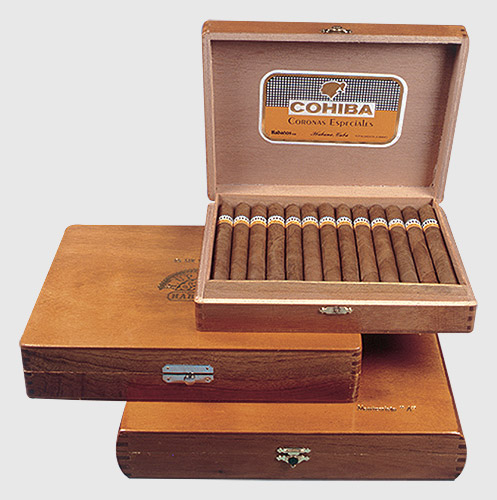

Varnished natural wood boxes with fully formed lids sometimes bearing the brand emblem in gold foil. Others are left plain. A presentation reserved for very special cigars that are always round.

### '8-9-8' (10 or 25 habanos)

Boxes with telltale curved sides. The origin of these boxes was based on the number and arrangement of the cigars inside; 8 on the top row, 9 in the middle and 8 on the bottom making 25. It even gave its name to the first vitola to use it, the Dalia. Today the same 3-layer arrangement is used for boxes of 10; 3 on the top row, 4 in the middle and 3 on the bottom, so there is an 8-9-8 in 10s! All the cigars are round.

### Bundles or Mazos (10 or 25 habanos)

Bundles of round cigars with bands. Some are wrapped in silver foil or cellophane to prevent damage and preserve moisture..

### Small Packs (1, 3 or 5 habanos)

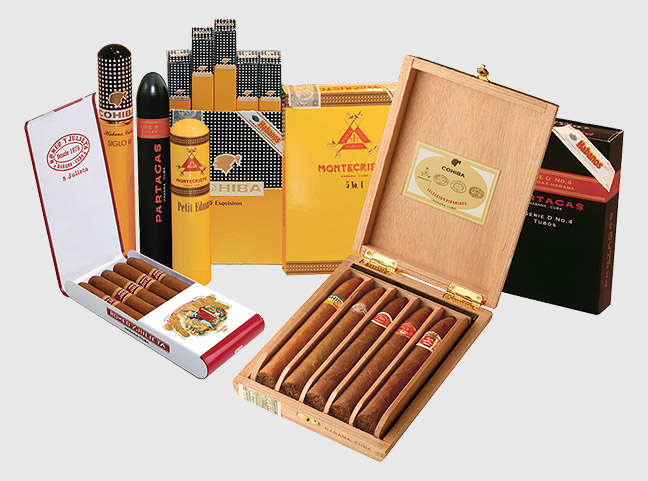

Smaller packs allow you to carry a few of your favourite Habanos or make ideal gifts. They come in cardboard, aluminium or wood. .

### Special boxes

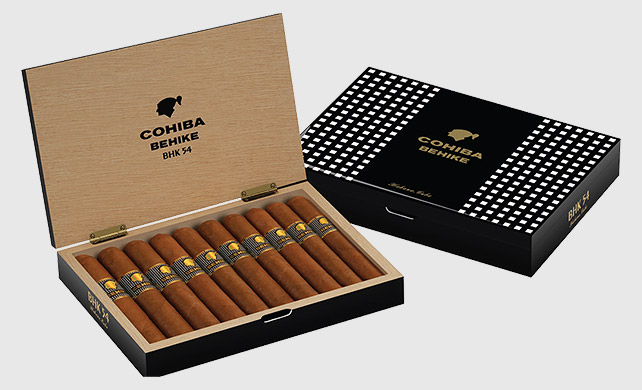

Within the wide range of Habanos there are other types of packs with special characteristics which are not found in any of the categories described above although they form part of the standard Habanos portfolio.

")

## Special Productions

From time to time you will see special productions of Habanos offering presentations or special sizes that are not normally available in a particular brand.These specialities often take the form of the very finest cabinets or humidors many of which are the work of leading Cuban artists and craftsmen. Others may be made in leather or contain innovations such as humidified tubes.

Usually sold through the franchised network of [La Casa del Habano](https://www.habanos.com/donde-comprar-2/la-casa-del-habano/ "La Casa del Habano") stores, they are worth buying, if you can find them, because they are made in small quantities and will not be repeated.

##### Humidors and cabinets in precious woods

Over the last 15 years there have been several releases of numbered limited edition humidors and cabinets made in rare and precious cuban woods such as cedar,acanaandmajagua.

Amongst the most exclusive releases have been the"Colección Habanos"cabinets, which ressemble books, the"Replica Antique"humidors that faithfully reproduce designs from the past, and special commemorative humidors to mark anniversaries of the best known Habanos brands. Cohiba, Montecristo, Romeo y Julieta and Partagas are the brands most often honoured in this way, although any of the existing 27 brands can be choosen.

##### Jars

Porcelain and glass jars are produced from time to time as limited editions as they were in 2000 when the Cohiba, Montecristo and Cuaba ceramic jars were produced to mark the new Millennium.These are usually available through Duty Free shops and La Casa del Habano network

##### Leather cases and humidified tubes

Other special Habanos productions include leather cases and humidified tubes that have been made in small quantities in recent years. They aim to provide Habanos enthusiasts with a variety of high quality accessories as well as to explore new ways of improving the conservation of cigars.

##### Ediciones Limitadas

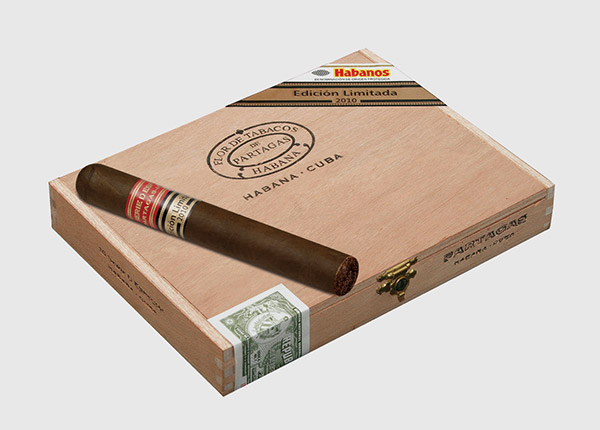

Limited Editions in the leading brands of Habanos have been produced since 2000. They are distinguished not so much by their boxes, but more by the exclusivity of the cigars contained in them of which only small quantities are made in sizes not normally found in the brands in question. They are produced with tobacco aged at least 2 years before the cigars are made.

The boxes carry an extra black and gold seal indicating that they contain Limited Edition cigars as well as the year in which they were released. Each Habano is dressed with an extra band giving the same information.

##### Regional Editions

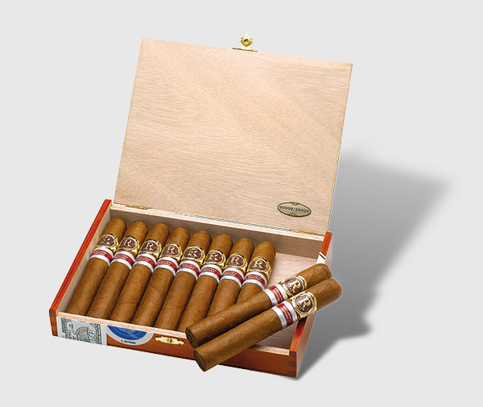

Regional Editions of Habanos are only distributed in certain parts of the world. Usually they are made in the less well-known of the 27 Habanos brands, which have particular associations with different countries.

While they are made from the standard tobaccos and blends for the brands in question with no special features, they are produced in sizes not normally associated with those brands and are presented in numbered boxes.

The boxes carry an extra silver and burgundy seal indicating that theyare Regional Editions and giving the name of the territory for which they were made. Each Habano is dressed with a second band giving the same information.

")[Catalogue](https://www.habanos.com/en/vitolarios/ "Catalogue")

## Choosing, cutting and smoking

The Habano you pick, the way you cut it, light it, smoke it and above all the tastes that you enjoy are your choices and yours alone. However, there are some practical points to bear in mind.

### Choosing

Four of your five senses are required when choosing a Habano – or all five if you believe, as some do, that there is something to be learnt from rolling it next to your ear.

The wrapper must please the eye. Maybe you prefer a light colour, or maybe a dark. Either way, the colour should be even and there should be a sheen on the leaf. Don't worry if you see a white spot or a green patch. These are natural blemishes, beauty spots if you will, that occurred long ago during the growing or curing processes. Neither affects the quality of the smoke.

Press the cigar gently between your thumb and index finger to test its condition. It should feel firm but springy to the touch.

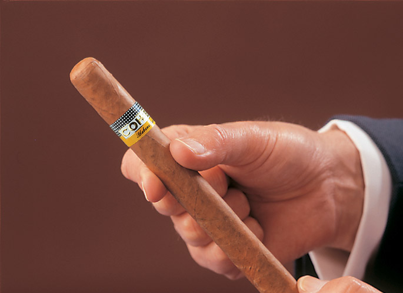

Enjoy the aromas of mature leaf as they waft up from the box – a promise of the flavours to come.

Taste can only be judged by smoking – quite a challenge when you have over  and  each with its own style to choose from.

Novices are advised to experiment with a vitola that is common to many brands such as a [Mareva](https://www.habanos.com/academia-habanos/el-mundo-del-habano/vitolario-y-envases/principales-formatos/#mareva "Principales formatos"). Start with one of the lighter flavoured marques – see [Habanos brands and flavours](https://www.habanos.com/en/academia-habanos/el-mundo-del-habano/las-marcas-y-sabores-del-habano/sabores-de-las-diferentes-marcas-y-lineas/ "Sabores de las diferentes marcas y líneas").

Newcomers should start with smaller formats. For more experienced smokers, the best guide is the amount of time at their disposal. Remember that a long filler Habano is constructed so that its flavour will intensify by stages as it is smoked.

It is a great shame to abandon a Habano before it has had the chance to display its true colours. So pick a vitola you have the time to enjoy in its entirety.

### Cutting

The cut should be made just above the line where the cap meets the wrapper (on about 3mm from the point).

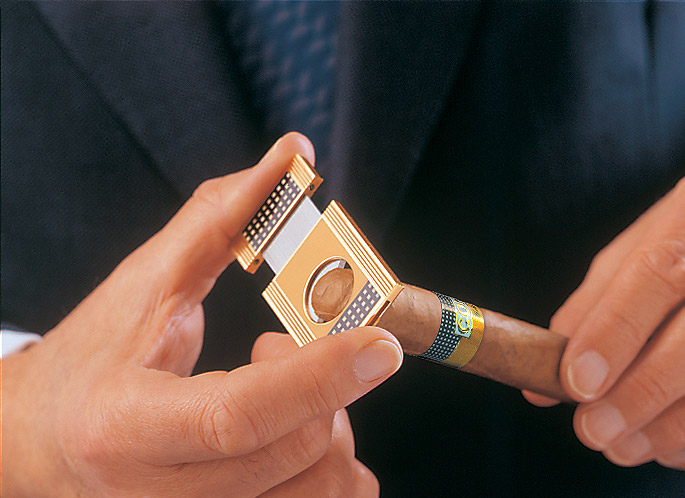

The objective is simple. You must create an aperture broad enough to ensure an unobstructed draw whilst retaining enough of the cap to stop the wrapper from unravelling.

A number of devices compete for the role. The most popular is the single or double bladed guillotine. Alternatively there are pairs of special cigar scissors. Another is the punch cutter with a circular blade. It removes a section from the cap, which preserves the shape of the cigars head, although it cannot cut pointed ends.

Not to be recommended are V-cutters, which tend to tear the cap. Nor should you pierce the cap with a match or cocktail stick, which will compress the filler into a lump and impede the draw.

**Do not remove the band for fear of damaging the wrapper**.

### Lighting

Two principles apply.

The first is to light your cigar with an odourless flame. Always use a butane gas lighter, a wooden match or a spill. Never use a petrol lighter, a wax match or a candle because their aroma will permeate the cigar.

The second is to take your time and do a thorough job. Nothing ruins the enjoyment of a Habano faster than the thin smoke you draw when it is badly lit. Here is a small ritual to help you get it right every time.

Hold the foot of the cigar at 90 degrees to the flame and rotate it until the surface is evenly charred.

Place the Habano between your lips and, holding the flame a centimetre away, draw on it until the flame jumps onto the foot. Continue to rotate the cigar.

Blow gently on the foot to check that it is evenly lit.

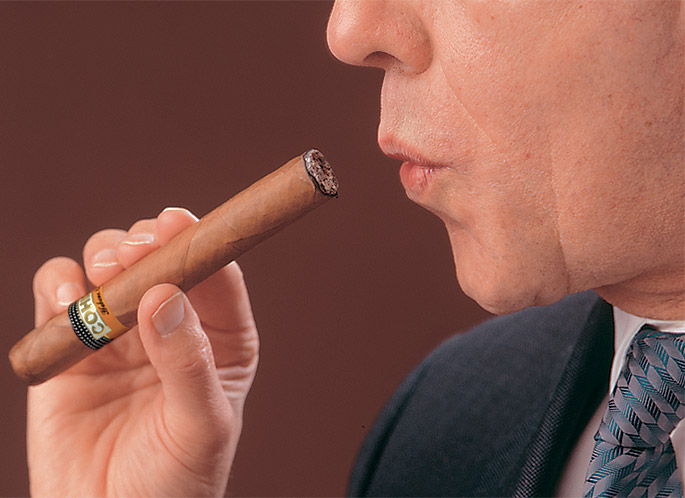

### Smoking

A Habano should be smoked slowly. It should be sipped rather than gulped or it may overheat, which can harm the flavour.

Don't inhale – this is not a cigarette. Gently draw the smoke into your mouth and allow it to play gloriously on your taste buds.

Relax and savour the subtle flavours and aromas of the tobaccos in the blend.

It is fine to relight your Habano if it goes out. But first clean off any loose ash or you will find it hard to re-ignite.

A Habano may be smoked with enjoyment for at least three quarters of its length. Don't concern yourself with the length or fate of the ash. It is not done to tap your Habano nervously, like a cigarette. Let the ash fall in its own time, preferably into an ashtray.

### And parting

When the sad moment comes to part with your Habano, don't crush it to a pulp. Lay it to rest in the ashtray and it will go out by itself. Allow it to die with dignity.

### Video Resumen

<http://www.archivohabanos.testwalking.com/booklet/videos/enjoying/12_corte_en.mp4>

[Catalogue](https://www.habanos.com/en/vitolarios/ "Catalogue") |

## Keeping Habanos

Habanos can be kept for a good 15 years, sometimes longer, and will, like exceptional wines, improve with age.

##### The right conditions

Habanos should be stored at between **16°C** and **18°C** and in a relative humidity of **65** to **70 percent**.

The humidity is most crucial. If a Habano becomes too wet it will not smoke. If it dries out, it will taste harsh.

As humidity varies with temperature changes, it is also important to keep the temperature constant.

##### Humidors

Perhaps the ideal humidor is the "walk-in" variety illustrated here in which the temperature and humidity are controlled electronically. You will find them in specialist cigars shops like those belonging to the worldwide network of [La Casa del Habano](https://www.habanos.com/en/donde-comprar-2/la-casa-del-habano/ "La Casa del Habano") shops where all the cigars are kept ready for sale in perfect condition. Often they provide lockers in which you can store your cigars.

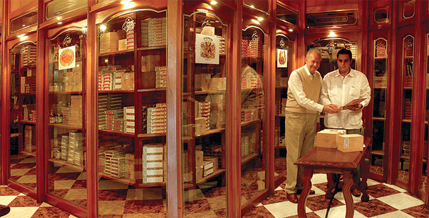 Walk-in Humidor

However, if you do not have access to such facilities, happily a whole industry exists making humidors to help you keep your Habanos.

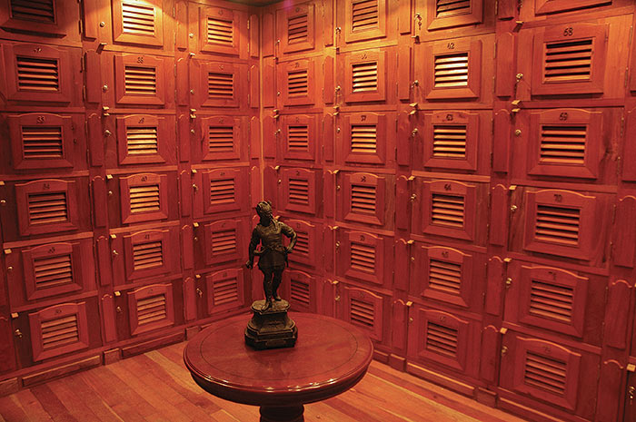 Lockers in La Casa del Habano

These can be boxes, cupboards or even full-sized rooms that are specially designed for cigars and contain moisture sources.

 Humidor

You are well advised to invest in your own in which to keep a selection of Habanos ready to smoke.

 Humidors

Your cigars will take a few days to acclimatise to the conditions inside so it is a good idea to buy a humidor with a tray that allows new arrivals to be separated from the old.

Putting Habanos in the fridge is no alternative. Fridges are drier than you might think and fine cigars readily absorb smells.

##### Troubleshooting

A number of problems may arise when storing fine cigars. For example, they may become too wet or too dry.

Dryness is worst because after two or three months they will start to lose their flavour – never to be regained. When re-humidifying dry cigars do it gently in stages or you will risk the wrappers bursting as the leaves absorb moisture.

Prolonged wetness rots tobacco, but you are much more likely to encounter 'bloom'. This is a white, powdery mould that occurs naturally on a Habano when it is subjected to a sudden increase in humidity. It is a sign that the cigar is alive and well and should simply be removed with a brush.

Worst of all is tobacco weevil or lasioderma serricorne. It feasts on tobacco, perforates wrappers and renders cigars unsmokeable.

Thankfully infestations are rare but the best prevention is never to let the temperature in your humidor exceed 18°C.

The only solution is to put an infected box into a deep freeze and leave it there for a few days. This will kill the weevils and save the cigars that have not attracted their attention.

Since 2005 all Habanos have been frozen at the warehouse in Havana before the are release to the market, so this problem is rarer than it once was.

##### Ageing

A marriage begins between the leaves used to make your Habano from the moment it leaves the torcedor's bench.

It takes time for the blend of filler leaves to harmonise and deliver the taste intended by the .

Ageing is best conducted in a large humidor where moist air can circulate around the boxes and in which the conditions are monitored year in year out. It is a task best left to specialist cigar shops.

The result is worth waiting for because the taste will have developed and your Habano will share its essence with greater ease.

##### Video

<http://www.archivohabanos.testwalking.com/booklet/videos/enjoying/11_conservacion_en.mp4>

## Matching the taste

Whether in the morning, at noon, or at night, the time spent enjoying a Habano is an important moment for each individual.At times you may prefer to concentrate on the essential flavours and aromas of the cigar alone. At other times you may choose to match its fragrance with something else that will enhance the flavour in your mouth.

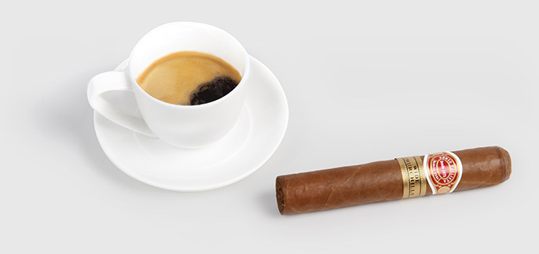

Liquors or spirits like Malt Whiskies, fine Cognacs or Vintage Ports are perhaps the traditional partners for cigars. In recent years, however, there has been a surge of interest in extending the range of possibilities to tempt the Habanos smoker's palate. The finest food, drinks with tastes as diverse as wines and Champagnes have entered the stage along with cocktails, the finest grades of coffee and tea, and even tasty morsels such as chocolates and certain types of canapés.

##### Habanosommeliers

At the forefront of this movement have been the Habanosommeliers. Almost unheard of in the last century, today most of the finest restaurants in the world where smokers are accommodated include a thorough knowledge of Habanos within the skills demanded of their sommeliers, or wine waiters.

Every year since 2002, Habanos s.a. has staged a global contest for  at which the winners of countless regional contests all over the world meet in Havana during the [Festival del Habano](https://www.habanos.com/academia-habanos/el-mundo-del-habano/el-habano-en-el-mundo/el-festival-del-habano/ "El Festival del Habano") to decide who will be the world champion for the year. Contestants must study the way in which tobacco is grown and cigars are made in Cuba. They must be familiar with every size in the leading Habanos brands and be aware of all their different flavours. Each is required to present a personal recommendation for an ideal combination of a particular Habanos with a specific drink and is assessed on the preparation and service of both products.

Armed with a storehouse of knowledge, Habanosommeliers are broadening the horizons of ways in which to enhance the enjoyment of Habanos in conjunction with other products of similar quality, heritage and tradition.

##### How to match tastes

The list of drinks with which Habanos have been associated since 2000 is bewildering. To spirits like cognac can be added, Armagnac, Jerez brandy, both single Malt and blended Whiskies, Tequila and, of course, Rum from Cuba. And the wine category now embraces Ports, Champagnes, Sherries, as well as red and white wines from many prestigious denominations of origin of the world. The delicate, taste of Iberico ham in a canapé has been identified as a suitable cigar partner as has high grade chocolate sometimes with tobacco leaf included in its recipe.

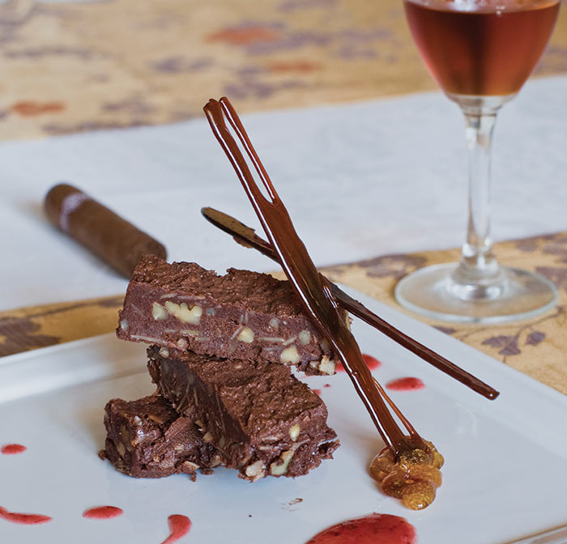

When you consider that there are over [250 different standard Habanos](https://www.habanos.com/vitolario/ "Vitolario") in [27 different brands](https://www.habanos.com/marcas/ "Marcas") to choose from, not to mention the specialities that are produced each year and aged Habanos bought many years ago and kept at home by Habanos enthusiasts, the number of possible combinations is enormous.

Perhaps the most traditional approach to selecting a match is to pick examples of both products with similar strengths to ensure that in the combination one does not overcome the other. Consequently it would be appropriate to try one of the full flavoured Habano brands with a powerful rum aged for many years in oak barrels. However opposites can attract too, so you should not avoid putting a full flavoured cigar up against, for example, a lighter tasting Armagnac.

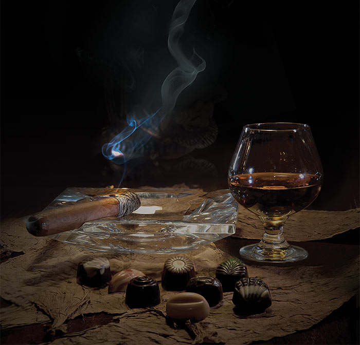

In any case the object is to find combinations of great products that please your palate. Take your favourite Habanos, seek the advice of an expert like a Habanosommelier and start to explore.

## Ageing tobacco leaves

There are two ways in which Habanos can benefit from the passage of time.

One is before the cigars are made when the tobaccos are left to mature for an additional period. The other takes place after the Habanos have been made and are sealed in their boxes.

Various types of categories exist within the Habanos Protected Denomination of Origin that take account of these processes and are recognised by the . Their unique characteristics merit special attention.

##### Ageing tobacco leaves

Earlier chapters in this book have studied the complex and, above all, time consuming processes of curing, fermentation and ageing through which all the leaves in a Habano must pass. Once completed the tobacco leaves are fully conditioned and ready to be made into cigars. However, just as with the most valuable spirits like fine Cognacs, Malt Whiskies or Rums that are left for years in oak barrels to improve, tobaccos for Habanos can benefit too from extra ageing. Tannins are released while sugar levels increase to deliver a rounder, mellower, distinctly aromatic taste to the tobacco leaves.

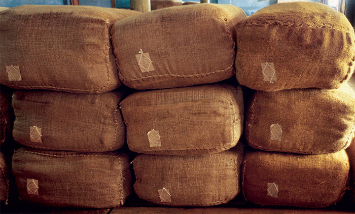 Filler and binder leaves ageing in "pacas".

Since 1999, bales of all the different types of leaves, selected for their ageing potential, have been reserved from each year's harvest and kept at special warehouses in Havana. As a result stocks of aged tobaccos now exist to create some remarkable Habanos, produced in small quantities and designed to appeal to the most knowledgeable enthusiasts.

Most of these aged tobaccos are used in special editions of Habanos that are released from time to time, but some are used in standard production sizes. In some cases all the types of leaf they contain are specially aged, in others the extra ageing applies only to the wrapper leaves.

 Wrapper leaves ageing in "tercios" made of "yagua"

The categories of these cigars that are approved by the Regulatory Council for the Protected Denomination of Origin (D.O.P.) Habanos are explained next.

##### Reserva

The term Reserva is used to describe Habanos in which all the leaves – fillers, binders and wrappers – have been aged in bales for at least 3 years before being taken to the factory for rolling.

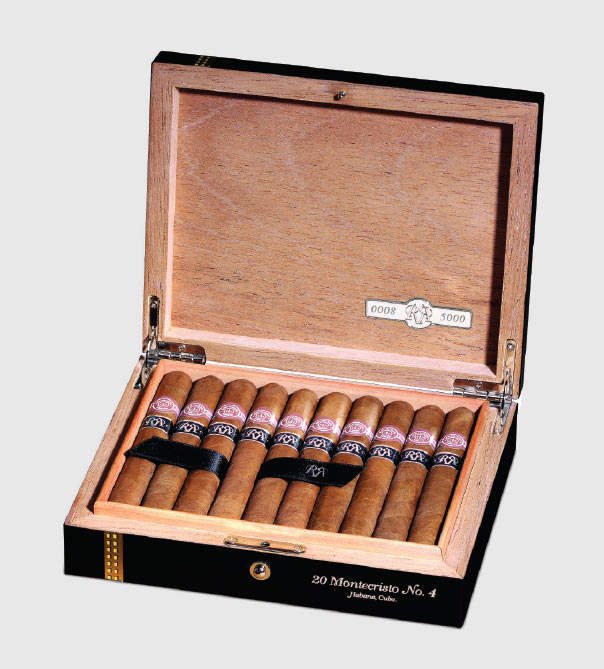

Specially selected leaves from  are used to produce the Reserva Habanos.

The first of this type of speciality, the Cohiba Seleccion Reserva, was released in 2003 using tobaccos from the 1999 harvest. Subsequently the Partagas Serie D No. 4 Reserva was made from leaves grown in 2000 and the Montecristo No. 4 Reserva from leaf harvested in 2002.

Customarily only a limited number of Reserva Habanos are made for each release. They are presented in just 5,000 elegant, lacquered boxes containing 20 Habanos, which are numbered accordingly. Every cigar carries a second black and silver band identifying that it is a Reserva.

##### Gran Reserva

The term Gran Reserva applies only to Habanos whose fillers, binders and wrappers have all been aged for at least 5 years before being rolled at the factory.

Only those judged to be the finest leaves from , the best tobacco growing zone in Cuba, are chosen to undergo such a lengthy confinement to ensure that, when the time comes to turn them into Habanos, they will offer a unique flavour and aroma.

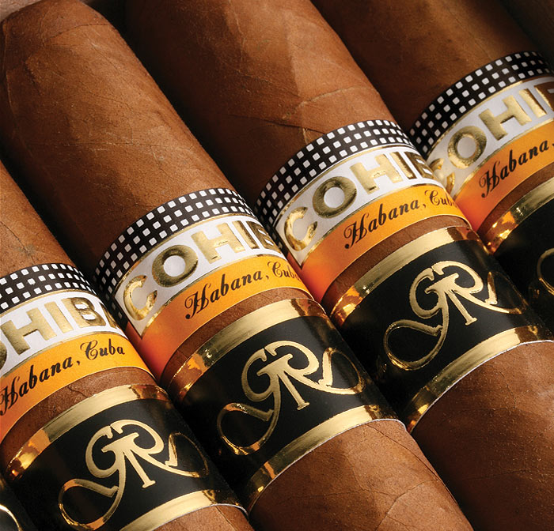 Cohiba Siglo VI Gran Reserva Cosecha 2003.

The first Gran Reserva Habanos was released in 2009, produced with tobaccos harvested in 2003. The size selected was the iconic Cohiba Siglo VI. It was presented in just 5,000 elegant, lacquered boxes containing 15 cigars, which were numbered accordingly, and each Habano was identified by a black and gold Gran Reserva band.

A second iconic size, the Montecristo No. 2, was released as a Gran Reserva in 2011 using tobaccos harvested in 2005.

##### Edición Limitada

The first Edición Limitada –Limited Edition Habanos – were introduced in 2000 and since then between three and five releases have been made annually, except in 2002. Limited Edition wrappers are darker than those found on standard Habanos. Darker wrappers come from the leaves picked from the higher levels on shade-grown tobacco plants, which are thicker. Such leaves demand longer periods for fermentation and ageing so they are left in bales for at least two years before the cigars are made.

At the outset it was only the wrappers on Limited Editions that were made from extra-aged leaves, but since 2007 the fillers and binders too have been specially aged for at least two years.

The boxes carry an extra black and gold seal indicating that they contain Limited Edition cigars and giving the year when they were released. Each cigar is dressed with a second band giving the same information.

##### Cohiba Maduro 5

Cohiba Maduro 5 differs from the other cigars in this section in two ways. First because it is a standard line and not a speciality Habano; and second, because it provides an example of a cigar in which just one of its leaves, the dark  wrapper, is made from extra-aged tobacco.

Introduced in 2007, all three sizes in Cohiba's Linea Maduro 5 are dressed uniformly with wrappers that have been harvested from the very top levels of shade-grown tobacco plants to ensure that once aged they are all dark enough to earn the colour classification maduro. These leaves, which in Cuba are produced by entirely natural means, demand extra fermentation and ageing. In this case they are left to mature for at least five years, as the number 5 in Line's name confirms, before they are added to the cigars.

Opinions differ in the Habanos world over how much the wrapper influences the taste. However few would dispute that Cuban maduro wrappers bring a significant sweetness and distinct aroma to the flavour.

## Ageing finished cigars

The first thing most cigar enthusiasts do when they buy Habanos is to look for the date stamped on the bottom of the box to find out when they were made. The most knowledgeable among them are aware that the age will affect the flavour and aroma in the same way as it does with bottles of the finest wines.

The filler leaves, the binder leaf and the wrapper, which compose the blend, will bed down gradually over time provided they are kept in the correct conditions.

The starting point for this process was on the cigar roller's bench when all the leaves met for the first time. Moisture was added to make the leaves malleable, which provoked a final fermentation and the finished cigars were left in the Escaparate for a time to recover. Then they were banded and placed in boxes, which were  It is from this point that the "Vintage" or "Box Age" of a Habano is measured.

The last vestiges of the processes that brought the tobaccos to their flavoursome conclusion remain present in the cigars enabling them gently to develop still further.

Eventually these cigars become known as Aged Habanos, but remember, in this context, the vintage has nothing to do with any extra ageing of the tobacco leaves, or when they were harvested.

##### The ideal conditions for ageing Habanos

The important thing for a Habano is that it is allowed to retain its original characteristics so that it can develop flavours and aromas that are even rounder, more balanced and sometimes more pronounced than when it was bought. A constant temperature is required as well as a level of humidity to prevent its aromas fading and a loss of substance which would occur if it were to dry out.

To obtain the full benefits of ageing in boxes the following requirements should followed:

1. The Habanos should be kept between **16oC** and **18oC** and between **65%** and **70%** relative humidity so that the delicate balance of flavours can develop properly.
2. The location should be well-ventilated so that any unpalatable aromas can disperse freely.

##### The concept of aged habanos

No hard and fast rule exists on the amount of time that must elapse before a Habano can be described as "Aged".

Some consider that 5 years is sufficient for the benefits of ageing to become apparent, others feel that at least 10 years should pass since the Habanos were placed in their box.

Nor is there a unique theory on how the taste of any particular size or brand of Habanos will change over time. Many books and articles have been written on the subject, but nothing counts as much as the individual taste preferences that smokers have accumulated through their own experience.

There are some countries where there is a long tradition of ageing Habanos. For example in England it has been the custom to leave Habanos for at least two years before they are smoked.

Also it was in the United Kingdom that in 2008 the [Habanos distributor](https://www.habanos.com/en/donde-comprar-2/distribuidores/ "Distribuidores") introduced Aged Habanos for cigars with a minimum age of ten years, which had been stored carefully on their premises in the perfect conditions. Each Habano was given a second band indicating its vintage – the year in which it was made.

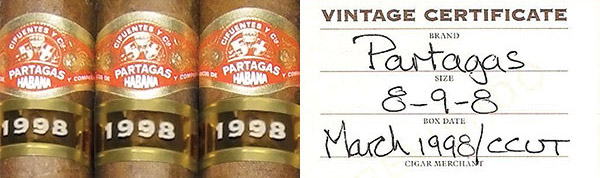

Provided that the correct conditions of temperature and humidity are respected, you can build your own collection of Habanos and age them for a long time. There are aficionados and collectors of Habanos, who treasure boxes with very old dates including some that go back fifty years or more. Sometimes their patience is rewarded at auctions where aged Habanos have been known to attract prices as high as $1,500 per cigar.

The maximum time that a Habano can continue to be kept and to improve its taste qualities while it is ageing is another matter that attracts conflicting opinions. In any event the length of time it will last depends upon the blend and the quality of the tobaccos used to make the Habano that is being aged and, of course, on the correct temperature and humidity to avoid the cigar losing its aroma through evaporation.

##### Identifying the date of a box

Finding the date on boxes made since the year 2000 is comparatively easy as was explained on page 73. However between 1985 and 1999, the dates were stamped using a three or four letter code.

From 1985 to 1998 the code word used was NIVELACUSO with each of the ten letters corresponding to a number as you can see below:

Under this system, if you see the letters NISC on a box, they will convert to 1297, which means that the box was filled in December 1997, LUC converts to 587, or May 1987, and so on.

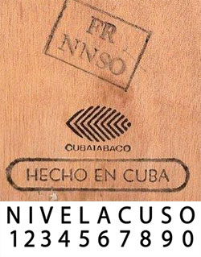

Example of NIVELACUSO code NNSO: Made November 1990

However in 1998, when a new codeword, CODIGUNETA, was introduced to replace NIVELACUSO, things became complicated. First, the order of the numbers as they related to the letters was changed so that a box carrying the letters UNCC would date from January 1999. And second, because the code was broken early in the year and from around May onwards another system of randomly chosen letters and numbers replaced it.

These were:

1. EP00 – May 1999
2. ES00 – June 1999
3. EU00 – July 1999
4. EA00 – Agost 1999
5. EO00 – September 1999
6. LE00 – October 1999
7. LL00 – November 1999
8. LR00 – December 1999

Example of CODIGUNETA code CCUG: Made May 1999

Armed with this information you can go back over a quarter of a century to identify the age of a Habano box. If you wish to delve even further into history, some help is available from the other , but otherwise you will have to consult an experienced cigar merchant.

[El Festival del Habano](https://www.habanos.com/en/the-world-of-the-habano/el-festival-del-habano/ "El Festival del Habano")

## Habano destinations

Now that you are nearing the end of this book, you may want some guidance on where to purchase and, just as important in these days of growing restrictions, where to light up your Habanos.

There are some places where you can do both. In others you can either buy or smoke.

When it comes to buying you want a good selection of brands and sizes in perfect condition to choose from and when it's time to smoke you want comfort and, ideally, the chance to match your cigar with a drink.

The number of Habano destinations around the world is growing. Here are some names that you might like to note.

##### La Casa del Habano

La Casa del Habano is the name of a network retail cigar stores franchised by Habanos s.a. There are over 140 La Casa del Habano stores throughout the world on five continents. A full list can be found on the franchise's global website at [www.lacasadelhabano.com](http://www.lacasadelhabano.com) or here in the section [Where to Buy](https://www.habanos.com/donde-comprar-2/ "Dónde Comprar").

Each store ensures the best service and keeps the widest assortment of Habanos brands and sizes in the perfect conditions of temperature and humidity displayed in walk-in humidors. Personal lockers can be made available to keep your Habanos ready to smoke year in year out.

There are some special sizes in certain brands like **Partagás Salomones** and several limited production series such as the **Colección Habanos and Replica Antique** humidors that can only be found at La Casa del Habano stores.

Many stores have smoking rooms attached, which offer the perfect environment in which to enjoy a Habano.

##### Habanos Specialists

Habanos Specialists are independent cigar retailers, who support the unique quality and prestige of Habanos by having both excellent service and a wide assortment of Habanos. Each one meets the standards set by Habanos s.a. and its local distributors for their ability to keep cigars in perfect condition and their knowledge about the product.

Wherever you are in the world when you see the distinctive
Habanos Specialists' sign, you know you will find someone to guide your choice of Habano.

Some of them also have smoking rooms where you can enjoy your preferred cigars.

##### Cohiba Atmosphere

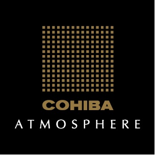

Another name to look for is Cohiba Atmosphere. Under the name of the most prestigious Habanos brand, these destinations promise the highest standards of service for enjoying a wide variety of Habanos brands and sizes combined with an array of drinks to match them. Several offer haute cuisine too.

You can find them already in cities like Beijing, Hong Kong, Tokyo, Prague, Buenos Aires and Cancun, but their numbers are increasing, so check the Habanos website at [Where to Smoke](https://www.habanos.com/donde-fumar/ "Dónde Fumar") when you make your travel plans.

##### Smoking rooms

All over the world more and more hotels, restaurants and bars are providing smoking rooms dedicated to the enjoyment of cigars. Some are indoors, others are outdoors according to local laws, but they all offer you the chance to light your Habano in comfort, often with a drink to match it. You can find a list of the best places on the Habanos website at www.habanos.testwalking.com

Welcome to the world of Habanos.

[El Festival del Habano](https://www.habanos.com/en/the-world-of-the-habano/el-festival-del-habano/ "El Festival del Habano")

