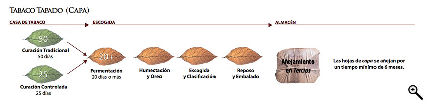

# A long way yet to go

Growing the leaf is just the start of the story, with many patient stages of processing yet to come. Nothing can be hurried.

Many months and in some cases years will pass before the leaf is ready to make a Habano.

The diagrams show the path that each type of leaf must take, from the farmer's curing barn to its final resting place in the warehouse where it will be aged.

The variation in the time taken to ferment and age the different types of leaf means that the crops from several different harvests are needed to make a Habano.

 ")
