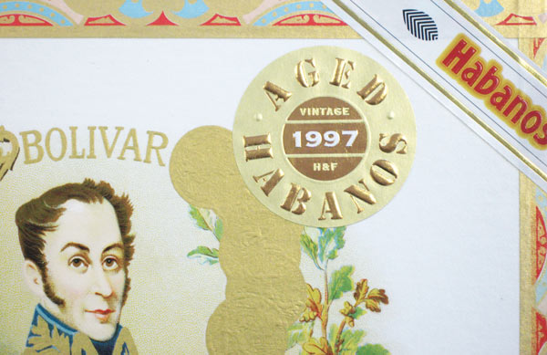
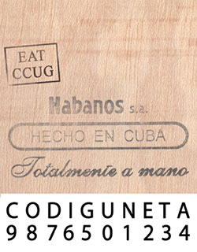

# Ageing finished cigars

The first thing most cigar enthusiasts do when they buy Habanos is to look for the date stamped on the bottom of the box to find out when they were made. The most knowledgeable among them are aware that the age will affect the flavour and aroma in the same way as it does with bottles of the finest wines.

The filler leaves, the binder leaf and the wrapper, which compose the blend, will bed down gradually over time provided they are kept in the correct conditions.

The starting point for this process was on the cigar roller's bench when all the leaves met for the first time. Moisture was added to make the leaves malleable, which provoked a final fermentation and the finished cigars were left in the Escaparate for a time to recover. Then they were banded and placed in boxes, which were  It is from this point that the "Vintage" or "Box Age" of a Habano is measured.

The last vestiges of the processes that brought the tobaccos to their flavoursome conclusion remain present in the cigars enabling them gently to develop still further.

Eventually these cigars become known as Aged Habanos, but remember, in this context, the vintage has nothing to do with any extra ageing of the tobacco leaves, or when they were harvested.

##### The ideal conditions for ageing Habanos

The important thing for a Habano is that it is allowed to retain its original characteristics so that it can develop flavours and aromas that are even rounder, more balanced and sometimes more pronounced than when it was bought. A constant temperature is required as well as a level of humidity to prevent its aromas fading and a loss of substance which would occur if it were to dry out.

To obtain the full benefits of ageing in boxes the following requirements should followed:

1. The Habanos should be kept between **16oC** and **18oC** and between **65%** and **70%** relative humidity so that the delicate balance of flavours can develop properly.
2. The location should be well-ventilated so that any unpalatable aromas can disperse freely.

##### The concept of aged habanos

No hard and fast rule exists on the amount of time that must elapse before a Habano can be described as "Aged".

Some consider that 5 years is sufficient for the benefits of ageing to become apparent, others feel that at least 10 years should pass since the Habanos were placed in their box.

Nor is there a unique theory on how the taste of any particular size or brand of Habanos will change over time. Many books and articles have been written on the subject, but nothing counts as much as the individual taste preferences that smokers have accumulated through their own experience.

There are some countries where there is a long tradition of ageing Habanos. For example in England it has been the custom to leave Habanos for at least two years before they are smoked.

Also it was in the United Kingdom that in 2008 the [Habanos distributor](https://www.habanos.com/en/donde-comprar-2/distribuidores/ "Distribuidores") introduced Aged Habanos for cigars with a minimum age of ten years, which had been stored carefully on their premises in the perfect conditions. Each Habano was given a second band indicating its vintage – the year in which it was made.

Provided that the correct conditions of temperature and humidity are respected, you can build your own collection of Habanos and age them for a long time. There are aficionados and collectors of Habanos, who treasure boxes with very old dates including some that go back fifty years or more. Sometimes their patience is rewarded at auctions where aged Habanos have been known to attract prices as high as $1,500 per cigar.

The maximum time that a Habano can continue to be kept and to improve its taste qualities while it is ageing is another matter that attracts conflicting opinions. In any event the length of time it will last depends upon the blend and the quality of the tobaccos used to make the Habano that is being aged and, of course, on the correct temperature and humidity to avoid the cigar losing its aroma through evaporation.

##### Identifying the date of a box

Finding the date on boxes made since the year 2000 is comparatively easy as was explained on page 73. However between 1985 and 1999, the dates were stamped using a three or four letter code.

From 1985 to 1998 the code word used was NIVELACUSO with each of the ten letters corresponding to a number as you can see below:

Under this system, if you see the letters NISC on a box, they will convert to 1297, which means that the box was filled in December 1997, LUC converts to 587, or May 1987, and so on.

Example of NIVELACUSO code NNSO: Made November 1990

However in 1998, when a new codeword, CODIGUNETA, was introduced to replace NIVELACUSO, things became complicated. First, the order of the numbers as they related to the letters was changed so that a box carrying the letters UNCC would date from January 1999. And second, because the code was broken early in the year and from around May onwards another system of randomly chosen letters and numbers replaced it.

These were:

1. EP00 – May 1999
2. ES00 – June 1999
3. EU00 – July 1999
4. EA00 – Agost 1999
5. EO00 – September 1999
6. LE00 – October 1999
7. LL00 – November 1999
8. LR00 – December 1999

Example of CODIGUNETA code CCUG: Made May 1999

Armed with this information you can go back over a quarter of a century to identify the age of a Habano box. If you wish to delve even further into history, some help is available from the other , but otherwise you will have to consult an experienced cigar merchant.

[El Festival del Habano](https://www.habanos.com/en/the-world-of-the-habano/el-festival-del-habano/ "El Festival del Habano")
