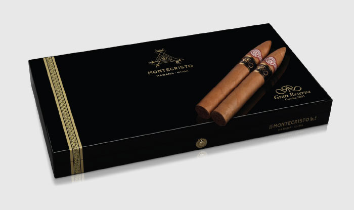
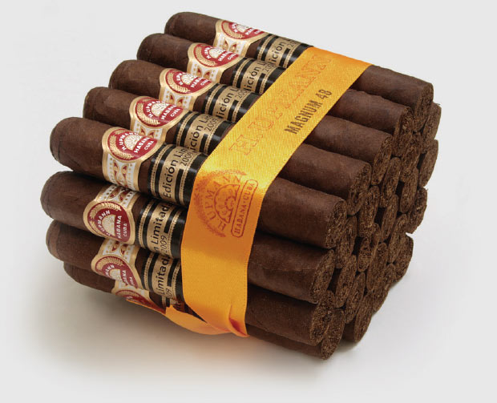
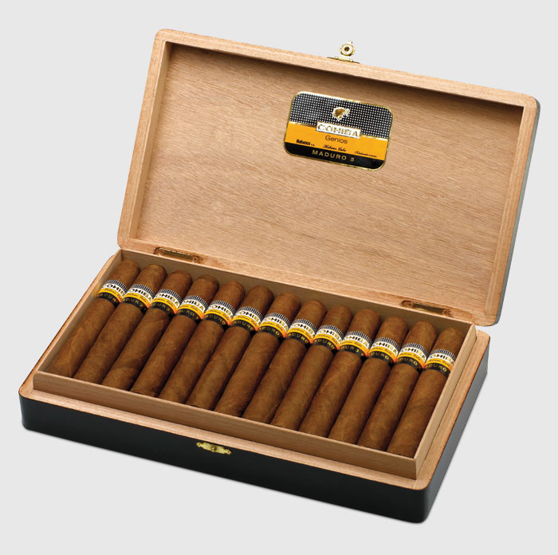

# Ageing tobacco leaves

There are two ways in which Habanos can benefit from the passage of time.

One is before the cigars are made when the tobaccos are left to mature for an additional period. The other takes place after the Habanos have been made and are sealed in their boxes.

Various types of categories exist within the Habanos Protected Denomination of Origin that take account of these processes and are recognised by the . Their unique characteristics merit special attention.

##### Ageing tobacco leaves

Earlier chapters in this book have studied the complex and, above all, time consuming processes of curing, fermentation and ageing through which all the leaves in a Habano must pass. Once completed the tobacco leaves are fully conditioned and ready to be made into cigars. However, just as with the most valuable spirits like fine Cognacs, Malt Whiskies or Rums that are left for years in oak barrels to improve, tobaccos for Habanos can benefit too from extra ageing. Tannins are released while sugar levels increase to deliver a rounder, mellower, distinctly aromatic taste to the tobacco leaves.

 Filler and binder leaves ageing in "pacas".

Since 1999, bales of all the different types of leaves, selected for their ageing potential, have been reserved from each year's harvest and kept at special warehouses in Havana. As a result stocks of aged tobaccos now exist to create some remarkable Habanos, produced in small quantities and designed to appeal to the most knowledgeable enthusiasts.

Most of these aged tobaccos are used in special editions of Habanos that are released from time to time, but some are used in standard production sizes. In some cases all the types of leaf they contain are specially aged, in others the extra ageing applies only to the wrapper leaves.

 Wrapper leaves ageing in "tercios" made of "yagua"

The categories of these cigars that are approved by the Regulatory Council for the Protected Denomination of Origin (D.O.P.) Habanos are explained next.

##### Reserva

The term Reserva is used to describe Habanos in which all the leaves – fillers, binders and wrappers – have been aged in bales for at least 3 years before being taken to the factory for rolling.

Specially selected leaves from  are used to produce the Reserva Habanos.

The first of this type of speciality, the Cohiba Seleccion Reserva, was released in 2003 using tobaccos from the 1999 harvest. Subsequently the Partagas Serie D No. 4 Reserva was made from leaves grown in 2000 and the Montecristo No. 4 Reserva from leaf harvested in 2002.

Customarily only a limited number of Reserva Habanos are made for each release. They are presented in just 5,000 elegant, lacquered boxes containing 20 Habanos, which are numbered accordingly. Every cigar carries a second black and silver band identifying that it is a Reserva.

##### Gran Reserva

The term Gran Reserva applies only to Habanos whose fillers, binders and wrappers have all been aged for at least 5 years before being rolled at the factory.

Only those judged to be the finest leaves from , the best tobacco growing zone in Cuba, are chosen to undergo such a lengthy confinement to ensure that, when the time comes to turn them into Habanos, they will offer a unique flavour and aroma.

 Cohiba Siglo VI Gran Reserva Cosecha 2003.

The first Gran Reserva Habanos was released in 2009, produced with tobaccos harvested in 2003. The size selected was the iconic Cohiba Siglo VI. It was presented in just 5,000 elegant, lacquered boxes containing 15 cigars, which were numbered accordingly, and each Habano was identified by a black and gold Gran Reserva band.

A second iconic size, the Montecristo No. 2, was released as a Gran Reserva in 2011 using tobaccos harvested in 2005.

##### Edición Limitada

The first Edición Limitada –Limited Edition Habanos – were introduced in 2000 and since then between three and five releases have been made annually, except in 2002. Limited Edition wrappers are darker than those found on standard Habanos. Darker wrappers come from the leaves picked from the higher levels on shade-grown tobacco plants, which are thicker. Such leaves demand longer periods for fermentation and ageing so they are left in bales for at least two years before the cigars are made.

At the outset it was only the wrappers on Limited Editions that were made from extra-aged leaves, but since 2007 the fillers and binders too have been specially aged for at least two years.

The boxes carry an extra black and gold seal indicating that they contain Limited Edition cigars and giving the year when they were released. Each cigar is dressed with a second band giving the same information.

##### Cohiba Maduro 5

Cohiba Maduro 5 differs from the other cigars in this section in two ways. First because it is a standard line and not a speciality Habano; and second, because it provides an example of a cigar in which just one of its leaves, the dark  wrapper, is made from extra-aged tobacco.

Introduced in 2007, all three sizes in Cohiba's Linea Maduro 5 are dressed uniformly with wrappers that have been harvested from the very top levels of shade-grown tobacco plants to ensure that once aged they are all dark enough to earn the colour classification maduro. These leaves, which in Cuba are produced by entirely natural means, demand extra fermentation and ageing. In this case they are left to mature for at least five years, as the number 5 in Line's name confirms, before they are added to the cigars.

Opinions differ in the Habanos world over how much the wrapper influences the taste. However few would dispute that Cuban maduro wrappers bring a significant sweetness and distinct aroma to the flavour.
