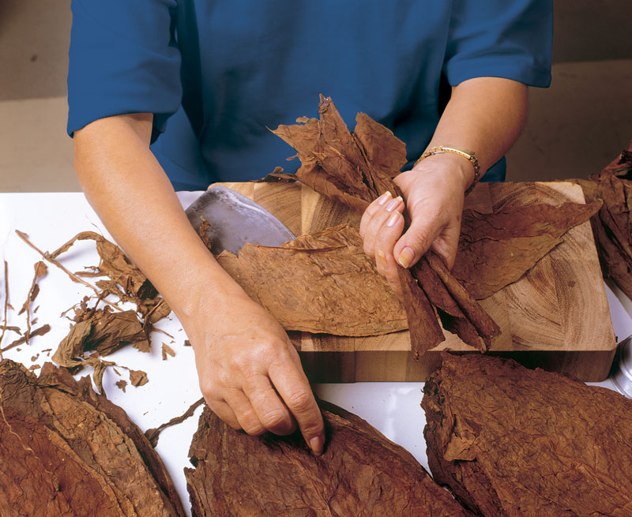
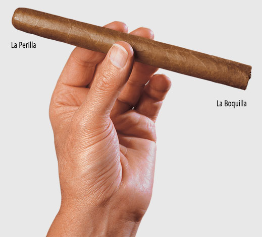

# Anatomy of a Habano

It takes up to six types of tobacco leaf to make a Habano, each type specially grown and prepared for its purpose.

Four for flavour…

Two, three or four types of leaf are blended to form the ***tripa***, or **filler**, source of the rich flavours and aromas that immediately distinguish a Habano from the rest.

1. ***Volado***: a light-flavoured leaf, especially valued for its combustibility also known as *1* (Strength 1).
2. ***Seco***: medium-flavoured, the most important leaf for aroma *2* (Strength 2).
3. ***Ligero***: a full-flavoured and slow-burning leaf that adds strength to the blend *3* (Strength 3).
4. **Medio Tiempo**: a rare leaf used very occasionally to bring extra intensity to the taste *4* (Strength 4).

…one for structure…

The ***capote***, or **binder**, is the special leaf that wraps around the leaves of the filler, defining the shape of the Habano and perfecting its smoking quality…

…and one to delight the eye

The ***capa*** or **wrapper** is the exquisitely thin and supple leaf that forms the outer surface of the cigar.
The wrapper contributes little to the flavour of a Habano, but it stands as the ultimate symbol of the cigars perfection.

Every leaf is grown in Cuba, especially for the making of Habanos.

**You will not find such tobacco in cigars that are not Habanos.**
