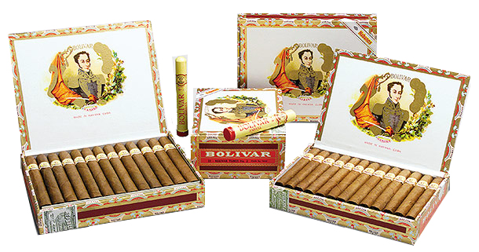
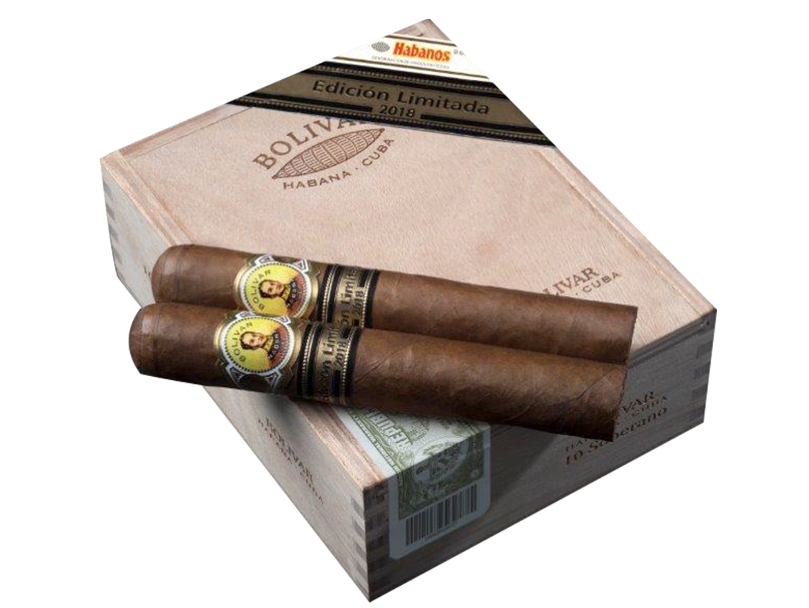

# Bolivar

Simón Bolívar is one of the great figures of the 19th century. He has gone down in history as the Liberator of a large part of South America from Spanish rule.

The Bolívar brand was created in 1902. Today it is based at the Partagás factory in downtown Havana.

In keeping with the character of the historical figure after whom it is named, this Habano is characterized by the strong personality of its flavour. Bolivar is one of Habanos' strongest and most flavour brands. The blend composed of filler and wrapper leaves coming from the Vuelta Abajo zone  is especially appreciated by expert smokers.

The Bolívar brand has spread its chart size and presentations: in 2018 was launched its limited edition **Bolívar Soberano (54 x 140 mm length)**, which for the first time featured the Duke Factory size, totally unprecedented in the brand's portfolio.

With this Habano, aficionados can enjoy the brand's balanced and aromatic blend in a completely new format. Its most recent release was **Bolívar Regentes** (52 x 130 mm length) 2021 Limited Edition.

All  Habanos  are made "Totalmente a mano con tripa larga" – *Totally  hand**made with long filler.* It is a favorite brand  among Habanos enthusiasts of full flavour Habanos.

**Strength**

- *Full*
