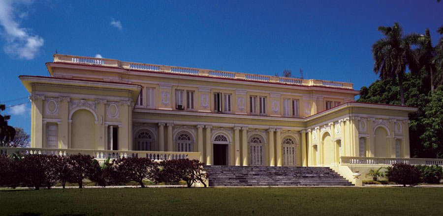
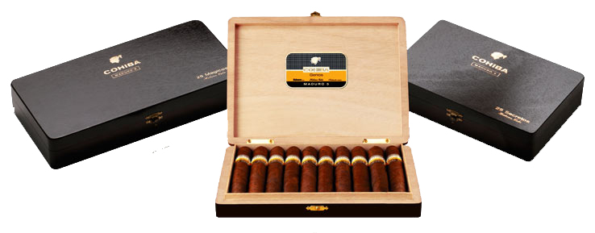
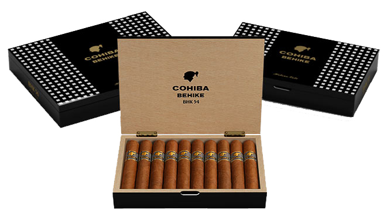
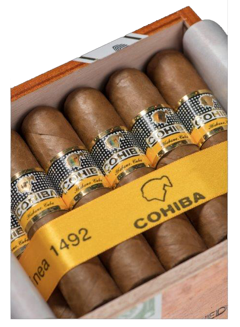

# Cohiba

Cohiba is the most prestigious brand in the tobacco world and in 2016 it celebrated its 50th anniversary.
It was created in 1966 and for many years it was intended solely as a gift to government personalities, national and foreign, and of course to President Fidel Castro. Since then, it has been manufactured in the prestigious El Laguito factory in Havana.

Since 1982, the year in which it is presented in different countries, Cohiba has been available to be enjoyed by the world's most demanding smokers in limited quantities.

*Factory «El Laguito», in Havana.*

The name "Cohiba" is an old word used by the Taíno Indians, original inhabitants of the Island, to define the rolled tobacco leaves that these Indians smoked, and that Christopher Columbus saw for the first time in Cuba in 1492. Cohiba is for hence the first name of tobacco.

It is the most prestigious brand in the tobacco world, the elite of Habanos. The leaves used in its preparation are "the selection of the selection" of the best vegas of "San Juan y Martínez" and "San Luis", in the "Vuelta Abajo" area of the "Pinar del Río" region, Cuba.

All the Habanos of the Cohiba brand are made "Totalmente a mano".

Cohiba is the only Habanos brand in which two of the three types of leaves used to make it, dry and light, undergo additional fermentation. This special treatment gives Cohiba an unmistakable aroma and flavor, which cannot be found in any other brand.

*Línea Clásica.*

Cohiba initially launched the Línea Clásica, developed between 1966 and 1989 with its characteristic medium to strong flavor; to which would be joined the Line 1492, with a medium flavor, which was launched in 1992 to commemorate the V Centenary of the arrival of Christopher Columbus on the Island; and later the Cohiba Maduro 5 Line, with a mature layer aged for five years through natural processes, which was launched in 2007 with three new vitolas.

*Línea 1492.*

In 2009 the first Gran Reserva de Habanos was presented, under the Cohiba brand with the Siglo VI vitola, emphasizing the unique character of Habanos.

In 2010, the brand's portfolio was expanded with the launch of the new Cohiba Behike line, the most exclusive Habanos, S.A. has ever launched. For the first time, it incorporated Medio Tiempo in its blend, a leaf from the 2 upper leaves of the sun tobacco plant that gives it an exceptional character and flavor.

*Línea Maduro 5.*

In 2021, Cohiba turns 55 and has developed a broad portfolio and, in addition, has been present as a priority in the development of special products, which include products that are introduced to the market on a very limited and exclusive basis.

Cohiba, at 55, continues to be a brand in continuous renewal and innovation, always desired and attractive to current and future fans.

*Behike.*

Through this constant innovation, Cohiba is always the avant-garde brand that leads the trends in the world of Habano, being the first to introduce a Reserva in 2002, and a Gran Reserva in 2009, which were made with leaves of tobacco aged a minimum of 3 and 5 years respectively.
Cohiba, is synonymous with exclusivity, of the highest quality, but also of something beyond the senses, a unique experience for lovers of considered the best tobacco in the world.

*Cohiba Medio Siglo.*

*Cohiba Medio Siglo.*

**Strenght:**

- Línea Clásica: *Medium to Full*
- Línea 1492: *Medium*
- Línea Maduro 5: *Medium to Full*
- Línea Behike: *Full*
