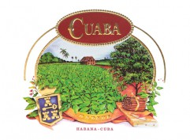

# Cuaba

The Cuaba brand is characterized by having Habanos with very distinctive shape known as *Double figurados*.

This brand recreates at the end of the 19th the style for Double Figurados Habanos became fashionable. A century later, in 1996, this traditional style was revived at the Romeo y Julieta factory.

Double Figurados, are at the pinnacle of the cigar maker's art, and for this alone they merit a place in every cigar enthusiast's collection.

At the start Cuaba offered just comparatively small sizes. Divinos, Tradicionales, Generosos and Exclusivos. Since 2003, three much larger vitolas, Distinguido, Diadema and Salomon, have been released as part of the standard range.

Cuaba is an Indian word dating back to the time of Christopher Columbus when he arrived to Cuba, it was the name for a highly combustible bush, and was used to light cigars during religious ceremonies.

All Habanos are made "Totalmente a Mano con Tripa Larga "- Totally handmade with Long Filler, with wrapper filler leaves coming from the Vuelta Abajo zone, in the Pinar del Rio region, Cuba.

**Stregnth**

- *Medium to Full*
