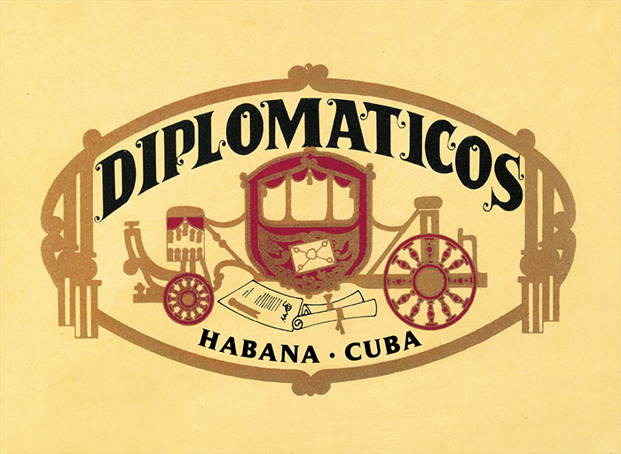

# Diplomáticos

Diplomáticos is a comparatively recent brand dating from the 1960's. It bears a marked resemblance to Montecristo, using numbers not names to describe its sizes.

All the Habanos of the brand are made "Totalmente a Mano con Tripa Larga", Totally handmade with long filler and with wrapper and filler leaves coming from Vuelta Abajo zone, in the Pinar del Río region, Cuba.  This brand is a medium to full strength Habano.

**Strength**

- *Medium to Full*
