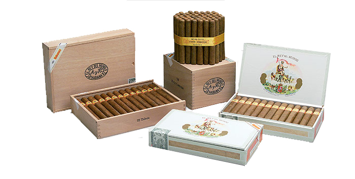

# El Rey del Mundo

In 1882, and under the aegis of Antonio Allones, who had started producing Habanos over 30 years in Havana, it was decided to launch a brand of premium quality and price, with a name that quickly became known for its great dose of pretense: "The King of the World".

This success lives on to this day in a selected range of Habanos renowned for its light to medium flavour and consistency by the most demanding smokers.
It is a brand that it has been used a lot in regional editions.

All of the Habanos are made "Totalmente a Mano con Tripa Larga"- Totally Handmade with Long Filler" with filler and wrapper leaves coming from the Vuelta Abajo zone, in  Pinar del Río region, Cuba.

**Strength**

- *Light to Medium*
