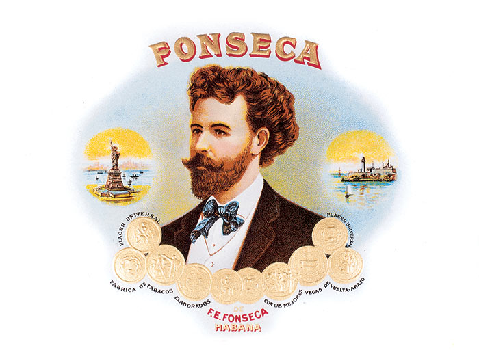

# Fonseca

Don Francisco Fonseca founded his brand in the last decade of the 19th century.

It is said that Don Francisco was an elegant person whose concern for appearance was transferred to the Habanos brand he created: presenting his Habanos in an original tissue paper that wraps them all together.

Even today, this kind of presentation is still a characteristic and distinctive feature of the vitolas that make up this brand's offer. Fonseca's smooth blend of filler and wrapper tobaccos from the Vuelta Abajo zone, with a light strength, is ideal to accompany light meals.

All Fonseca vitolas are Totalmente a Mano -Totally handmade, some with long filler and others with short filler.

**Strength**

- *Light*
