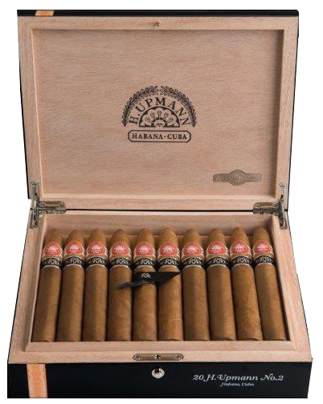
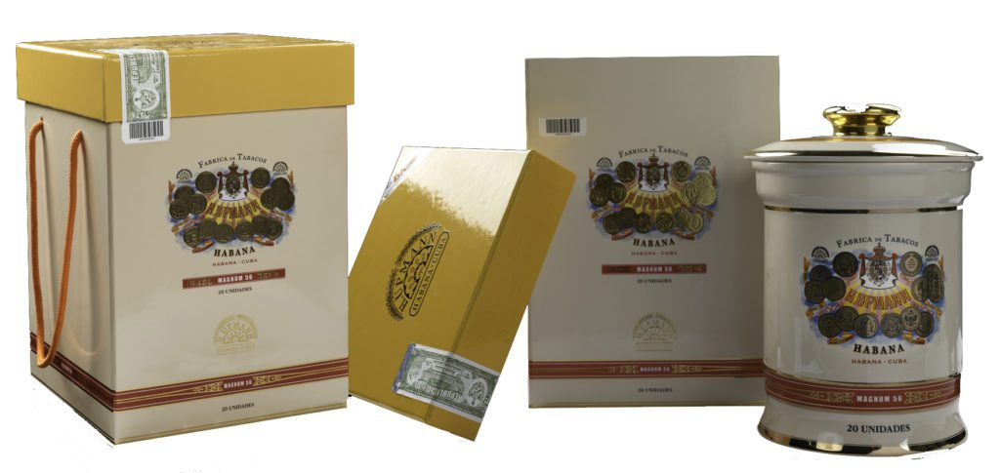
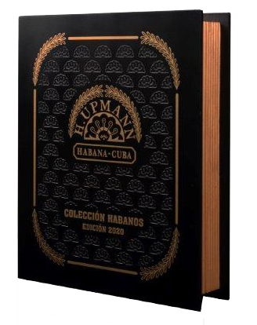

# H. Upmann

Herman Upmann was a German banker whose love for Habanos led him to settle in Havana in 1844 and found a bank and a Habanos factory in this city.

Over time, the bank closed, but his brand of cigars persists today as an example of the most refined Habanos medium strength flavour Habanos. The H. Upmann blend, with a light to medium strength, is obtained from leaves coming from the Vuelta Abajo zone, in the Pinar del Río region. All its vitolas are made "Totalmente a Mano con Tripa Larga "– Totally handmade with Long Filler.

The gold medals adorning the H. Upmann box were obtained in no less than eleven international fairs throughout the nineteenth century, as a reward for the brand's quality and inimitable aroma.

In 2008, the Magnum 50 was presented, a vitola that forms a Linea of its own together with the Magnum 46. This Linea has a differentiated presentation within the brand.

The vitola Half Corona was presented in 2011, specially designed for those who want to enjoy the full flavour of the Habano in a short smoke, or those who want to get closer to the Habano through the aromatic and balanced flavour of H. Upmann .

*H-Upmann Half Corona*

The first Reserva of the brand was presented in 2014: Upmann No. 2 Reserva Cosecha 2010.

*H-Upmann No. 2 Reserva*

The brand presented an important novelty in its regular line in 2016, with the launch of the H. Upmann Magnum 54 and the first Gran Reserva of the brand was presented in 2017: H. Upmann Sir Winston Gran Reserva Cosecha 2011.

The last Edición Limitada- Limited edition for the brand was presented in 2018 with the vitola H. Upmann Propios, a unique vitola within the medium ring gauge Habanos vitolas.

*H-Upmann Propios*

The brand launched the H. Upmann Magnum 56 Jar in 2019, an exclusive product for the Duty Free and Travel Retail channels that contains 20 units of the Magnum 56 vitola (56 ring gauge x 150 mm length).

*Jarra H-Upmann Magnum 56*

Colección Habanos continues to be one of the year's special launches most eagerly anticipated by faithful aficionados of the finest tobacco in the world.
This Colección Habanos H. Upmann is a benchmarks within the most refined Habanos with a smooth to medium strength flavour.

This Colección includes 20 H. Upmann SUPER MAGNUM, of which a production of 3,000 has been produced to satisfy a greater number of consumers and collectors. This production will be available at the international network of stores under La Casa del Habano franchise. For the first time, Habanos, S.A. incorporates an exclusive identifying second ring at the bottom for the collections.

SUPER MAGNUM (56 ring gauge x 180 mm length) is the parejo vitola with the heaviest ring gauge under the brand's standard portfolio. This ring gauge had only been used for the 2015 H. Upmann Magnum 56 Limited Edition. Línea Mágnum is characterized by its elegant, nuanced blend with smooth to medium strength flavour.

H. Upmann SUPER MAGNUM are made "Totalmente a mano con tripa larga" – "Totally Handmade with Long Filler" and their leaves are specially selected from the Vuelta Abajo area in Pinar del Río, Cuba, in small quantities. They are made by expert Cuban torcedores – cigar rollers – working painstakingly to meet the expectations of the most demanding Habanos aficionados.

*Colección H-Upmann*

*Some other new vitolas have been incorporated in the brand's portfolio.*

**Strength**

- *Medium to Light*
