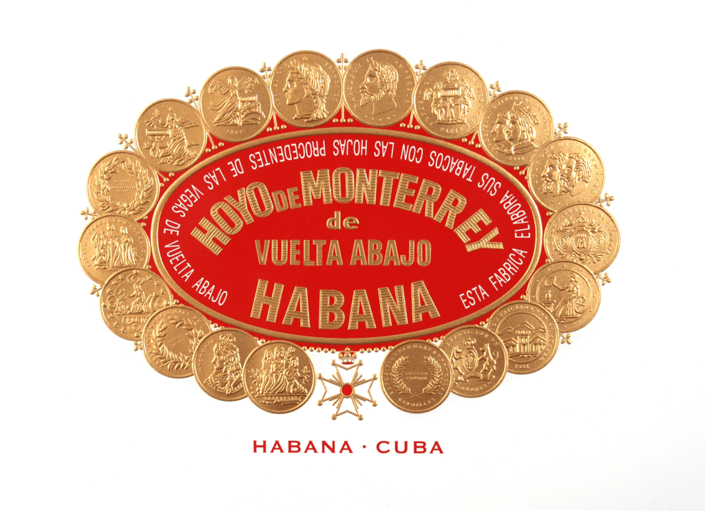
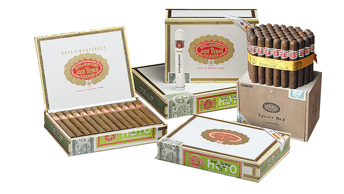

# Hoyo de Monterrey

Hoyo de Monterrey owes its origin to the plantation of the same name located in "San Juan y Martínez", in the heart of the "Vuelta Abajo" area. The Hoyo de Monterrey plantation, one of the most famous, has an inscription on the entrance door that reads: "Hoyo de Monterrey. José Gener. 1860". Hoyo de Monterrey is located in one of the fertile lands on the banks of the river that runs through "San Juan y Martínez".

All of the brand's vitolas are made "Totally Handmade with Long filler" with leaves coming from the region of "Pinar del Río", in the "Vuelta Abajo" area.

Vitolas such as Double Coronas and Serie Le Hoyo stand out in the brand, thanks to their slim and medium-ring gauge formats. Special mention should be made of Petit Robustos, a 102-mm-long 50-gauge format that was added to Hoyo de Monterrey's portfolio in 2004 and is especially aimed at those smokers who are looking for a high-quality Habano and do not have much time to enjoy it.

In 2008, the Epicure Especial vitola was introduced, joining the brand's standard portfolio after its success as Edición Limitada in 2004, and together with Epicure No. 1 and Epicure No. 2, it constitutes a Línea with a differentiated presentation.

In 2014, Le Hoyo de San Juan was launched, a new vitola that has revitalized and renewed the historic Le Hoyo Series.

In 2016, the brand introduced its Reserva Cosecha 2012 Epicure No. 2 and in 2018, it presented with a special edition for the La Casa del Habano franchise network. Also the same year, Le Hoyo de Rio Seco, the new thick-gauge vitola in the Le Hoyo series, was launched.

Last year's Hoyo de Monterrey Double Coronas Gran Reserva Cosecha 2013 was the Festival's main launch, being the brand's first Gran Reserva in its iconic Double Coronas vitola.

The light flavour of its blend makes it an attractive option for those who like a lower-strength, delicate and aromatic Habano with great elegance and complexity.

Primaveras under Hoyo de Monterrey brand was the new vitola selected by Habanos, S.A. in 2021 to celebrate the spring festival of the Chinese lunar year, the "Year of the Ox".

Primaveras of Hoyo de Monterrey is a limited-quantity production to commemorate this celebration in China, available worldwide. This vitola is presented in a special box of 18 Habanos made "Totally Handmade with Long Filler ", after a careful selection of the wrapper, filler and binder leaves from the most prestigious area, "Vuelta Abajo", in the "Pinar del Río" region, Cuba.

Its medium strength is another distinctive feature of this release that will delight the most experienced smokers of what is considered the best tobacco in the world.

**Strength**

- *Light*
