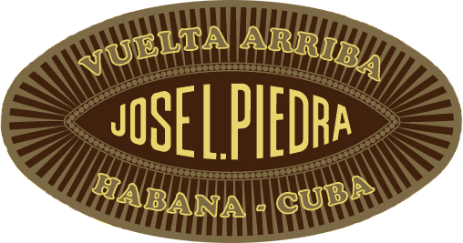

# José L. Piedra

José L. Piedra is a particularly noteworthy Habano not only because its blend is composed of filler tobaccos grown exclusively in the Remedios tobacco region, but also because it is made using the Totalmente a Mano, Tripa Corta, or "totally hand made, short filler" technique.
The Piedra family came to Cuba in the 1880's from the Spanish province of Asturias.

They settled near the town of Santa Clara, which lies at the heart of the Remedios region where tobacco has been grown since the 16th Century, and started to make cigars.

The family's second generation led by José Lamadrid Piedra, whose name is commemorated today, founded and developed the brand.

All seven of the José L. Piedra sizes are made from Remedios tobaccos using the traditional Tripa Corta,Totalmente a Mano – short filler, totally hand made – technique with a blend that provides a medium to full flavour.

The José L. Piedra brand is presented to the market with a new, renewed and more modern image. In the particular case of José L. Piedra Petit Caballeros, it is already appreciated with the new image, the deck of 12 units and the display of 15 units with petanque of 3 Habanos each.

**Strength**

- *Medium to Full*
