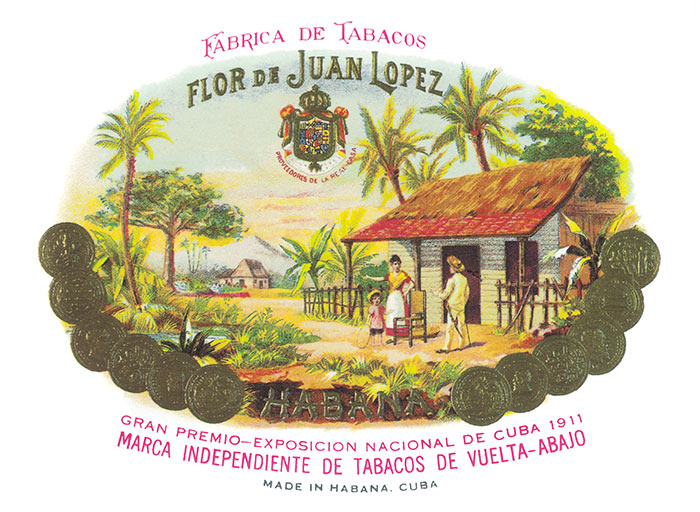
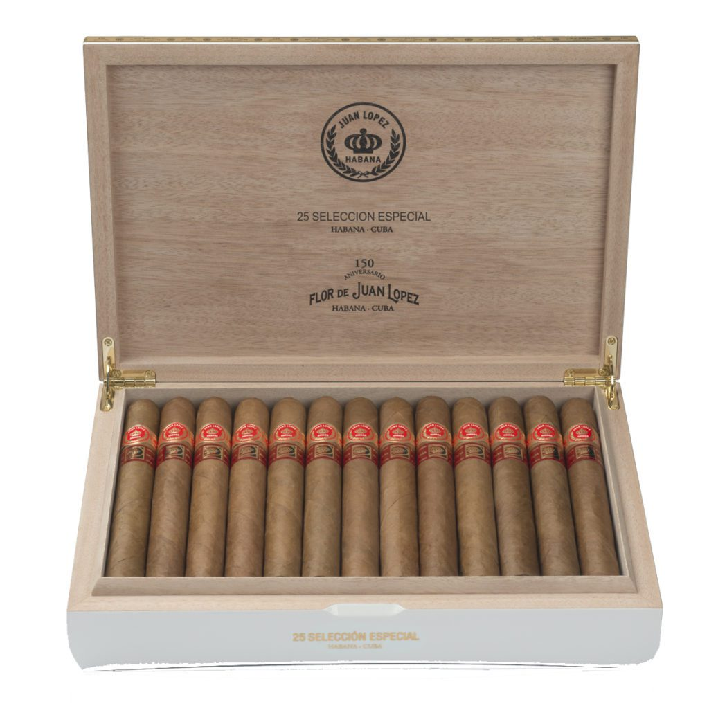

# Juan López

The Juan López brand was created by a Spaniard of the same name in the 1870s.

It is a brand known mainly in small circles of smokers, but they have a great deal of loyalty to this brand. The Selección No.1 and especially the Selección No.2 basically make up the brand's vitolario.

**Selección Especial** is a vitola that was incorporated into the brand's vitolario to commemorate its 150 years and 30 anniversaries of the international network of the La Casa del Habano franchise. Selección Especial consists of 25 Habanos of unique dimensions and a pleasant smoke.

All its vitolario presents a consistent flavour and is composed of vitolas made Totally by Hand with Long Tripe, with a blend composed of tripe and cape leaves from the Vuelta Abajo area, in the Pinar del Río region.

**Strength**

- *Medium to Full*
