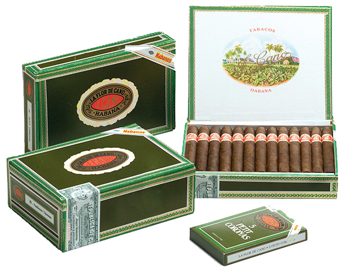

# La Flor de Cano

La Flor de Cano Habanos are characterized by a good balance between flavour and aroma. They are at a medium price level.

The Flor de Cano vitolario is made up of Habanos made Totally by Hand with Short Tripe from the Vuelta Abajo area of the Pinar del Río region, Cuba.

The Flor de Cano incorporates the new vitola with name Elegidos which is produced by the rest of the brand's portfolio, "Totalmente a Mano con Tripa Corta" – Totally Handmade with Short filler with leaves coming from the Vuelta Abajo zone, of Pinar del Río region, Cuba.

**Strength**

- *Medium*
