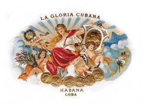
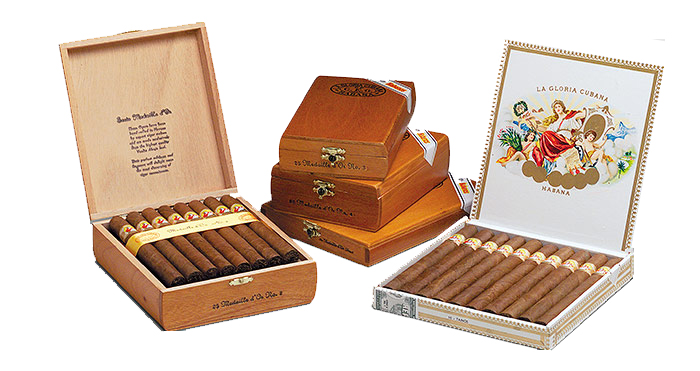

# La Gloria Cubana

La Gloria Cubana, founded in 1885, is a little known jewel amongst Habano brands, nevertheless it enjoys a long history, its name alone clearly defines its origin.

During its more than 100 years of history, La Gloria Cubana has always attracted a circle of loyal fans, who are traditionally among the most knowledgeable smokers.

The brand is characterized by its elegant presentation, especially in the Medaille d'Or Series. All the vitolas are Tripa Larga, Totalmente a Mano – long filler, totally hand made.

The blend, made from filler and binder tobaccos grown in the Vuelta Abajo region, is classified as medium and offers well-balanced nuances of taste and aroma.

**Strength**

- *Medium*
