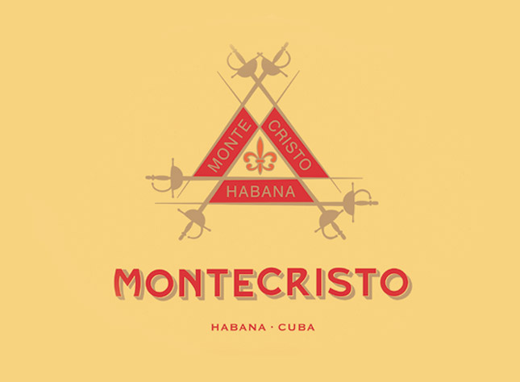
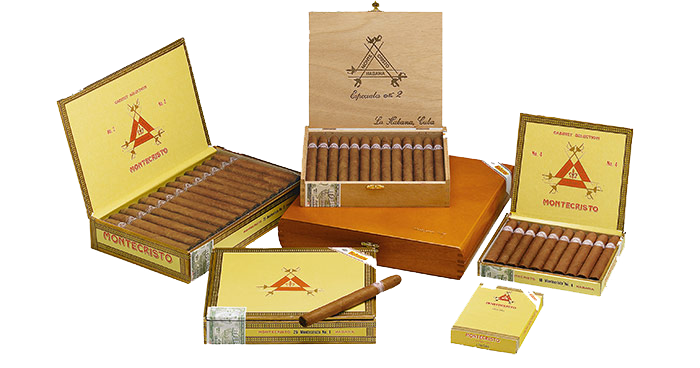
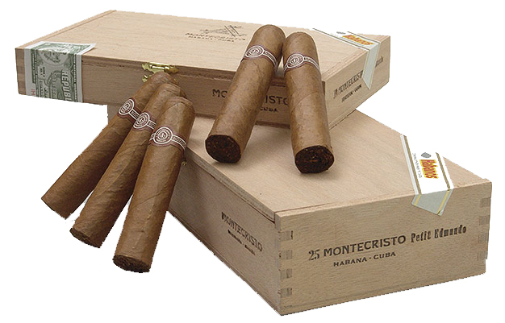
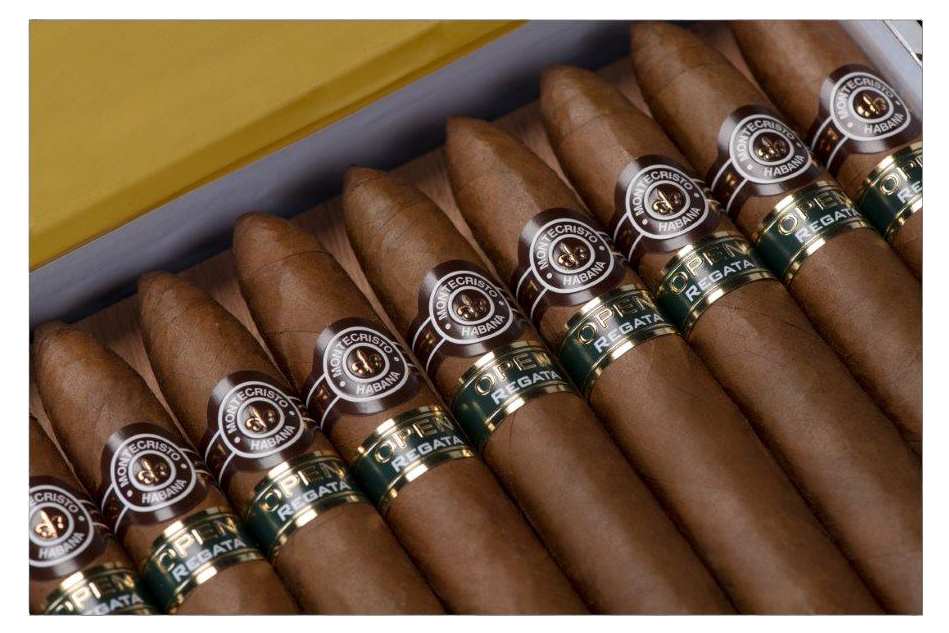
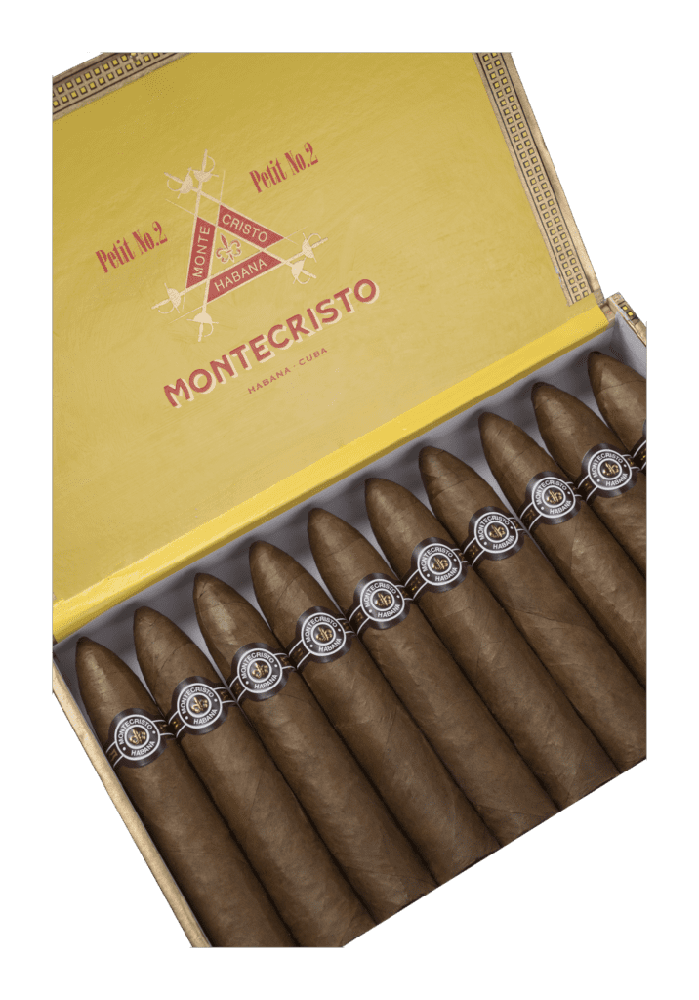
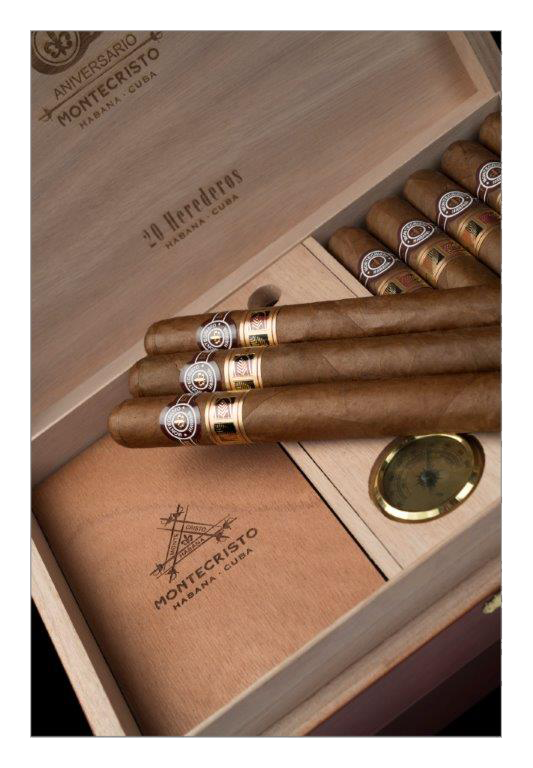

# Montecristo

Montecristo is one of the most recognized Habanos brands in the world. Montecristo could be considered to be the benchmark by which all other Habanos are measured.

Its name originates from the novel "The Count of Monte Cristo" by Alexander Dumas. The tobacco store reader read the novel to the Torcedores (cigar makers) at the H.Upmann factory in Havana, where the brand was founded in 1935. Such was the acceptance that it was decided to give the name of the novel's protagonist to the new brand.

Although initially it was composed by five unique vitolas, numbered from 1 to 5, the brand progressively completed an offer that currently covers the tastes of the most demanding smokers, from the majestic Montecristo A, to smaller formats.

*Línea Clásica*

Montecristo Edmundo and Petit Edmundo, were launched in 2004 and 2007 respectively, stood out among the latest launches of the brand.

*Montecristo Petit Edmundo*

With its distinguished aroma and its Long filler vitolas, made "Totalmente a mano" with leaves from "Vuelta Abajo" zone, it has captivated both experienced smokers and those new to the world of Habano.

In 2007, the Montecristo Reserva was presented, which has been aged for three years in all its leaves (wrapper, binder and filler) and paid tribute to the classic Montecristo No. 4, the best-selling Habano in the world.

In 2009, the Línea Montecristo Open was introduced, specially conceived to be enjoyed in open spaces, with four new vitolas: Eagle, Master, Regata and Junior.

 *Montecristo Open Eagle*

 *Montecristo Open Junior*

 *Montecristo Open Regata*

In 2011, the Montecristo Gran Reserva Cosecha 2005 was presented, the first Gran Reserva made in Montecristo, in a format highly prestigious among smokers: Montecristo No. 2.

In 2013, the Double Edmundo vitolas and a new figurado, the Montecristo Petit No. 2, were launched.

In 2015 the brand saw the launch of its special 80th anniversary vitola and Montecristo Churchills Añejados, and in 2016, the brand presented its 2016 Limited Edition with the new Montecristo Dantés vitola. Later on, Montecristo Línea 1935 was launched with three new vitolas -Maltés, Dumas and Leyenda- which were incorporated into the brand's regular portfolio, becoming the most premium proposal of the Montecristo brand.

 *Montecristo Petit No.2*

Montecristo Herederos is the vitola selected by Habanos, S.A. in 2020 to commemorate the 85 years of the brand and the 30th anniversary of the La Casa del Habano franchise network. Herederos was presented to the market in a special case of 20 flat-format Habanos and they were exclusively sold At the La Casa del Habano and Habanos Specialists franchise network.

 *Montecristo Herederos*

**Strenght**

- *Medium to Full*
- Línea Open: *Medium*
