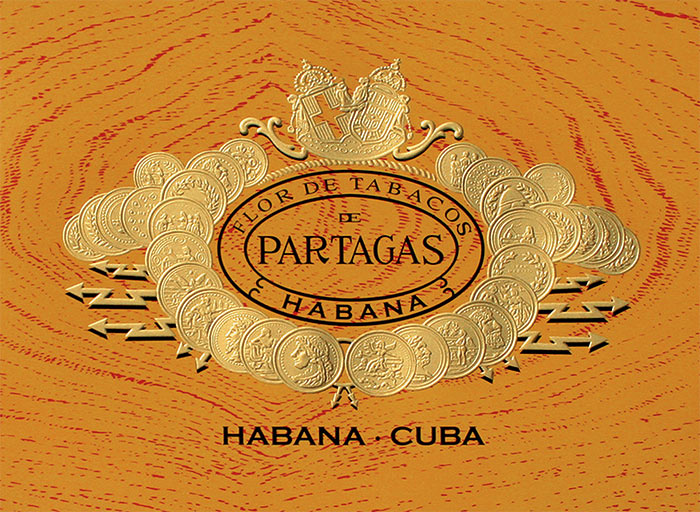
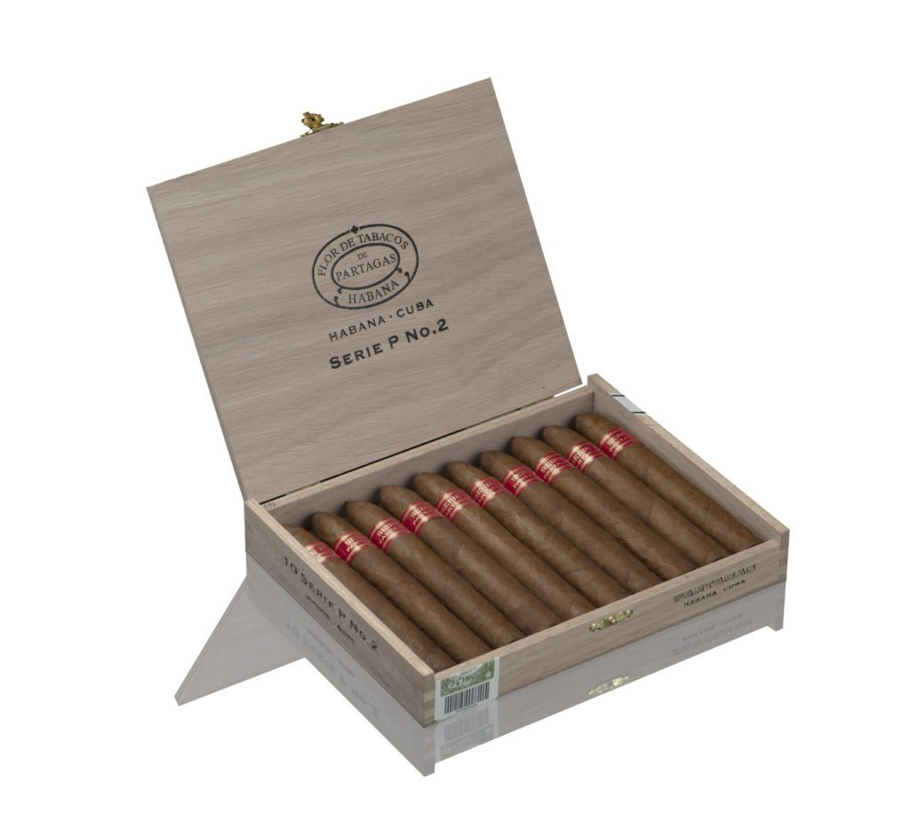
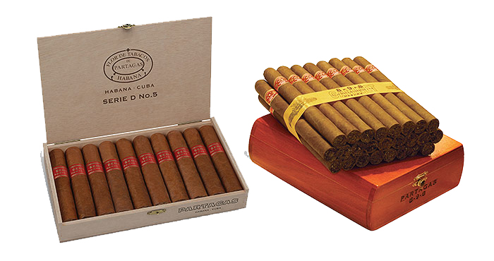

# Partagás

If there is a particularly famous Habanos factory in Havana, it is Partagás. For many years this Factory was located at 520 Industria Street, right behind the Havana's Capitol, in the heart of the city. Today, the Factory is located at 806 San Carlos Street.

The factory was created in 1845 by Don Jaime Partagás, and has been producing this prestigious Habanos brand ever since.

Partagás Habanos are immediately recognizable for their intense flavour. The character of its blend, made up of selected cigars from the Vuelta Abajo area, in the Pinar del Río region, is of inimitable richness and aroma.

The Partagás vitolario is characterized by a wide variety of shapes and sizes.

Particularly well- known are the Series D No. 4 vitolas, whose Reserva was the first made by Habanos in this concept, Lusitanias, 8-9-8 and the Partagás Pirámide: Series P No. 2, a pyramid that quickly became a Habano of choice for lovers of full flavor cigars, introduced in 2005.

In 2008, the Partagás Series P No. 2 and Series D No. 4 tubes and cardboard boxes released a new image.

In 2011, 2 new vitolas, Series E No.2 and Series D No. 5 were presented, within the well-known Series.

In 2013, the first Gran Reserva in the brand's history, Lusitanias Gran Reserva Cosecha 2007 was introduced to satisfy the most experienced smokers looking for an intense flavor with character.

The Partagás Tropicales Humidor has been chosen by Habanos, S.A. to commemorate the celebration of the brand's 175th anniversary, being one of the most awaited novelties for demanding Habanos lovers.

Tropicales has been the vitola selected to make up this special humidor. The vitola is of an even elegant format, and with unique measurements within the brand's portfolio (54ring gauge x 175 mm length), ideal for those aficionados who appreciate large-format and long-lasting vitolas.

In 2014 the brand hosted the launch of Series D No. 6 and in 2015 the concept of aged cigars was inaugurated with two reference brands, Montecristo and Romeo y Julieta, followed by Partagás Coronas Gordas.

The Partagás Series No. 1 Limited Edition, launched in 2017, introduced for the first time the factory name Noblezas, totally new, in the Habanos portfolio.

In 2018, Partagás Línea Maduro No. 2 and Maduro No. 3 were launched. The Maduro No. 1 vitola was launched in 2015 for the La Casa del Habano network of specialized stores and which became part of the standard portfolio making up this new Línea.

In recent times, humidors have been the object of desire of aficionados, becoming more relevant each year. Partagás Tropicales Humidor 175 Aniversario, is a "Global Specialty" of which only a unique series of 450 numbered copies will be made, containing 50 Habanos each, becoming a precious collector's item.

**Strength**

- *Fuerte*
