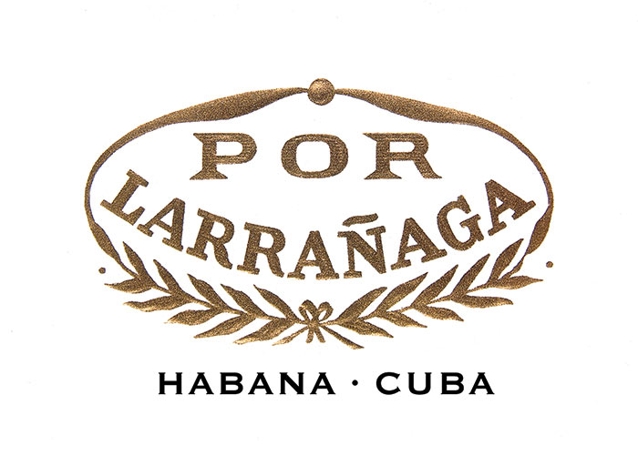
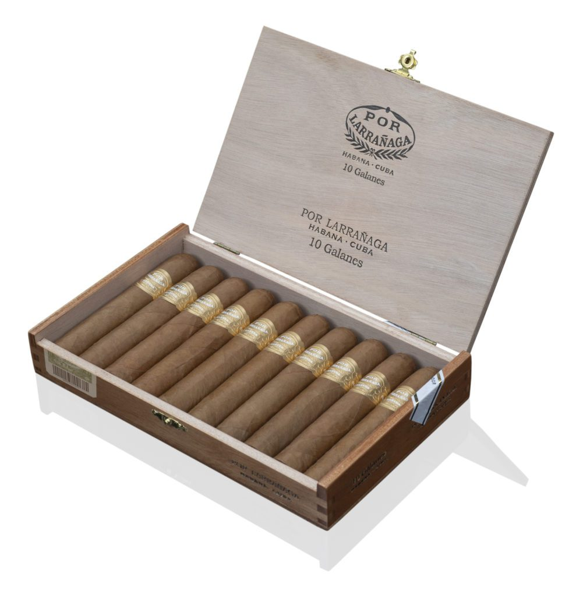

# Por Larrañaga

Por Larrañaga is a Habanos brand with a long history. Founded in 1834, it has a well-earned reputation as a brand that is carefully crafted and well presented.

The Por Larrañaga brand is characterized by Habanos made "Totalmente a Mano con Tripa Larga" y "Totalmente a Mano con Tripa Corta" -Totally Handmade with Long Filler and Totally Handmade with Short Filler. The filler and wrapper leaves for its preparation come from the Vuelta Abajo zone, in the Pinar del Río region, Cuba.

One of the brand's latest launches is the new Galanes vitola (52 ring gauge x 120 mm length) which is incorporated within the chart size of this historic brand of characteristic strength from light to medium and follows trend shapes of recent times. It is the first heavy-gauge vitola to be introduced into the brand's portfolio.

**Strength**

- *Light to Medium*
