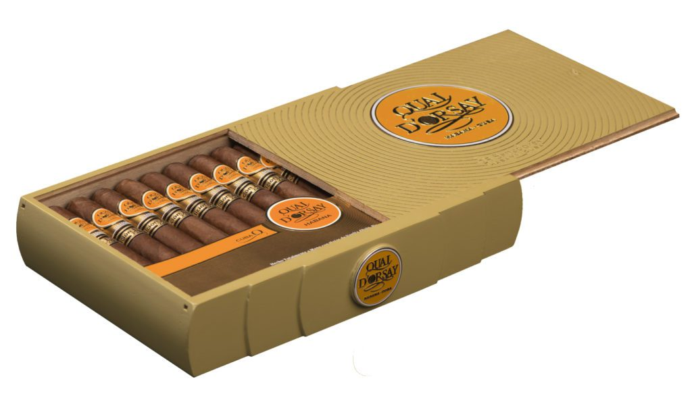

# Quai d'Orsay

Quai D'Orsay is a young brand within the Habanos vitolario, established in 1973 by Cubatabaco exclusively for the French market at the request of Seita, the former French company.

Its name is due to the famous avenue of Paris located on the edge of the Seine and where Seita had his offices at that time.

For more than 40 years, the brand has remained a discreet jewel in the Habanos portfolio, accessible only to experts in the French market. The biggest innovations were successful in regional editions and four in recent decades were exclusively for the French market.

All the Habanos of Quai D'Orsay are made "Totalmente a mano con Tripa Larga"-"Totally Handmade with Long filler" and light strength.

Quai D'Orsay brand began a new stage with the launching of two new vitolas in which they were released with a new image and with international distribution to the different markets of Habanos, S.A.

**Quai D'Orsay No. 50** (50 ring gauge x 110 mm length) and **Quai D'Orsay No. 54** (54 ring gauge x 135 mm legth), the latter, is a new vitola within the regular portfolio of Habanos, S.A. Both presentations were combined with the **Coronas Claro** size (42 ring gauge x 142 mm length) to produce a suggestive brand portfolio available throughout the world through the international distribution network of Habanos, S.A.

The brand has gained presence and visibility of origin with the mentions "Havana" and "Cuba" in the center and on the sides of the ring. A simplified version of this new ring was presented in the 2016 Regional Edition for the French market, in the **Quai D'Orsay Secreto Cubano** vitola (ring gauge 40 x 110 mm length).

With these new vitolas which were incorporated into the brand's regular portfolio, Habano enthusiasts from all over the world will be able to discover and enjoy the refinement and French "charm" and all the light strength of the best Cuban tobacco.

**Strength**

- *Light*
