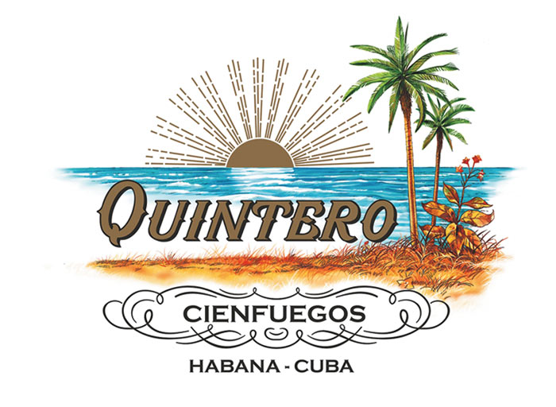
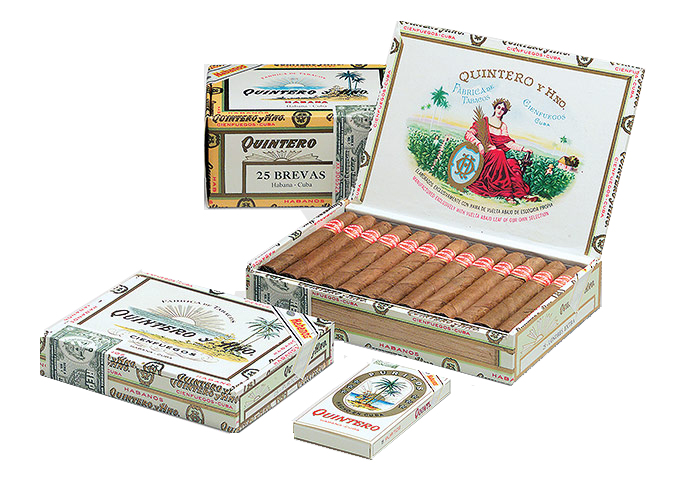

# Quintero

Quintero is an interesting brand for those who want to access to the Habano's flavour with a medium strength, but with an affordable price.

It is one of the few Habanos brands that was not born in Havana. Its founder, Agustín Quintero settled in the city of Cienfuegos, also called the Pearl of the South.

All the Habanos made with this brand's blend comes from the Vuelta Abajo zone.

Quintero Habanos are made with the "Totalmente a Mano" technique with Short filler to get their characteristic medium flavour.

**Strength**

- *Medium*
