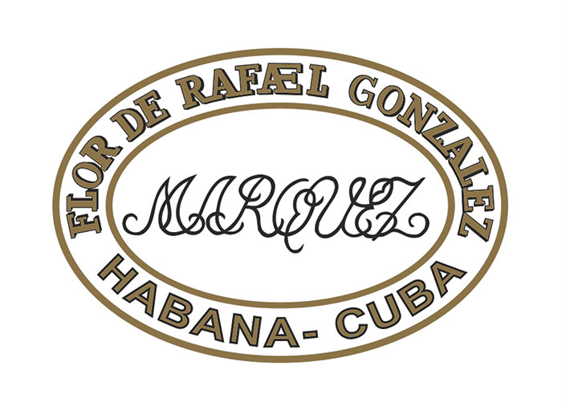

# Rafael González

Rafael González is a brand created in the 1930's.

This brand which has the factory name of Cervantes, was first called a Lonsdale after Lord Lonsdale.

On its lid label each box carries a curious inscription written in English to the effect that the cigars should be smoked within one month of the date of shipment from Havana or otherwise they should be carefully matured for about one year.

All sizes are made with filler and binder leaves coming from the Vuelta Abajo zone, in Pinar del Río region and it is characterized by a light strength.

Rafael González vitolas are made "Totalmente a Mano con Tripa Larga" – Totally Handmade with Long Filler and just one is made with short filler technique.

**Strength**

- *Light*
