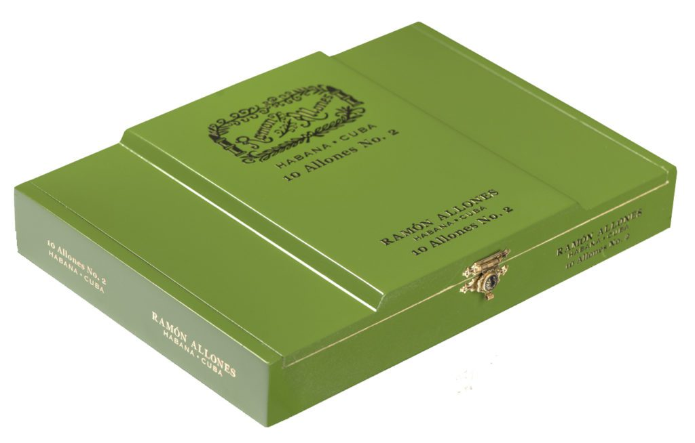

# Ramón Allones

Ramón Allones is one of the big names in the history of Habanos. Founded in 1837, it is also one of the oldest brands still in production.

Ramón Allones was the first one to pack his Habanos in boxes decorated with labels and stamped with his brand's emblem, being the pioneer of packaging tradition that we know today.

The Ramón Allones brand is also used in regional editions.

All the Habanos are made "Totalmente a Mano con Tripa Larga" Totally Handmade with Long Filler, with wrapper, binder and filler leaves coming from the Vuelta Abajo zone, in Pinar del Río region, Cuba. It is a brand characterized by their intense and complex taste.

Among the most renowned vitolas are: Gigantes and Allones Specially Selected.

Vitolas, such as Ramón Allones Allones No.2, 2019 Limited Edition have been incorporated among others with a great acceptance.

**Strength**

- *Full*
