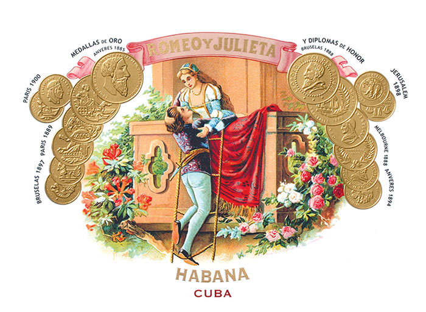
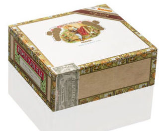

# Romeo y Julieta

The name Romeo y Julieta, created as a Habanos brand in 1875, has its roots in the literary tragedy of the same name by the English writer William Shakespeare.
The brand achieved international renown in the early years of the 20th century, after Don "Pepín" Rodríguez, one of the first to recognize the importance of rings as a factor for success.

Winston Churchill was one of the brand's most devoted smokers. Since his visit to Havana in 1946, his name was used on some rings and gave name to the brand's best known vitola: Churchills of Romeo y Julieta.

In 2006, Habanos, S.A. launched the younger brother of this emblematic vitola: Short Churchills, the Robustos of Romeo y Julieta.

Churchills is a mythical name in the Habano. Ever since Winston Churchill's visit to Cuba in 1946, numerous elements have reflected this personality's fondness for Habano in his rings.

First it was the Churchills, then the Short Churchills and, in 2010, two new vitolas of this famous brand were introduced: Wide Churchills, a new format that inaugurates the 55 ring gauge for the trend among lovers of thick ring gauge vitolas, and Julieta.

*Wide Churchills*

Its balanced and aromatic blend, with filler and binder leaves from the Vuelta Abajo area, in Pinar del Río region, makes Romeo y Julieta the classic medium-flavored Habano. Today, it enjoys great international prestige and presents one of the widest range of Habanos vitolas.

In 2012, the brand introduced 2 new products. A new vitola, Petit Churchills, ideal for those looking for a Habano with an aromatic and balanced flavor that can be enjoyed in a short period of time, and the new Reserva of Romeo y Julieta brand, with the vitola Churchills Reserva Cosecha 2008, made with cigars from the Vuelta Abajo zone, in the Pinar del Río region, aged for a minimum of 3 years.

*Romeo y Juleita Añejados*

In 2015 Romeo y Julieta Gran Reserva Cosecha 2009 and Julieta Pirámides Añejados were presented.

In 2017, the brand introduced the Romeo y Julieta Petit Royales and, in 2018, the Romeo y Julieta Tacos Limited Edition was launched.

*Petit Royales*

Romeo y Julieta turned 145 years old and to commemorate its anniversary the new "Linea de Oro" was presented, the most exclusive and elegant of Romeo y Julieta. This new Linea consists of 3 new vitolas, two of them in an even format and one in a figurative format, they are new vitolas in the Romeo y Julieta portfolio and introduced, for the first time, a Medium to full strength.

***Dianas, Hidalgos y Nobles***, have been the vitolas chosen by Habanos, S.A. to make up this new Linea, which is presented to the market in a high- quality case, with a high gloss lacquered finish on sycamore wood dyed the brand's red. These Habanos also have a foot band designed exclusively for this linea.

**Strength**

- *Medium*
- Línea de Oro: *Medium to Full*
