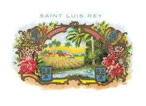
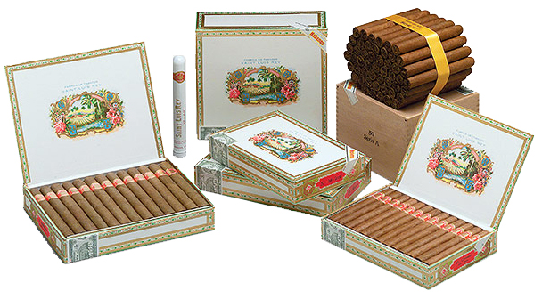

# Saint Luis Rey

Saint Luis Rey is a Habanos brand founded before the Second World War. Some say that its name was taken from the work of Thornton Wilder, "The bridge of Saint Luis Rey", very popular at that time.

However it is more likely that it refers to the town of San Luis, one of the districts at the epicenter for the tobacco culture in the Vuelta Abajo zone, in the Pinar del Río region, Cuba, which is particularly famous for the superb wrapper leaves produced there.

The Saint Luis Rey brand enjoy a reputation among smokers who like intense flavors Habanos.
It is a brand which it is used for regional editions.

These Habanos are made with wrapper, filler and binder leaves coming from the Vuelta Abajo zone, in the Pinar del Río region, Cuba.

**Strength**

- *Full*
