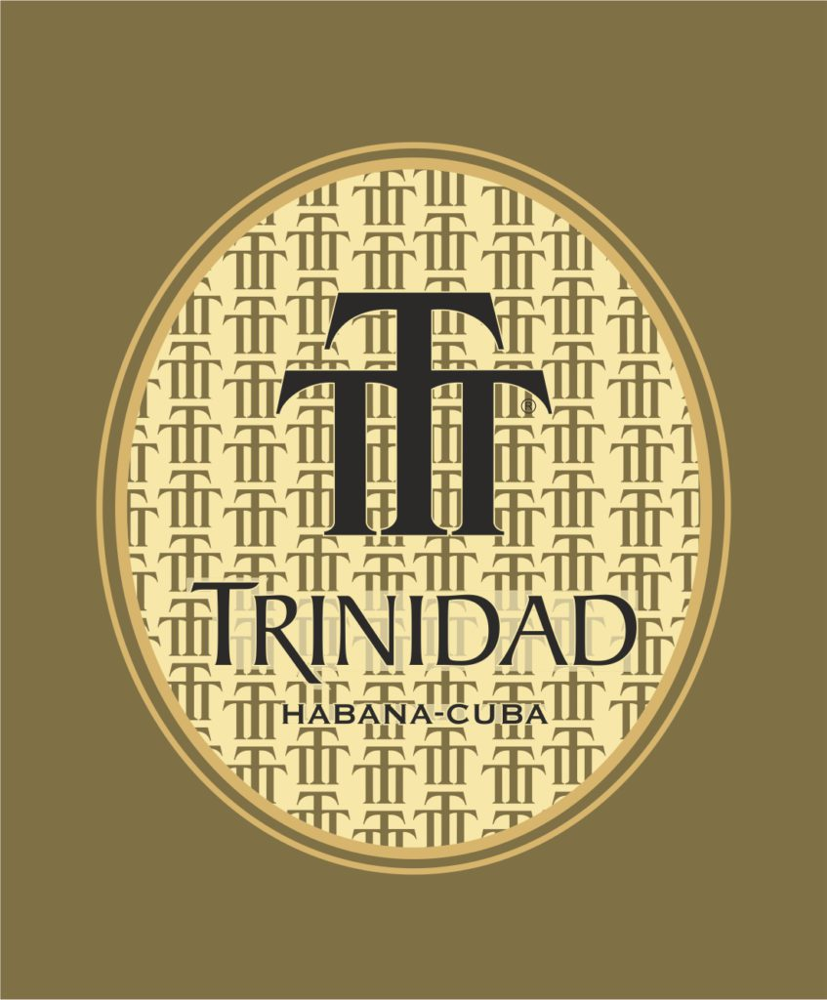
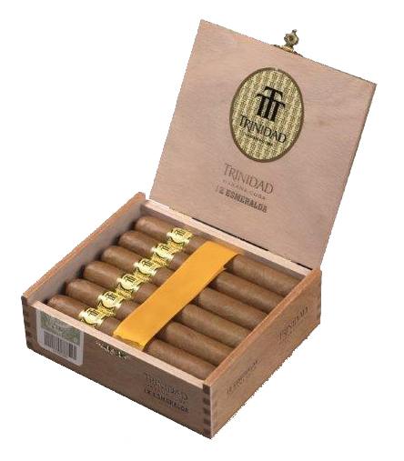

# Trinidad

Trinidad is named as a tribute to the Santísima Trinidad city raised during the 16th century, and listed by UNESCO as a World Heritage Site, which is located on the southern coast of Cuba.

Trinidad, as a Habano brand, dates back to 1969, and for many years, like the Cohiba brand, it was only used for gifts to foreign diplomats.

It was in 1998 when this brand was available to smokers for general sale and then only in very limited quantities.

At the start there was only one size of Trinidad: **Fundadores**. In 2003 three more sizes the **Reyes**, **Coloniales** and **Robustos Extra** were added to the range. A new image of the brand was also introduced, more modern and consistent with the extraordinary quality of its Habanos.

For several years Trinidad was made at El Laguito, the historic Cohiba factory, where its uniquely fragant and aromatic, medium flavoured blend of filler and binder leaves coming from the Vuelta Abajo zone, which make them unique and very exclusive.

Today Trinidad is made in Pinar del Río, the most important city of Vuelta Abajo.

In 2009 the **Trinidad Robustos T** was introduced to complete the brand's range.

Three new brand launches were added to the regular Habanos portfolio in 2019. Of the three vitolas, two of them are unpublished. These are **Esmeralda** (ring gauge 53 x 145 mm long) and **Media Luna** (ring gauge 50 x 115 mm long), while **Topes** (ring gauge 56 x 125 mm long) had already been launched as a Limited Edition in 2016 and with very good reception. Now, Topes incorporates ring gauge 56 for the first time in the brand's regular portfolio.

All Habanos are made "Totalmente a mano con Tripa Larga"- Totally Handmade with Long Filler.

**Strength**

- *Medium*
