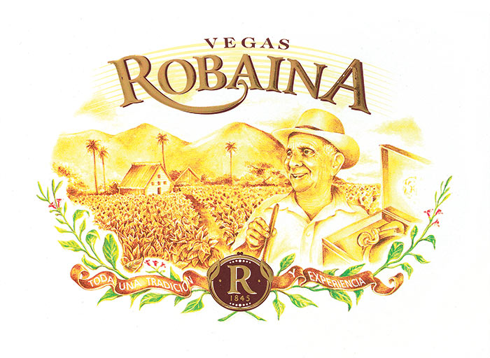
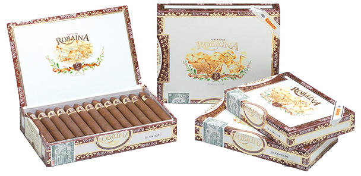

# Vegas Robaina

Since 1845, the Robaina Family has been producing excellent tobacco on its plantations at Cuchillas de Barbacoa situated in the San Luis district of the Vuelta Abajo tobacco zone.

Vegas Robaina brand was created in 1997, as a tribute to Cuban tobacco farmers through the figure of Alejandro Robaina, for having achieved high yields of the finest wrapper leaves.

Therefore, this brand also honours all the anonymous tobacco growers whose knowledge and skills make Habanos what they are today.

All five vitolas are made "Totalmente a Mano con Tripa Larga-Totally Handmade with Long Filler.

**Strength**

- *Medium to Full*
