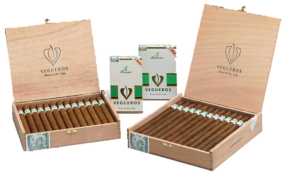
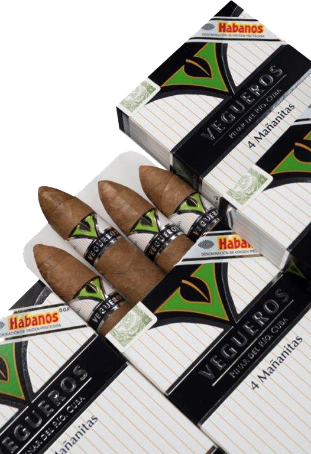
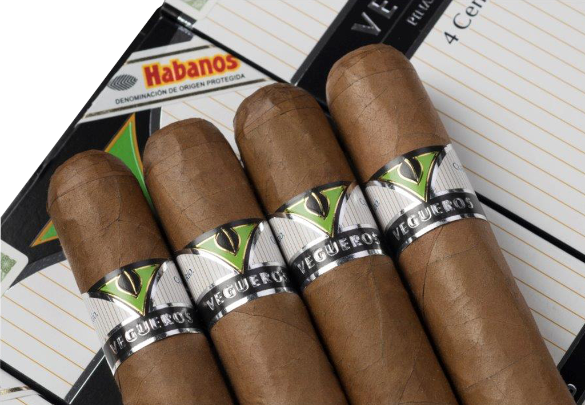

# Vegueros

Vegueros brand was introduced to the market in 1996 and pays tribute to all the farmers who from generation to generation have cultivated tobacco in the "Pinar del Río" region, Cuba.

It is a tradition in the "Vuelta Abajo" zone, for the vegueros – farmers – to make their own cigars. Visitors to this part of Pinar del Río province were curious and wanted to taste the cigars made in the land where the considered best tobacco in the world is grown.

Vegueros brand is made at the "Francisco Donatién" Factory, in a sturdy building located in Pinar del Río, was built in 1868, and converted into a cigar factory in 1961.

The brand was totally renewed, after more than fifteen years of its birth, incorporating innovative formats within its portfolio: Tapados (46 x 120 mm length), Entretiempos (52 x 110 mm length), Mañanitas (46 x 100 mm length) and now, the range is enriched with the Centrofinos vitola (50 x 130 mm length), being an attractive option for those who seek a medium to full flavor Habano, accessible and renewed.

The new vitolas of Vegueros are presented with the new image of the brand and in a 16-unit metal tin. Centrofinos in its trend format, highly appreciated by smokers of these times and may be accessible to a wider spectrum of smokers.

All the Habanos have been made "Totalmente a Mano con Tripa Larga"- Totally handmade with Long Filler, with wrapper, binder and filler leaves coming from the "Vuelta Abajo" zone, in "Pinar del Río" region with a medium to full strength by Cuban cigar rollers.

**Strength**

- *Full*
