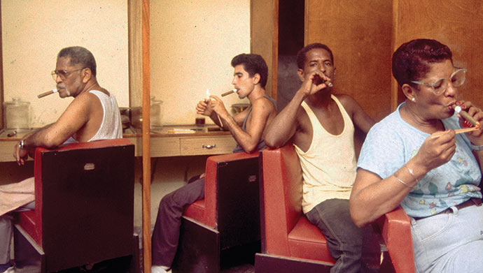

# Checking the work

There are strict quality control tests at all stages of hand making. Cigars that fail will never become Habanos.

Everyday the Workshop Manager (El Jefe de Galera) supervises the work of the cigar rollers. At the same time supervisors, who are themselves top grade , oversee each brigade of 30 to 40 workers watching their technique and checking the dimensions of the cigars they are making.

Supervisors examine the work of each Torcedor.

Finished cigars are placed in lidless, wooden boxes, open at the front like office out-trays, called  or cajuelas.

Each mini-rodero is labelled with the Torcedor's number, the vitola de galera and the date of manufacture. Afterwards the mini-roderos are placed inside larger wooden receptacles called roderos, which then go to the quality control department where technicians check the cigars for weight, length, girth, consistency, construction and appearance, particularly examining the tightness of the wrappers and the finish of the caps.

Samples of each Torcedor's work are regularly taken apart to verify their internal construction and blend. When problems are found the cigars are deducted from the daily quota – a serious matter for the Torcedores who are paid by piecework.

Amongst the latest quality control techniques there is a machine that checks the draw of the bunch by suction. The test takes place after the bunch has been pressed in the mould and before the wrapper is added. It was first introduced at the end of 2001 and is now used in every factory.

Testing the draw of the bunch by suction before the wrapper is added.

### Tasting the result

Every factory has its team of cigar tasters – the  – who meet every day to test cigars and score them according to a six-point quality checklist for draw, burn, aroma, flavour, strength and overall quality. 3-5 different cigars are tested at each sitting. If any deviation from the normal character of any brand and size is detected, they recommend adjustments to the blend.

The Catadores or tasters regularly smoke the work of each Torcedor in the factory.

The Catadores are the front line of the  – National Commission for Tasting –, which, as a part of the , is closely related to the Regulatory Council for the Protected Denomination of Origin (D.O.P.) Habanos. The latter is responsible for the consistency of the blends of all Habanos.

At any time, the Regulatory Council can make spot checks on any of the quality control procedures.

### Time to rest

Between making and packing, the cigars are taken to the conditioning room or Escaparate. Here in cedar-lined drawers, they are left to rest while they shed the excess moisture that was gained in the rolling process. After a week the cigars become smokeable but the longer they stay here the better. Conditions are strictly maintained at between 16 and 18°C and 65 to 70 percent relative humidity, noticeably cooler and drier than the ambient Cuban climate.

The Escaparate is often referred to as the "treasury". It is here that the true wealth of the factory is stored.

Formerly in the Escaparate Habanos were stored in bundles of 50 known as "medias ruedas" or "half wheels". Partagas Factory, Escaparate, 2000. La Habana, Cuba.

### Video

<http://www.archivohabanos.testwalking.com/booklet/videos/manufacture/08_control_en.mp4>
