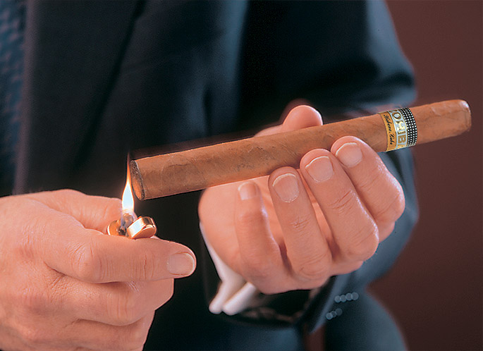
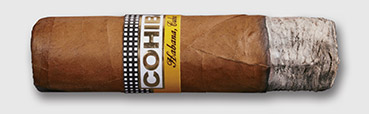

# Choosing, cutting and smoking

The Habano you pick, the way you cut it, light it, smoke it and above all the tastes that you enjoy are your choices and yours alone. However, there are some practical points to bear in mind.

### Choosing

Four of your five senses are required when choosing a Habano – or all five if you believe, as some do, that there is something to be learnt from rolling it next to your ear.

The wrapper must please the eye. Maybe you prefer a light colour, or maybe a dark. Either way, the colour should be even and there should be a sheen on the leaf. Don't worry if you see a white spot or a green patch. These are natural blemishes, beauty spots if you will, that occurred long ago during the growing or curing processes. Neither affects the quality of the smoke.

Press the cigar gently between your thumb and index finger to test its condition. It should feel firm but springy to the touch.

Enjoy the aromas of mature leaf as they waft up from the box – a promise of the flavours to come.

Taste can only be judged by smoking – quite a challenge when you have over  and  each with its own style to choose from.

Novices are advised to experiment with a vitola that is common to many brands such as a [Mareva](https://www.habanos.com/academia-habanos/el-mundo-del-habano/vitolario-y-envases/principales-formatos/#mareva "Principales formatos"). Start with one of the lighter flavoured marques – see [Habanos brands and flavours](https://www.habanos.com/en/academia-habanos/el-mundo-del-habano/las-marcas-y-sabores-del-habano/sabores-de-las-diferentes-marcas-y-lineas/ "Sabores de las diferentes marcas y líneas").

Newcomers should start with smaller formats. For more experienced smokers, the best guide is the amount of time at their disposal. Remember that a long filler Habano is constructed so that its flavour will intensify by stages as it is smoked.

It is a great shame to abandon a Habano before it has had the chance to display its true colours. So pick a vitola you have the time to enjoy in its entirety.

### Cutting

The cut should be made just above the line where the cap meets the wrapper (on about 3mm from the point).

The objective is simple. You must create an aperture broad enough to ensure an unobstructed draw whilst retaining enough of the cap to stop the wrapper from unravelling.

A number of devices compete for the role. The most popular is the single or double bladed guillotine. Alternatively there are pairs of special cigar scissors. Another is the punch cutter with a circular blade. It removes a section from the cap, which preserves the shape of the cigars head, although it cannot cut pointed ends.

Not to be recommended are V-cutters, which tend to tear the cap. Nor should you pierce the cap with a match or cocktail stick, which will compress the filler into a lump and impede the draw.

**Do not remove the band for fear of damaging the wrapper**.

### Lighting

Two principles apply.

The first is to light your cigar with an odourless flame. Always use a butane gas lighter, a wooden match or a spill. Never use a petrol lighter, a wax match or a candle because their aroma will permeate the cigar.

The second is to take your time and do a thorough job. Nothing ruins the enjoyment of a Habano faster than the thin smoke you draw when it is badly lit. Here is a small ritual to help you get it right every time.

Hold the foot of the cigar at 90 degrees to the flame and rotate it until the surface is evenly charred.

Place the Habano between your lips and, holding the flame a centimetre away, draw on it until the flame jumps onto the foot. Continue to rotate the cigar.

Blow gently on the foot to check that it is evenly lit.

### Smoking

A Habano should be smoked slowly. It should be sipped rather than gulped or it may overheat, which can harm the flavour.

Don't inhale – this is not a cigarette. Gently draw the smoke into your mouth and allow it to play gloriously on your taste buds.

Relax and savour the subtle flavours and aromas of the tobaccos in the blend.

It is fine to relight your Habano if it goes out. But first clean off any loose ash or you will find it hard to re-ignite.

A Habano may be smoked with enjoyment for at least three quarters of its length. Don't concern yourself with the length or fate of the ash. It is not done to tap your Habano nervously, like a cigarette. Let the ash fall in its own time, preferably into an ashtray.

### And parting

When the sad moment comes to part with your Habano, don't crush it to a pulp. Lay it to rest in the ashtray and it will go out by itself. Allow it to die with dignity.

### Video Resumen

<http://www.archivohabanos.testwalking.com/booklet/videos/enjoying/12_corte_en.mp4>

[Catalogue](https://www.habanos.com/en/vitolarios/ "Catalogue") |
