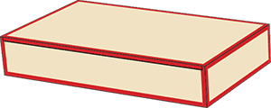
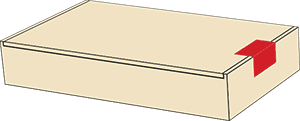
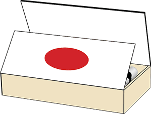
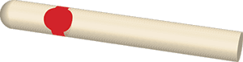
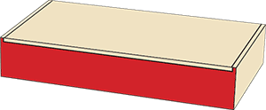

# Dressing the box

Cuba was first to introduce the classic labelled cigar box in the mid-19th Century, and it remains the best known form of Habano packaging

The extravagant paper trimmings on the box are called habilitaciones, literally dressings. Each label has its own time-honoured name and all of them are applied by hand.

Some labels are applied before the box is filled, and some afterwards.

Just before the box is closed and sealed there is a final quality examination by the Revisadores or inspectors.

Expert eyes scour the contents to check the colour matching, the banding and, above all, the appearance of each and every Habano.

Any that fail the test are placed upside down and the whole box is returned to the Escogedor for correction.

### LA CUBIERTA

The image on the top of the box, often reminiscent of the time when the names were literally branded onto the box with a hot iron. This is where the idea of a 'brand name' first came from.

### LA VISTA

A romantic pictorial celebration of the brand, often with much gold and embossing. Vistas typically feature medals that the brand has won, the coats of arms of former royal patrons, historical images and notes about the brand.

### EL FILETE

The decorative strip that seals the the lid's hinge.

### LA PAPELETA

A rectangular or oval seal on the short side of the box.

### EL BOFETON

The protective leaf of paper inside the box, decorated to complement the Vista

### LA ANILLA

Cuba's term for the cigar band. The common term elsewhere is la vitola (hence 'vitolfilia' for cigar-band collecting) but this is a word with other meanings in Cuba. A particular size and shape of Habano is also a vitola.

### EL LARGUERO

The coloured strip on the long sides, often showing the brand.

### EL COSTERO

The coloured strip on the short sides of the box, often showing the size name.

### EL TAPACLAVO

A seal fixed over the nail that secures the lid of some boxes.

 |
