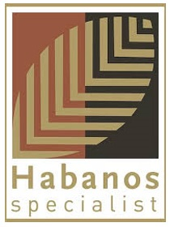
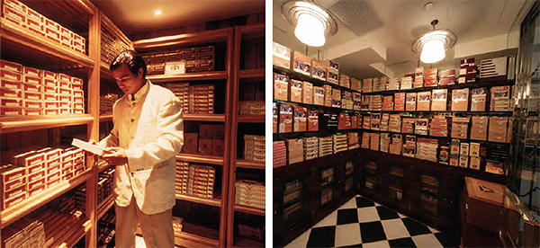

# Habano destinations

Now that you are nearing the end of this book, you may want some guidance on where to purchase and, just as important in these days of growing restrictions, where to light up your Habanos.

There are some places where you can do both. In others you can either buy or smoke.

When it comes to buying you want a good selection of brands and sizes in perfect condition to choose from and when it's time to smoke you want comfort and, ideally, the chance to match your cigar with a drink.

The number of Habano destinations around the world is growing. Here are some names that you might like to note.

##### La Casa del Habano

La Casa del Habano is the name of a network retail cigar stores franchised by Habanos s.a. There are over 140 La Casa del Habano stores throughout the world on five continents. A full list can be found on the franchise's global website at [www.lacasadelhabano.com](http://www.lacasadelhabano.com) or here in the section [Where to Buy](https://www.habanos.com/donde-comprar-2/ "Dónde Comprar").

Each store ensures the best service and keeps the widest assortment of Habanos brands and sizes in the perfect conditions of temperature and humidity displayed in walk-in humidors. Personal lockers can be made available to keep your Habanos ready to smoke year in year out.

There are some special sizes in certain brands like **Partagás Salomones** and several limited production series such as the **Colección Habanos and Replica Antique** humidors that can only be found at La Casa del Habano stores.

Many stores have smoking rooms attached, which offer the perfect environment in which to enjoy a Habano.

##### Habanos Specialists

Habanos Specialists are independent cigar retailers, who support the unique quality and prestige of Habanos by having both excellent service and a wide assortment of Habanos. Each one meets the standards set by Habanos s.a. and its local distributors for their ability to keep cigars in perfect condition and their knowledge about the product.

Wherever you are in the world when you see the distinctive
Habanos Specialists' sign, you know you will find someone to guide your choice of Habano.

Some of them also have smoking rooms where you can enjoy your preferred cigars.

##### Cohiba Atmosphere

Another name to look for is Cohiba Atmosphere. Under the name of the most prestigious Habanos brand, these destinations promise the highest standards of service for enjoying a wide variety of Habanos brands and sizes combined with an array of drinks to match them. Several offer haute cuisine too.

You can find them already in cities like Beijing, Hong Kong, Tokyo, Prague, Buenos Aires and Cancun, but their numbers are increasing, so check the Habanos website at [Where to Smoke](https://www.habanos.com/donde-fumar/ "Dónde Fumar") when you make your travel plans.

##### Smoking rooms

All over the world more and more hotels, restaurants and bars are providing smoking rooms dedicated to the enjoyment of cigars. Some are indoors, others are outdoors according to local laws, but they all offer you the chance to light your Habano in comfort, often with a drink to match it. You can find a list of the best places on the Habanos website at www.habanos.testwalking.com

Welcome to the world of Habanos.

[El Festival del Habano](https://www.habanos.com/en/the-world-of-the-habano/el-festival-del-habano/ "El Festival del Habano")
