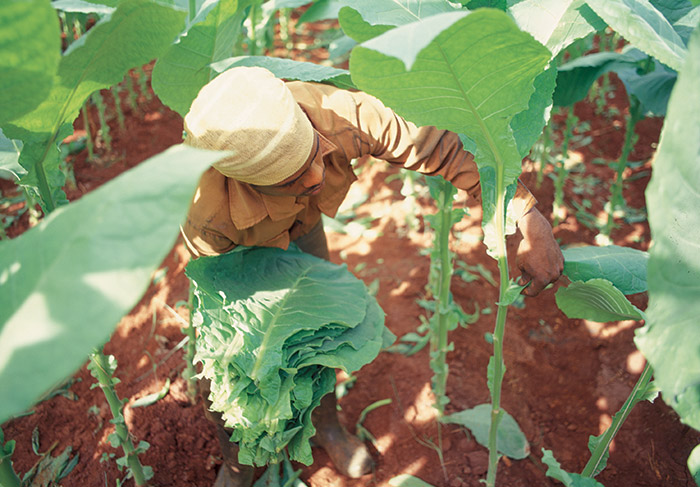
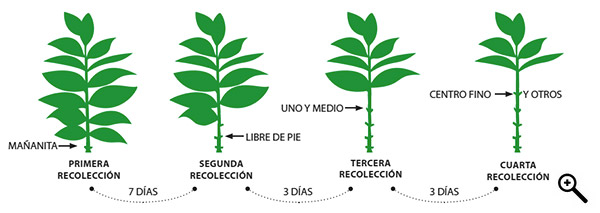
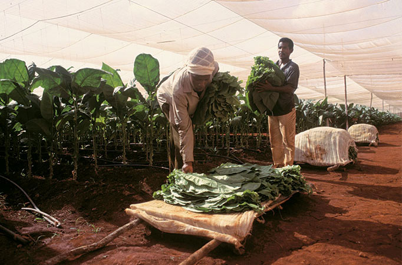

# Harvesting leaf by leaf

Around 40 days after planting out, the harvest can begin – a laborious task because each leaf must be picked by hand.

Only two or three leaves can be taken at a time, with days to wait between each picking. The harvesting of a single plant takes close to 30 days to complete.

Leaves are picked at intervals from the bottom up, allowing time between pickings for the plant to develop its remaining leaves.

Shade-grown () plants are taller with more leaves, and so they require more pickings.

A sun-grown plant is illustrated here.

The Mañanita leaves that are picked first are too small for Habanos, but they are the perfect size for Cuban mini cigars (Minis Cubanos).

The beginning of a long journey

The harvested leaves are taken to the farmer's barn for air curing – just the first of many stages that the leaf has yet to pass through.

")
