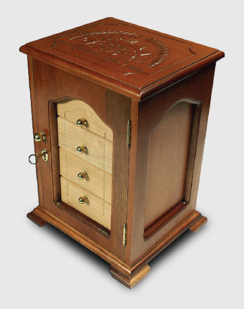
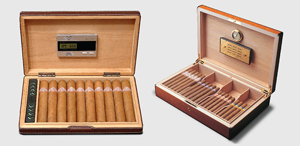

# Keeping Habanos

Habanos can be kept for a good 15 years, sometimes longer, and will, like exceptional wines, improve with age.

##### The right conditions

Habanos should be stored at between **16°C** and **18°C** and in a relative humidity of **65** to **70 percent**.

The humidity is most crucial. If a Habano becomes too wet it will not smoke. If it dries out, it will taste harsh.

As humidity varies with temperature changes, it is also important to keep the temperature constant.

##### Humidors

Perhaps the ideal humidor is the "walk-in" variety illustrated here in which the temperature and humidity are controlled electronically. You will find them in specialist cigars shops like those belonging to the worldwide network of [La Casa del Habano](https://www.habanos.com/en/donde-comprar-2/la-casa-del-habano/ "La Casa del Habano") shops where all the cigars are kept ready for sale in perfect condition. Often they provide lockers in which you can store your cigars.

 Walk-in Humidor

However, if you do not have access to such facilities, happily a whole industry exists making humidors to help you keep your Habanos.

 Lockers in La Casa del Habano

These can be boxes, cupboards or even full-sized rooms that are specially designed for cigars and contain moisture sources.

 Humidor

You are well advised to invest in your own in which to keep a selection of Habanos ready to smoke.

 Humidors

Your cigars will take a few days to acclimatise to the conditions inside so it is a good idea to buy a humidor with a tray that allows new arrivals to be separated from the old.

Putting Habanos in the fridge is no alternative. Fridges are drier than you might think and fine cigars readily absorb smells.

##### Troubleshooting

A number of problems may arise when storing fine cigars. For example, they may become too wet or too dry.

Dryness is worst because after two or three months they will start to lose their flavour – never to be regained. When re-humidifying dry cigars do it gently in stages or you will risk the wrappers bursting as the leaves absorb moisture.

Prolonged wetness rots tobacco, but you are much more likely to encounter 'bloom'. This is a white, powdery mould that occurs naturally on a Habano when it is subjected to a sudden increase in humidity. It is a sign that the cigar is alive and well and should simply be removed with a brush.

Worst of all is tobacco weevil or lasioderma serricorne. It feasts on tobacco, perforates wrappers and renders cigars unsmokeable.

Thankfully infestations are rare but the best prevention is never to let the temperature in your humidor exceed 18°C.

The only solution is to put an infected box into a deep freeze and leave it there for a few days. This will kill the weevils and save the cigars that have not attracted their attention.

Since 2005 all Habanos have been frozen at the warehouse in Havana before the are release to the market, so this problem is rarer than it once was.

##### Ageing

A marriage begins between the leaves used to make your Habano from the moment it leaves the torcedor's bench.

It takes time for the blend of filler leaves to harmonise and deliver the taste intended by the .

Ageing is best conducted in a large humidor where moist air can circulate around the boxes and in which the conditions are monitored year in year out. It is a task best left to specialist cigar shops.

The result is worth waiting for because the taste will have developed and your Habano will share its essence with greater ease.

##### Video

<http://www.archivohabanos.testwalking.com/booklet/videos/enjoying/11_conservacion_en.mp4>
