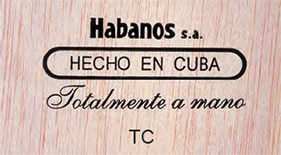
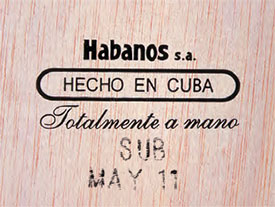

# Marks of distinction

When you have a reputation like Habanos, it is no surprise that unscrupulous persons will try to pass off their product as yours.

Here are the authenticating marks that you should look for when buying Habanos. It's also important always to buy your cigars at authorised shops.

### The Cuban Government warranty seal

The warranty seal was first introduced in 1889 by Royal Decree of the King of Spain. Then in 1912 the independent Cuban Government passed a law authorising the use of a new design, which is similar to the one in use today. It was modified slightly in 1931 and more radically in 1999 with the addition of the red serial number and an emblem that is visible only under ultra-violet light.

Most recently, in 2009, a new version was introduced with a hologram on each seal as well as an individual bar code that tracks every box of Habanos from production to each Habanos s.a. exclusive distributor anywhere in the world. The bar code allows you to find out if a box is genuine by using the Authenticity Check you will find on Habanos s.a.'s website at [www.habanos.testwalking.com](https://www.habanos.com/en/verificacion-de-autenticidad/ "Verificación de Autenticidad")

### Denomination of origin

Since 1994 all boxes have carried the Habanos seal as a mark of the cigars' denomination of origin. No box of Habanos is shipped from Cuba without it.

### Local importers' stamps

Individual countries or regions have their own certifying marks as an extra, local defence against counterfeiting. These marks are the responsibility of the local [exclusive distributors](https://www.habanos.com/en/donde-comprar-2/distribuidores/ "Distribuidores"). For more information about the stamp in the market where you are ask your local authorised [Habanos Specialist](https://www.habanos.com/en/donde-comprar-2/especialista-habanos/ "Especialista Habanos").

### On the bottom of the box

Since 1960, the bottoms of all Habano boxes have been hot-stamped with the words 'Hecho en Cuba'. Before that time, it was often written in English ('Made in Cuba'). Since 1994, the bottoms of the boxes have also been hot-stamped with 'Habanos s.a.', the name of the company that distributes Habanos worldwide. From 1985 to 1994, the name was 'Cubatabaco'. Nowadays they are marked as shown below:

Totalmente a Mano – Tripa Larga
Since 1989 boxes of classic, Tripa Larga – long-filler – Habanos have been hot-stamped with the words Totalmente a Mano –Totally by hand'–.

Totalmente a Mano – Tripa Corta
Boxes of short-filler Habanos are also hot-stamped with the words Totalmente a Mano – Totally by hand – and since 2002 ink stamped with the letters TC (Tripa Corta – 'Short Filler').

There are also some boxes of cigars that are inscribed only with "Habanos s.a." and "Hecho en Cuba" (Made in Cuba) omitting the words "Totalmente a mano" (Totally by hand).

These are machine made cigars which are not essentially covered by the Habanos Denomination of Origin (D.O.P). Most of them are covered by the "Cuba. Tabaco Mecanizado" Denomination of Origin (D.O.P.) for *machine made cigars*

### Factory code and box date

There are two ink-stamps on the bottoms of Habanos boxes. One is a secret code that tells the industry which factory made the cigars. The other is the month and year when they were boxed.

The dates are not in code and the year is simple enough. The system started in 2000 with '00', then '01' and so on. However, unless you know a little Spanish, the months may need deciphering.

They are:

1. ENE (Enero) January
2. FEB (Febrero) Frebruary
3. MAR (Marzo) March
4. ABR (Abril) April
5. MAY (Mayo) May
6. JUN (Junio) June
7. JUL (Julio) July
8. AGO (Agosto) Agost
9. SEP (Septiembre) September
10. OCT (Octubre) October
11. NOV (Noviembre) November
12. DIC (Diciembre) December

Habanos improve with age, so the date is important to connoisseurs.

*Note: Ink-stamps indicating the factory and date of manufacture were first introduced on Habanos boxes in 1985 but both were in code. If you want to check the date of a box between 1985 and 1999. Ask your authorised [Habanos Specialist](https://www.habanos.com/en/donde-comprar-2/especialista-habanos/ "Especialista Habanos").*
