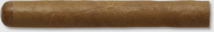
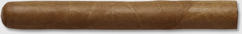
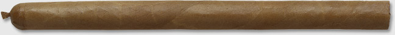
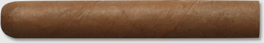
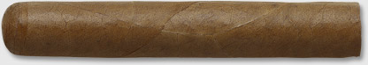
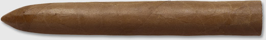
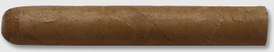
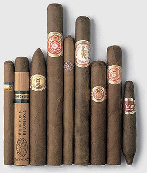

# Principal shapes and sizes

One of the glories of Habanos is the sheer choice – 27 brands with more than 250 different cigars between them. Here are the main shapes and sizes that it is useful to know about.

Habanos come in lengths from under 4 inches (100mm) to over 9 inches (230mm).

The industry standard measure for diameter is known as 'ring gauge' and is expressed in 64th of an inch, although some countries prefer to use millimetres. Ring gauges vary from 26 (i.e. 26⁄64 th of an inch or 10.32mm) to 57 (i.e. 57⁄64 of an inch or 22.62mm).

In Cuba, the sizes are calledvitolas. Thevitola de galerais the size name the factories use – the factory name. Thevitola de salidais the size name you find on a box – the market name.

Sometimes the market name is the same as the factory name, but not often.

The same size is often known by different market names in different brands, and different brands may sometimes use the same market name for different sizes.

On top of this, some vitolas have popular generic names like 'torpedo'.

Confused? The following examples are listed by factory name with their popular names too.

### MAREVA

Popular Name: Petit Corona
Dimensions: 5 1/8 ins x 42 ring gauge, or 129 mm x 16.67 mm diameter.

The Marevais by far the most popular of all the sizes. Its 42 ring gauge allows three filler leaves to be used to their full in the blend and it is as near as you get to a 'standard' girth for Habanos. TheMarevaorPetit Coronaoffers around 30 minutes of smoking pleasure.

### CORONA

Popular Name: Corona
Dimensions: 5 5/8 ins x 42 ring gauge, or 142 mm x 16.67 mm diameter.

A Corona is the size to crown a memorable dinner, or perhaps to give you time for contemplation on a busy day. With the same girth as the Mareva, it offers over half an hour of essential relaxation.

### LAGUITO NO.1

Popular Name: Lancero
Dimensions: 7 1/2 ins x 38 ring gauge, or 192 mm x 15.08 mm diameter.

When elegance is the order of the day, the slender length of the Lancero is hard to beat. There is a shorter version too, the Coronas Especiales, which measures just 6 inches. Both originated at Havana's El Laguitofactory, the home of Cohiba, and boast the finesse of a twist of leaf on the cap. This one will take the best part of one hour to smoke.

### CAÑONAZO

Popular Name: Siglo VI
Dimensions: 5 7/8 ins x 52 ring gauge, or 150 mm x 20.64 mm diameter.

Many consider this to be the ultímate shape and size for a Habano. Today it is acknowledged for its excellent combustion that releases the full flavourof its filler blend during the hour or so it takes to smoke. This size was chosen for the first Gran Reserva Habano.

### PETIT EDMUNDO

Popular Name: Petit Edmundo
Dimensions: 4 3/8 ins x 52 ring gauge, or 110 mm x 20.64 mm diameter.

The trend for heavy gauge cigars combined with a reduction in the amount of time available these days to enjoy them has seen the popularity of the Petit Edmundo – as well as similar sizes like Petit Robusto – increase. It burns well whilst drenching the palate with flavour for the 20 to 25 minutes you should allow to smoke it.

### EDMUNDO

Popular Name: Edmundo
Dimensions: 5 1/3 ins x 52 ring gauge, or 135 mm x 20.64 mm diameter.

The Edmundo is part of a group of heavy girth sizes that have grown in popularity in recent years. Halfway between a robusto and a Cañonazo, it commandsa loyal following for its good draw and balanced release of flavour for the 50 minutes or so it takes to smoke.

### JULIETA NO. 2

Popular Name: Churchill
Dimensions: 7 ins x 47 ring gauge, or 178 mm x 18.65mm diameter.

Originally from the Romeo y Julieta factory. It is said that Winston Churchill smoked some 300,000 Habanos duringhis long life. Not all matched these dimensions but this was his size of choice. Another feast for the palate to be enjoyed for over an hour.

### PROMINENTE

Popular Name: Double Corona
Dimensions: 7 5/8 ins x 49 ring gauge, or 194 mm x 19.45 mm diameter.

When time allows, there are few experiences for the taste buds to match the steady revelations of a Double Corona. Its colossal leaves may surprise you at firstwith their delicacy before they build to acrescendo of flavour. A good hour and a quarter is needed to smoke one.

### ROBUSTO

Popular Name: Robusto
Dimensions: 4 7/8 ins x 50 ring gauge, or 124 mm x 19.84 mm diameter.

Modern constraints on time have made this stocky shape the first choice for many experienced smokers. Slow burning and packed with flavour, most of the joys of a really large cigar can be savoured in 30 to 40 minutes.

### PIRÁMIDE

Popular Name: Torpedo
Dimensions: 61⁄8 ins x 52 ring gauge, or 156 mm x 20.64 mm diameter.

The sizes shown so far are what is called parejo or straight-sided. This is a figurado. Many believe that the Piramide or Torpedo, with its tapered head and shoulders, hasspecial advantages when it comes to combustibility during the hour or so it takes to smoke.

### EXQUISITO

Popular Name: Double Figurado
Dimensions: 5 3/4 ins x 46 ring gauge, or 145 mm x 18.26 mm diameter.

Pointed at both ends, this Double Figurado shape is perhaps a better candidate for the title of 'torpedo'. A century ago mostHabanos looked like this but today the shape is rare except in one brand – Cuaba, where every size is Double Figurado.

### PERLA

Popular Name: Tres Petit Corona (TPC)
Dimensions: 4 ins x 40 ring gauge, or 102 mm x 15.87 mm diameter.

The Perla is one of a group of smaller vitolas, some a little longer, others a little fatter than this one. They share the abilityto deliver the true taste of a Habano in 20 minutes or so.

### LAGUITO NO. 3

Popular Name: Panetela
Dimensions: 4 .ins x 26 ring gauge, or 115 mm x 10.32 mm diameter

A quarter of an hour will suffice to smoke this tiny example of the Torcedor's art. Perfect, for instance, to enjoy during aninterval at the theatre. In fact one similar vitola is called the Entreacto, literally 'between acts'.

### How shape and size affect the taste

Each brand has its own characteristic style of flavour, but different vitolas can vary the sensation of taste.

The bigger the Habano, the richer the taste will tend to be, and the cooler the smoke.

Fat Habanos burn slowly and deliver a large volume of rounder smoke that drenches the palate with the full mixture of flavours.

Double Figuradosoffer a unique flavour at the start dominated by the wrapper and binder. The true blend is revealed when the widest part is reached.

Thinner Habanos smoke more quickly and concentrate the flavours on the tongue giving a slightly sharper taste.

The blender will to some extent compensate for these differences by, for instance, omitting the strongest flavoured ligero leaf from the blending of thinner Habano sizes.

[Flavours](https://www.habanos.com/en/the-world-of-the-habano/flavours/ "Flavours")")
