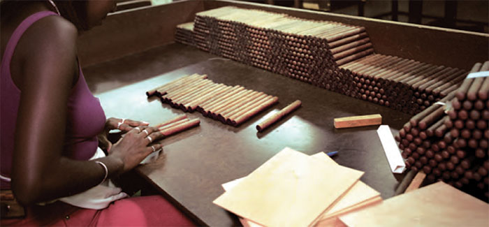
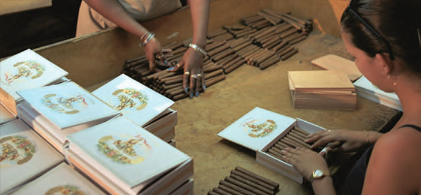

# Sorting the colours

No product on earth enjoys a more painstaking treatment in its presentation and packaging, starting with the perfect colour-matching of the wrappers.

Wrappers come in many finely distinguished shades of colour, and great care is taken to ensure that all of the cigars in any one box are the exact same shade.

The colour of a Habano wrapper is purely natural in origin – no artificial process is used to force it. Leaves from the upper levels of the plant are naturally darker, and become darker still in the course of fermentation.

Among the most senior workers in the factory are the Escogedores – colour graders – who work in pairs to colour-match the wrappers in any box or bundle of Habanos.

One Escogedor sorts the cigars en masse, dividing them by colours and shades of each colour in a pattern of columns and rows that may well represent 60 or more finely distinguished shades.

Sorting each shade into tones of dark to light from left to right.

A second Escogedor then sorts the cigars within each shade, one box-full at a time, ordering them so that any slight differences in tone run dark to light from left to right across the box. The Escogedor also chooses which face of each Habano will face upwards in the box.

Selecting the face of each Habano for banding.

At any stage in these processes the Escogedores will reject any cigars that do not look good enough.

Video Resumen

<http://www.archivohabanos.testwalking.com/booklet/videos/manufacture/10_acabado_en.mp4>
