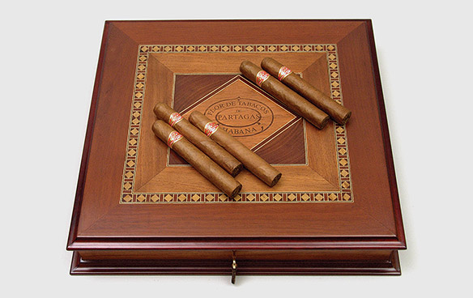
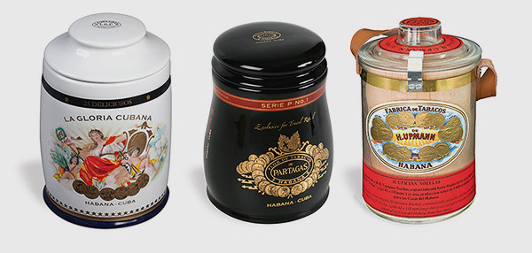
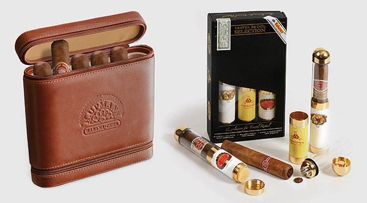

# Special Productions

From time to time you will see special productions of Habanos offering presentations or special sizes that are not normally available in a particular brand.These specialities often take the form of the very finest cabinets or humidors many of which are the work of leading Cuban artists and craftsmen. Others may be made in leather or contain innovations such as humidified tubes.

Usually sold through the franchised network of [La Casa del Habano](https://www.habanos.com/donde-comprar-2/la-casa-del-habano/ "La Casa del Habano") stores, they are worth buying, if you can find them, because they are made in small quantities and will not be repeated.

##### Humidors and cabinets in precious woods

Over the last 15 years there have been several releases of numbered limited edition humidors and cabinets made in rare and precious cuban woods such as cedar,acanaandmajagua.

Amongst the most exclusive releases have been the"Colección Habanos"cabinets, which ressemble books, the"Replica Antique"humidors that faithfully reproduce designs from the past, and special commemorative humidors to mark anniversaries of the best known Habanos brands. Cohiba, Montecristo, Romeo y Julieta and Partagas are the brands most often honoured in this way, although any of the existing 27 brands can be choosen.

##### Jars

Porcelain and glass jars are produced from time to time as limited editions as they were in 2000 when the Cohiba, Montecristo and Cuaba ceramic jars were produced to mark the new Millennium.These are usually available through Duty Free shops and La Casa del Habano network

##### Leather cases and humidified tubes

Other special Habanos productions include leather cases and humidified tubes that have been made in small quantities in recent years. They aim to provide Habanos enthusiasts with a variety of high quality accessories as well as to explore new ways of improving the conservation of cigars.

##### Ediciones Limitadas

Limited Editions in the leading brands of Habanos have been produced since 2000. They are distinguished not so much by their boxes, but more by the exclusivity of the cigars contained in them of which only small quantities are made in sizes not normally found in the brands in question. They are produced with tobacco aged at least 2 years before the cigars are made.

The boxes carry an extra black and gold seal indicating that they contain Limited Edition cigars as well as the year in which they were released. Each Habano is dressed with an extra band giving the same information.

##### Regional Editions

Regional Editions of Habanos are only distributed in certain parts of the world. Usually they are made in the less well-known of the 27 Habanos brands, which have particular associations with different countries.

While they are made from the standard tobaccos and blends for the brands in question with no special features, they are produced in sizes not normally associated with those brands and are presented in numbered boxes.

The boxes carry an extra silver and burgundy seal indicating that theyare Regional Editions and giving the name of the territory for which they were made. Each Habano is dressed with a second band giving the same information.

")[Catalogue](https://www.habanos.com/en/vitolarios/ "Catalogue")
