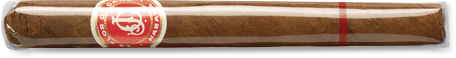

# Styles of presentation (I)

Choices and more choices. There are seven forms of presentation for individual Habanos, and an abundance of options when it comes to the packs you can buy.

**With a band**

The classic Habano: fully-dressed with a band to identify its brand. .

With a double band

In some cases there can be a second band identifying the vitola, or, where appropriate, a second band featuring a special production.

Without a band

In specialist cigar shops it is still possible to find Habanos without bands in slide lid boxes or bundles. However these were discontinued in the first years of the 21st century and now all Habanos leave the factories with bands on them.

Cedar-wrap (cedros)

The subtle aroma of cedar imparts a delicacy to the flavour and some brands wrap each cigar accordingly. The wood is porous so the cigars can be kept like this in a humidor.

Aluminium tubes

Created for railway companies in the 1930's, cedar-lined aluminium tubes help preserve cigars from damage and drying out. Ideal for outdoor pursuits like yachting or mountaineering. Decant the cigars from the tubes when placing them in a humidor.

Tissue-wrap

Employed by just one Habano brand at present – Fonseca. The tissue offers a modicum of protection for the wrapper.

Silver or gold paper wrapping

Some Habanos are wrapped in metallic silver or gold paper according to the traditions of certain high quality sizes.

Cellophane-wrap

In the past most Habano brands were from time to time wrapped in cellophane sleeves for some countries. Today cellophane is used only for machine made cigars.

##### Round versus box-pressed Habanos

All Habanos are round when they leave the Torcedor's bench. However when they are placed in labelled boxes the cigars are pressed into a square shape because the box is deliberately made too small. Why? At first perhaps it was to prevent damage during shipping but, as with many aspects of the Habano world, the original thinking is lost in time. Perhaps it was simply a fashion in days gone by.

In some brands most of the vitolas are box-pressed, in others none are. The present trend is for round Habanos, but the choice of shape is entirely yours.

 ")
