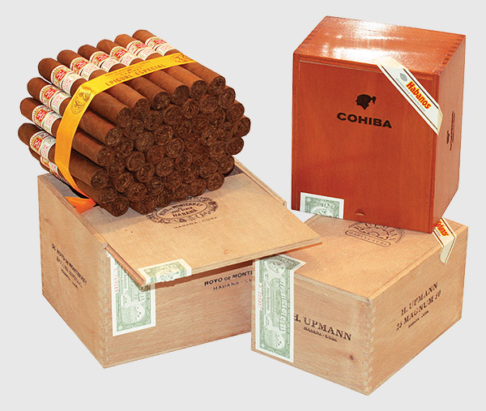
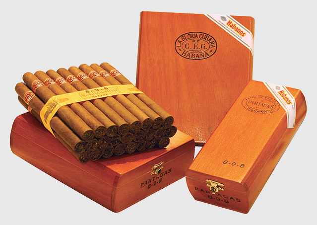
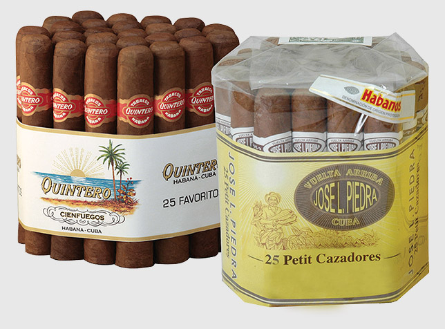

# Styles of presentation (II)

### Labelled Boxes (10, 20 or 25 habanos)

This is the most common form of Habano package. All box-pressed habanos come in this type of presentation.

### Semi Boîte Nature or SBN (5, 10, 12, 24 or 25 habanos)

The French name for this box confirms its Gallic origin. Some boxes are plain wood, others are varnished. The brand marks are hot-stamped into the wood. The cigars are always round.

### Cabinet Selection – SLB (10, 25 or 50 habanos)

'SLB' stands for 'Slide Lid Box', a presentation created for the British at the start of the 20th Century for selected 'Cabinet Quality' Habanos. Plain wood and varnished versions. The cigars are always round and tied in a silk ribbon.

### Cabinet Boîte Nature or BN (10 or 25 habanos)

Varnished natural wood boxes with fully formed lids sometimes bearing the brand emblem in gold foil. Others are left plain. A presentation reserved for very special cigars that are always round.

### '8-9-8' (10 or 25 habanos)

Boxes with telltale curved sides. The origin of these boxes was based on the number and arrangement of the cigars inside; 8 on the top row, 9 in the middle and 8 on the bottom making 25. It even gave its name to the first vitola to use it, the Dalia. Today the same 3-layer arrangement is used for boxes of 10; 3 on the top row, 4 in the middle and 3 on the bottom, so there is an 8-9-8 in 10s! All the cigars are round.

### Bundles or Mazos (10 or 25 habanos)

Bundles of round cigars with bands. Some are wrapped in silver foil or cellophane to prevent damage and preserve moisture..

### Small Packs (1, 3 or 5 habanos)

Smaller packs allow you to carry a few of your favourite Habanos or make ideal gifts. They come in cardboard, aluminium or wood. .

### Special boxes

Within the wide range of Habanos there are other types of packs with special characteristics which are not found in any of the categories described above although they form part of the standard Habanos portfolio.

")
