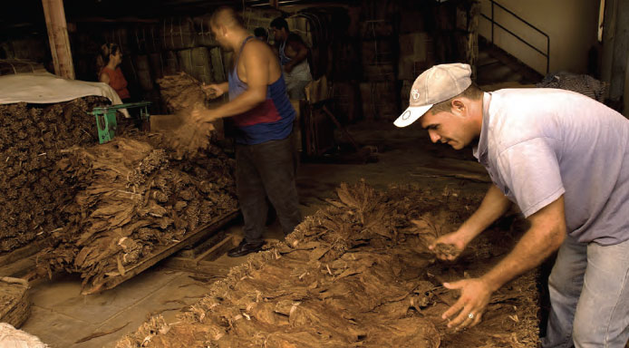
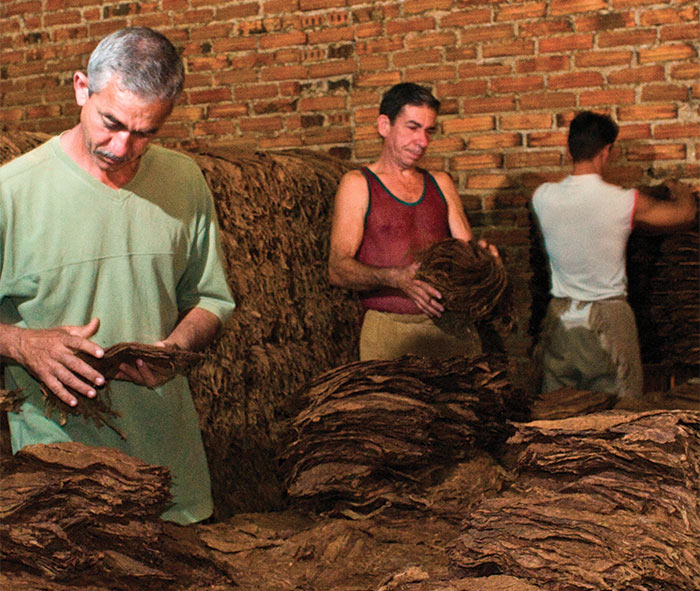

# Tabaco de sol (sun grown)

##### Sun-grown leaf for Fillers and Binders

Filler and binder leaves on the other hand are subjected to a much more complex and extensive process than wrappers, including several fermentations as is revealed below.

##### Air curing for Fillers and Binders

All filler and binder leaves are cured in the farmers' traditional Curing Barns. As with wrappers, the leaves are sewn together and hung over poles and, throughout the curing process as the leaves lose humidity, the poles are raised progressively to the upper part of the barn. Again the ventilation and light are adjusted constantly to allow for natural variations in temperature and humidity.

  Building piles of filler and binder leaves at the Stripping House for fermentation.

This process lasts for a minimum of 50 days, with longer periods for the leaves taken from the higher levels of the plant.

##### First Fermentation of Fillers and Binders

Still in the farmer's Curing Barn, fillers and binders are subjected to their first fermentation. The leaves from each pole are gathered intogavillasthen placed in piles and covered in cloth with a view to reducing further the natural humidity still contained in the leaf after its curing.

The fermentation process is precisely the same as takes place in a garden compost heap. Moisture and compression combine to generate heat. Constant supervision is required to ensure that things do not go too far.

Fermentation is essential to the smoking quality of the cigar. It sweats out impurities in the leaf, smoothing the flavour and reducing acidity, tar and nicotine.

This first fermentation takes a maximum of 30 days to complete. The leaves taken from the top levels on the plant need longest periods of time because they are thicker and richer in oils.

 The final stage of fermentation is sometimes conducted in barrels.

##### Sorting and classification of Fillers and Binders

It is at this stage that theEmpresa de Acopio y Beneficio del Tabacobuys the filler and binder leaves from the farmer and assumes the responsibility for the next phase which takes place in theEscogidaor Sorting House, where the leaves are taken after the first fermentation in the curing barn.

 Pure water is now used for the moistening or moja at the Stripping House.

The leaves are first moistened and aired to make them easier to handle and less vulnerable to damage during the classification. Then they are sorted and grouped in the four essential categories of flavour or that will be combinedin the blends of filler for Habanos: , , and .Volado leaves are collected from the lowest part of the plant and have little strength. They are also referred to as 1 (Strength 1) and the biggest and best of them are classified as binder. Thesecoleaves are taken from the middle of the plant and are renowned for their aroma. They have medium strength (Fortaleza2).Ligeroandmedio tiempoleaves come from the top of the plant and are the strongest in flavour (Fortalezas 3 and 4).

After this strict process of selection that is essential to the Habano, only around half of all the leaves will make the grade and be classified asmedio tiempo, ligero, seco, voladoand binder that will finally be used to make Habanos.

##### Second and third fermentations of Fillers and Binders

Following classification into thetiemposorfortalezasthat will be used in the preparation of blends in the factories, the leaves continue their long process of refinement.

In a building called the or Stripping House where they have been taken from the Sorting House, themedio tiempo, ligeroandsecoleaves undergo a second fermentation (sometimes also known as the pre-stripping fermentation) inpilonesor piles for a period of 15 days. Thevoladoand binder leaves, which are thinner, are only aired at this stage.

 The Despalilladoras, literally strippers, wear a ring-like metal knife on their thumbs to help cut the central veins.

Next all the filler and binder leaves are moistened in preparation for the tasks of stripping and pressing. The sure fingers of the stripout the lower portion of the central vein in each leaf of filler or binder. Then the leaves are stacked in small piles and pressed between boards.

  Stacking filler leaves in piles known as "burros".

Subsequently, all the leaves undergo another fermentation. This will be the second fermentation forvoladoand binder leaves, and the third formedio tiempo, ligeroandsecoleaves. The amount of time taken depends strictly upon the type of tobacco being 15 to 25 days forvoladoand binder, 45 to 60 days forsecoand around 90 days formedio tiempoandligero. For these fermentations the tobacco is stacked in piles known as burros covered in cloth, and the process is triggered by the water content retained in the leaf after the moistening that took place before the stripping.

The temperature during fermentation must be watched with great care. When it gets too hot, the pile is broken up, the leaves are allowed to cool down and the stack is rebuilt the other way round (bottom leaves to the top, top leaves to the bottom). This may happen several times in the course of the fermentation.

 Airing filler leaves on racks after the final fermentation.

##### Baling and ageing of Fillers and Binders

After this last fermentation, the leaves are aired on racks for a few days, then packed and transferred to the warehouse for the final patient process of ageing.

The fullest-flavoured leaves (ligeroandmedio tiempo) are aged the longest – for a minimum of two years. Meanwhile the lightest-flavoured leaf is aged the least. Like a fine wine, the longer the leaf is left to mature, the better it will be.

Filler and binder leaves are packed in hessian bales calledpacas. Each bale carries a label with all the information about the leaf it contains including its size, the year of harvest and the date of packing. In addition the labels on pacas indicate the leaf'stiempoorfortalezaas well as both the and the where the binders and fillers were processed.

Pacas containing filler and binder leaves before their departure to the warehouse.

The labels indicate the specific local character of the leaf which is the key to the distinctive blending of each of the sizes in all the Habano brands. It will allow for the creation of the blends that will be put into practice by the – Master Blender – in each of the factories in Cuba.

")
