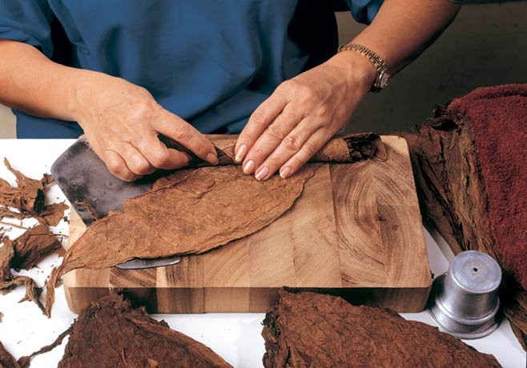
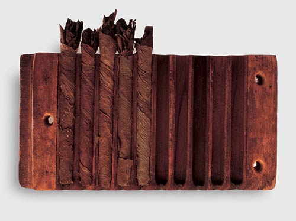
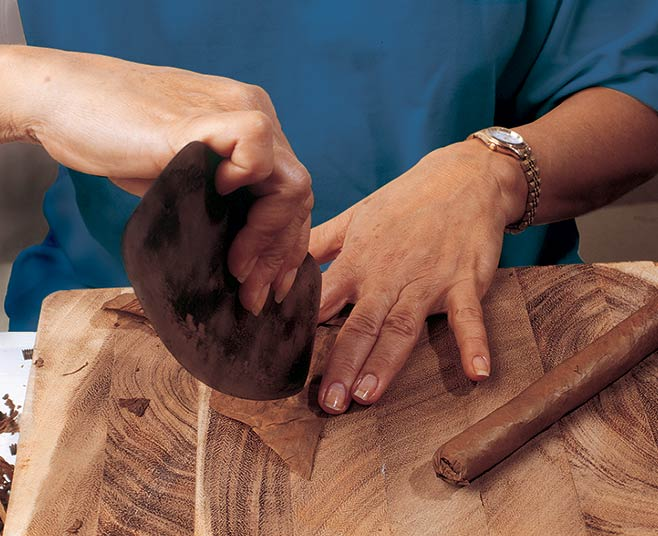
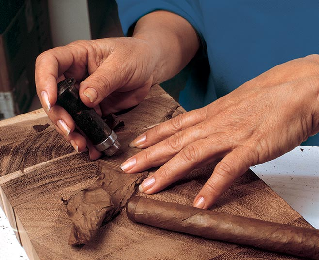
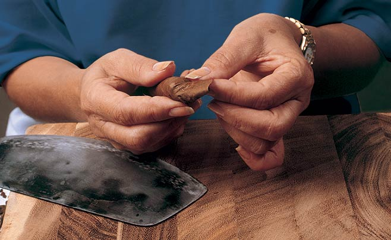

# The craft of the Torcedor

Habanos are made Totalmente a Mano –Totally by hand – as they have always been, by the Torcedores and Torcedoras, whose practised hands no machine can ever match

### This is how they do it

For tools they have only a wooden board (), two cutters (the flat-bladed – – and the little disc-cutting – –), a guillotine, a pot of colourless and flavourless natural vegetable gum (), a template to check length and girth (cepo), and the skill of their fingers.

There are four grades of Torcedor and only the top grade is allowed to make the biggest, most complicated Habanos.

It takes natural talent to reach the peak of this time-honoured craft, but one thing at least has changed. Most Torcedores these days are women (Torcedoras).

By tradition, a Lector – reader – reads to the Torcedores as they work, from the daily newspaper and from novels selected by popular vote.

Es tradición que un Lector acompañe con su lectura a los Torcedores en su trabajo, bien sea leyendo el periódico o bien novelas escogidas por elección popular.

First the Torcedora lays out the two or sometimes three half leaves that form the binder, placed so that the veined undersides of the leaves will face inwards when the cigar is formed.

Next she gathers together the leaves of the filler, folding and aligning each leaf to ensure a straight passage for smoke in the finished Habano. All leaves are placed with their lighter-flavoured tips towards what will be the foot (the lit end) of the cigar so that the flavour will intensify as it is smoked. The stronger-flavoured, slower-burning and  leaves are always placed at the centre.

Now the Torcedora forms the  or bunch by rolling the filler into the binder to the precise diameter required for that particular Habano. Rolling starts at what will become the foot of the cigar. Compression of the filler must be consistent at all points. The word torcedor translates as 'twister', but this is precisely what the torcedor must not do at this stage. The head (the mouth end) of the bunch is then cut square with the guillotine.

The Torcedora makes her bunches in batches and presses them for 30 minutes or more in a wooden mould to set their shape.

Next the Torcedora prepares the half leaf for the wrapper, still moist so that it will form perfectly to the shape of the bunch. She lays it on the board with its most veined side facing upward, leaving its smoothest side to be visible on the outside of the cigar.

She lightly trims the leaf with the chaveta blade, paying special attention to the edge that will be seen on the finished Habano.

The bunch is laid on the wrapper and rolled, starting at the cigar's foot with the tip of the wrapper leaf. Sensitive fingertips carefully stretch and straighten the leaf as the bunch takes up the wrapper. The tension in the leaf has to be perfect.

Next comes the 'cap'. First a section called the 'flag' is cut out from the spare wrapper leaf. It is then wound round the head to close off the open end and secure the wrapper.

To add the finishing touch, a small disc of wrapper is cut out with the casquillo and secured on the head with vegetable gum.

Finally the cigar is guillotined to length, and the work is complete.

In a day a good Torcedor can make between 60 and 150 Habanos in this fashion, depending on the size and complexity of the shape.

Video Resume

<http://www.archivohabanos.testwalking.com/booklet/videos/manufacture/07_torcedor_en.mp4>
