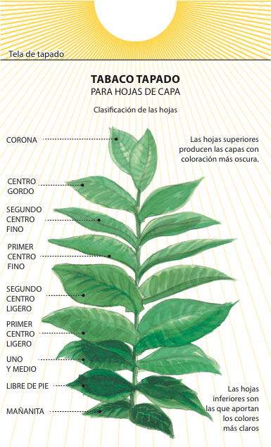
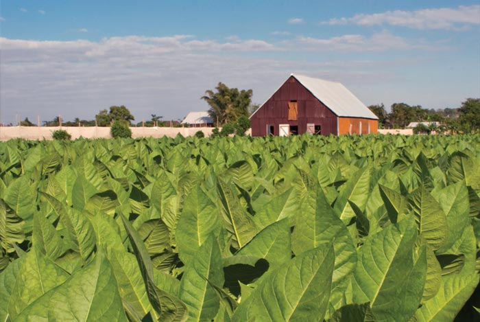
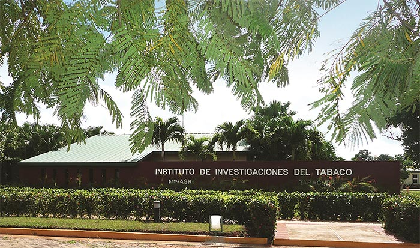

# The perfect leaf

Every leaf in a Habano is *Tabaco Negro Cubano*  – native Cuban Black Tobacco – directly descended from the plants that Columbus first discovered here more than five hundred years ago.

Two distinct forms of cultivation produce the different types of leaf required.

Wrapper leaves are grown in  (shade-grown) fields covered from end to end by muslin cloth.

Filler and binder leaves are grown in the open, enjoying the full benefit of the Cuban sun.

In each case the leaves have different characteristics at different levels of the plant, and each leaf is classified accordingly. Each leaf has its own destiny.

The muslin cover filters the sunlight and traps the heat so the leaves grow larger and finer – perfect conditions for growing the perfect wrapper leaf. Only the largest and finest leaves are selected to make wrappers for Habanos. No surprise that the wrapper is the most expensive leaf to produce.

Shade-grown tobacco field.

The full force of Cuban sunlight develops the glorious variety of flavours that are blended to form the rich and complex taste of a Habano.

A sun-grown tobacco field

### The true Cuban seed

From the 16th Century onwards, the tobacco that grew naturally in Cuba proved good enough to establish an unrivalled reputation throughout the world.

Then, at the start of the 20th Century as a new age of botanical research dawned, science was brought to bear on the many different seed varieties in use at the time for the growing of .

The botanists had two goals; first to identify the original seed's characteristics that delivered the classic Cuban taste; and second, to find varieties resistant to the many diseases that plagued the farmers.

And so in 1907, the variety known as *Habanensis* was born.

Instituto de Investigaciones del Tabaco. San Antonio de los Baños. Cuba

Independent research continued until in 1937 the industry established the first Experimental Research Station at *San Juan y Martinez*.

Four years later an improved seed variety named *Criollo* was introduced and this remains the basis of all the seeds permitted for the growing of Habano tobacco.

Soon afterwards *Criollo* itself was developed to create a variety called *Corojo*, bred especially for the growing of wrapper leaves and named after the famous plantation where it was tested.

Further new varieties have since been introduced to combat pests and diseases as well as such problems as the effects of global climate change.

Today Cuba's tobacco regions are served by the (Tobacco Research Institute) with its four experimental research stations, which together control all of the seed that the farmers sow.

One of the Research Institute's recent achievements has been to improve further the ecological growth of the plants, which is unique in the world of tobacco.

The quest continues to preserve and perfect the essence of the only true Cuban seed – .

")
