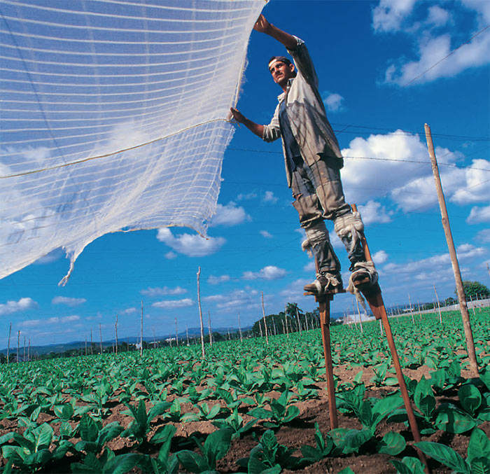
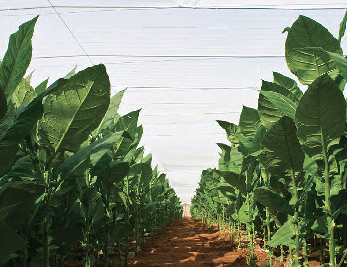
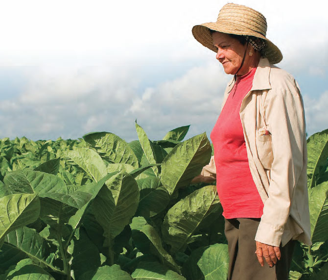

# The Vegueros, magic touch (II)

The extraordinary labour of shade-grown tobacco

Wrapper leaves are exceptional in every respect. Some 10-20 days into the growing season, the fields are entirely enclosed under canopies of muslin cloth – a remarkable sight.

Each plant is then individually strung to the frame. Irrigation is critical. The plants must get just the right quantity of water at the moment they need it.

Irrigation is critical. The plants must get just the right quantity of water at the moment they need it.

Flavour grows in the open

Cuban sunlight works its magic to bring on the rich variety of flavours in the sun-grown plants that supply the filler and binder leaves.

")
