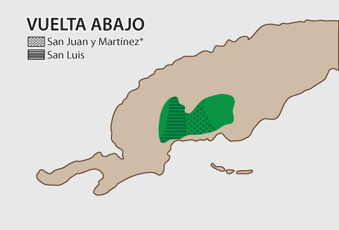

# Tobacco paradise

Nowhere in the world grows tobacco better than Cuba. But even here, only a few selected *Vegas* plantations are judged good enough to grow the tobacco for Habanos.

As a great wine is defined by its vineyard, so the character of a Habano is intimately connected with the land where the tobacco grows.

Selection is a principle that runs through every stage in the production of a Habano leaf, and this is where it starts.

The locations where tobacco for Habanos can be grown are strictly limited to certain defined regions, zones and districts of Cuba and within those regions to just a small number of plantations with their own special style of cultivation.

These are the elite *Vegas de Primera* first class fields ranked above all others for the exceptional quality of their soil and microclimate, and the uncommon degree of skill that goes to produce their crop.

So important are many of these regions, zones and districts to the production of a Habano that they enjoy a special status as Protected Denominations of Origin (D.O.P). You will find each one marked with an asterisk in the text.

### 1. PINAR DEL RIO\*

Name of the province that embraces all of the important growing zones in the west of Cuba, and the name of the provincial capital. It also gives its name to a tobacco region that is protected as a Denomination of Origin, and in which there are several tobacco zones such as *Vuelta Abajo\** and *Semi Vuelta,* and districts like *San Juan y Martínez\** and *San Luis\*.*

#### VUELTA ABAJO\*

The finest cigar tobacco-growing land in the world. *Vuelta Abajo\** is the main source of tobacco for Habanos, and the only zone that grows all types of leaf: wrappers, filler and binders. Indeed all tobacco for fillers and binders for Long Filler Habanos comes from this privileged zone. Not surprisingly *Vuelta Abajo* is also protected as a Denomination of Origin. But even here less than a quarter of the tobacco-growing land enjoys the *Vegas de Primera* status that is required for the growing of tobacco for Habanos.

The soil and climate conditions in the western part of Cuba, especially in the Vuelta Abajo tobacco zone, are unique in the world.

**San Luis\***: Small town at the epicentre of Cuban tobacco culture, known above all for the cultivation of wrapper leaves. As a district located in the *Vuelta Abajo\** zone, its name is protected as a Denomination of Origin. Here you find the world-famous *El Corojo Vega* as well as the *Cuchillas de Barbacoa* farm. It is one of the two districts from which the leaves grown on its finest vegas are selected for the Cohiba brand.

**San Juan y Martínez\***: The other famous small town in *Vuelta Abajo\** which gives its name to a district that is protected as a Denomination of Origin. It has a particular reputation for the cultivation of fillers and binders, and the famous *Hoyo de Monterrey* plantation is located here. It is the other district where the finest vegas supply leaves for .

#### SEMI VUELTA

The other tobacco zone situated in the Pinar del Río region known mainly for its cultivation of binder and filler leaves for *Tripa Corta* -Short Filler- Habanos. Traditionally the part of the Pinar del Rio\* tobacco region not included in *Vuelta Abajo\** has been called *Semi Vuelta*. However the area of this zone employed for Habanos is very small, barely one percent of its tobacco growing land. Nevertheless it has good soil for producing seeds which are later sown in *Vuelta Abajo\**. Most *Semi Vuelta* tobacco is grown for other purposes.

### 2. PARTIDO\*

Founded during the early 17th Century, *Partido\** is a historic tobacco region incorporating a number of tobacco-growing zones traditionally located to the south west and more recently to the south east of Havana City. *Partido\**, which is protected as a Denomination of Origin, specialises in the cultivation of wrapper leaves for long and short filler Habanos.

### 3. REMEDIOS\*

Cubas oldest tobacco producing region and a protected Denomination of Origin. It is the source of the leaf for one particular Habano brand: [José L Piedra](https://www.habanos.com/marcas/joselpiedra/ "José L. Piedra"). The soil and climate have their own distinctive character.

### 4. VUELTA ARRIBA\*

It was at Bariay in the extreme eastern part of this region that Columbus landed in 1492 and discovered Cuban tobacco. Consequently it is protected as a Denomination of Origin. Tobacco is still grown here, but not for Habanos.

### LA HABANA\*

Havana city, capital of Cuba. Although no tobacco is cultivated in Havana, the city gave its name to Cubas most famous export because its natural harbour provided the port from which Habanos were originally shipped. Also it remains the location of the most famous Habano factories. It is a Denomination of Origin because of its historical relationship with the production and export of Habanos.

\* Denominations of Origin recognised by The Regulatory Council for the Protected Denomination Of Origin (D.O.P.) Habanos and other Cuban Tobacco Denominations
