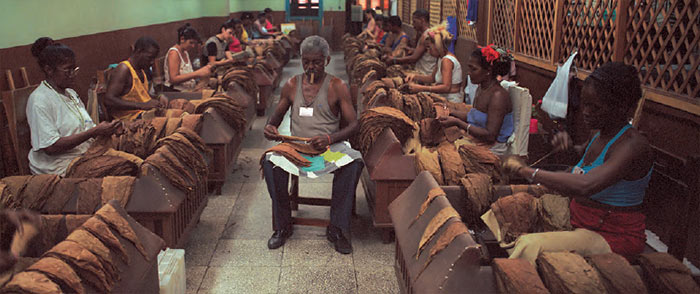
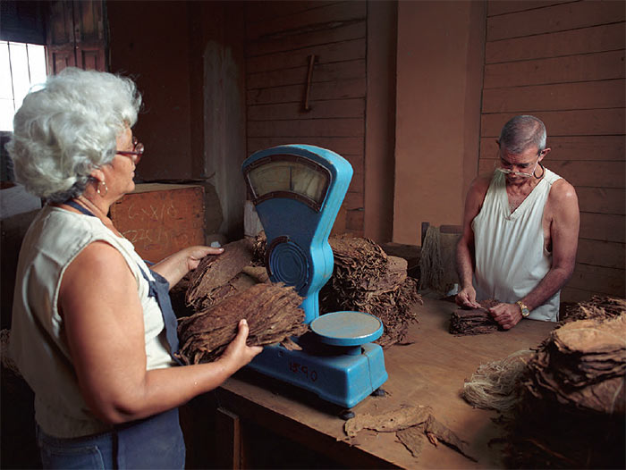

# Totally hand made long filler

Time has done its work, and the leaf is ready at last to play its part in the making of a Habano.

 The heart of any factory for hand made cigars is the 'galera', literally the 'galley', or workshop. Since 1865 Torcedores (cigar rollers) have been read to whilst they work by a 'Lector' or Reader.

The following pages describe an extraordinary craft that has changed little in 200 years.

##### Variations in the method of making

1. Totalmente a Mano Tripa Larga – Totally hand-made, long filler –

   All but a small number of Habanos are made totally by hand with a filler composed of full length tobacco leaves.

   According to the standards laid down by the , these are "totally hand-made, long filler" Habanos, made with fillers and binders harvested leaf by leaf only in  – first class fields – situated in .

2. Totalmente a Mano Tripa Corta – Totally hand-made, short filler–

   Some others are also made totally by hand, but using filler that is partly composed of shorter sections of leaf. These are the "totally hand made, short filler" Habanos. They can be made with filler and binder leaves from any tobacco region of Cuba protected as Denominations of Origin.

##### Preparing the wrapper leaves

 1. Precious wrappers are carefully removed from their bales and separated, a process called zafado.

The wrapper leaves are now aged and it is time for their final sorting and classification. They must also be stripped of their stems.

 2. The moistening or 'moja' of wrappers under a fine spray in electronically controlled moistening cubicles.

A moistening, or , brings them to the supple condition required for stripping and sorting, and their final purpose of wrapping a cigar.

The  or bunches of 40 to 50 leaves are held under a fine spray of pure water. Excess droplets are then shaken off with practised flourishes to avoid any staining, and the leaves are hung on racks so the moisture is absorbed evenly. Electronically controlled moistening cubicles, have been installed in some of the leading factories to perform this task.

Next the hands of highly skilled men and women perform the despalillo (stripping) and the rezagado (grading). One movement deftly removes the entire central vein of the leaf leaving its two halves ready to be graded into some 20 finely distinguished sizes and shades.

 3. Removing the central veins from the wrapper leaves and grading them by size and colour.

In the past, these tasks were performed only by women. Working from piles of leaves on their laps thus lent weight to the popular myth that Habanos are rolled on maidens' thighs.

 4. Stripped and graded wrappers are stored in batches selected for the sizes they will dress.

##### Preparing the filler and binder leaves

Filler and binder leaves are carefully removed from their bales for examination.

If necessary they are aired on racks to attain the required moisture level, or alternatively they are taken to the drying room where excess moisture is removed. Then they are placed in wooden containers for between one and three days until they are judged to be ready.

##### Composing the blend

The task of selecting the blends for each brand according to its own recipe starts well before the bales reach the factory.

The blend for each size within each brand is specified and monitored by the Tobacco Research Institute together with Habanos s.a. as part of the Regulatory Council to ensure that the quality and taste characteristics of each cigar are respected. The task of the  – Master Blender – in each factory is to make certain that the prescribe.

It is a remarkable feature of Cuban tobacco that such a small acreage of  can produce such a wide variety of flavours from area to area. Literally the tobacco grown on one side of a road in the  can taste completely different from the tobacco grown on the other side.

There is an established link between the factory and the areas that supply the leaf for the brands it manufactures. Nevertheless it is the Master Blender's responsibility to sample the flavour of the tobaccos in use from day to day. He carries the recipe for each brand and size in his head and is the guardian of their consistency.

In accordance with the Tobacco Research Institute guidelines, the ratio of each type of leaf that the Master Blender specifies for the cigars in production is assembled by the blending department in batches and issued to the cigar rollers for the day's work.

They call the blending department – literally 'the pack of cards' – because the process of assembling the leaves for a blend is similar to shuffling cards.

Finally, three years or more since the oldest leaf was picked, it is now about to become a Habano…

")
